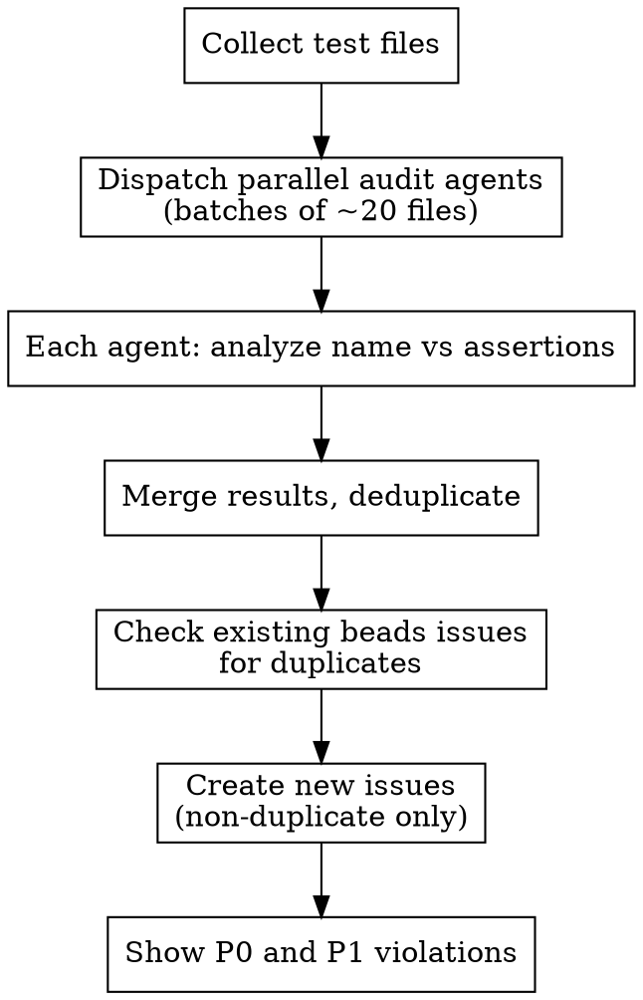

# Audit Test Assertions

Scan unit and integration tests, verify assertions match what each test name claims to test, file issues for violations, and surface the most urgent ones.

## Process



## Step 1: Collect Test Files

```bash
# All test files (unit + integration)
find tests/unit tests/integration -name 'test_*.py' -not -name '__init__.py'
```

Exclude `__init__.py`, `conftest.py`, and solution files (e.g., `exercises/*/solutions/`).

## Step 2: Dispatch Parallel Audit Agents

Split files into batches of ~20. Dispatch one subagent per batch. Each subagent receives:

**Prompt template for each audit subagent:**

> You are auditing test files for assertion-vs-name mismatches.
>
> For each test function in the files below, check whether the test's ASSERTIONS actually verify what the test NAME claims to test.
>
> **Priority Classification:**
> - **P0**: Test name is actively misleading — asserts the opposite of what name says, or asserts something completely unrelated
> - **P1**: Test name claims a specific behavior but assertions don't verify it (e.g., name says "preserves_order" but test only checks length; name says "raises_error" but no `pytest.raises`)
> - **P2**: Test name is slightly aspirational — assertions are in the right area but don't fully verify the claim (e.g., name says "accumulates_correctly" but only checks step count, not accumulated value)
>
> **What is NOT a violation:**
> - Test name says "terminates" and test checks step count < N — that IS testing termination
> - Test name says "does_not_crash" and test just runs without error — that IS testing crash-freedom
> - Test name is generic (e.g., "test_basic_execution") and assertions are generic — no mismatch
> - Smoke tests named as smoke tests
>
> **Output format** (one line per violation, skip clean tests):
> ```
> FILE | TEST_NAME | CLAIMS | ACTUALLY_CHECKS | PRIORITY
> ```
>
> Files to audit:
> [list of ~20 file paths]

## Step 3: Merge and Deduplicate Results

Combine all subagent results. Remove duplicate findings (same file + test name reported by overlapping agents). Sort by priority (P0 first).

## Step 4: Check Existing Beads Issues

Before creating issues, search for existing ones:

```bash
bd search "assertion mismatch"
bd search "test name"
bd query "label=audit-asserts AND status=open"
```

Skip any violation that already has an open issue.

## Step 5: Create Issues

For each new violation, create a beads issue:

```bash
bd create "Test assertion mismatch: <test_name> in <file>" \
  -p <0-4> \
  -t bug \
  -l audit-asserts \
  -d "Test name claims: <what name says>. Assertions actually check: <what they check>. File: <path>:<line>"
```

**Priority mapping:** P0 → `-p 0`, P1 → `-p 1`, P2 → `-p 2`

Use `bd find-duplicates --approach mechanical` after bulk creation to catch any near-duplicates.

## Step 6: Show Urgent Violations

```bash
bd query "label=audit-asserts AND status=open AND priority<=1"
```

Display as a summary table: file, test name, what's wrong, priority.

## Quick Reference

| Priority | Meaning | Action |
|----------|---------|--------|
| P0 | Actively misleading | Fix immediately |
| P1 | Claims unverified behavior | Fix soon — test gives false confidence |
| P2 | Slightly aspirational | Fix when touching that file |

## Common Mistakes

**Over-flagging smoke tests.** A test named `test_basic_python_execution` that just runs code without crashing is fine — the name doesn't claim specific behavior.

**Ignoring module docstrings.** If the module docstring says "tests verify X and Y" but individual tests only verify X, that's a P2 at the module level, not per-test.

**Missing the `.value` pattern.** Tests that assert on `tv.value` but ignore `tv.type` when the name mentions "type preservation" — this is a real P1.

**Creating duplicate issues.** Always search beads first. Prior audit (#14) found 16 P1s and ~94 P2s — many may already be tracked.
