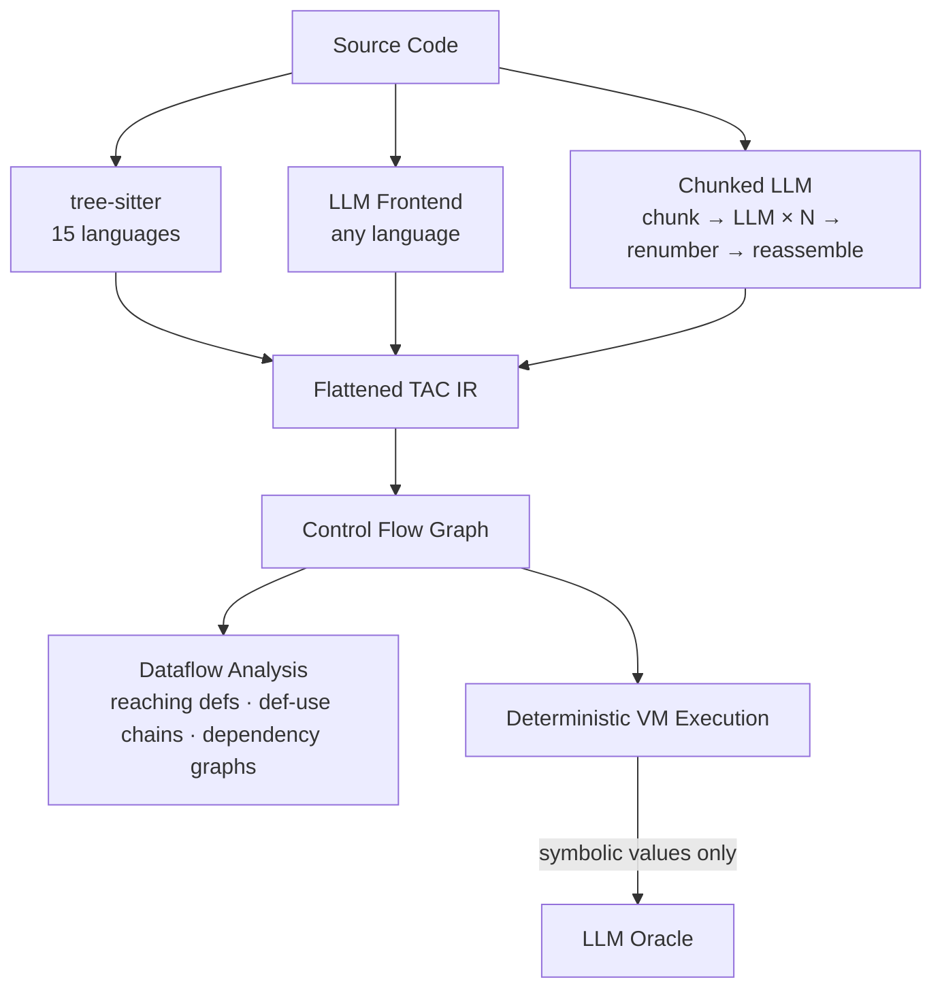
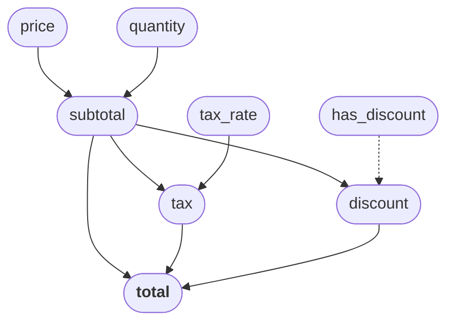

<p align="center">
  
</p>

# RedDragon

 | [Presentation](presentation/index.html) | [MIT License](LICENSE.md)

A multi-language source code analysis toolkit that:

- **Parses** source in 15 languages via tree-sitter, or any language via LLM-based lowering (including chunked lowering for large files)
- **Lowers** to a universal flattened three-address code IR (~19 opcodes) — the LLM frontend uses the LLM as a **compiler frontend**, constrained by a formal IR schema with concrete patterns
- **Builds** control flow graphs from IR instructions
- **Analyses** data flow via iterative reaching definitions, def-use chains, and variable dependency graphs
- **Executes** programs symbolically via a deterministic VM — tracking data flow through incomplete programs with missing imports or unknown externals entirely without LLM calls

## How it works



For programs with concrete inputs and no external dependencies, the entire execution is **deterministic with 0 LLM calls**.

## Setup

Requires Python >= 3.10 and [Poetry](https://python-poetry.org/).

```bash
poetry install
```

Set your API key for the LLM backend (only needed for `--frontend llm` or when execution encounters symbolic values):

```bash
export ANTHROPIC_API_KEY=sk-...          # for Claude (default)
export OPENAI_API_KEY=sk-...             # for OpenAI
export HUGGING_FACE_API_TOKEN=hf_...     # for HuggingFace Inference Endpoints
# Ollama requires no API key (runs locally at localhost:11434)
```

## Usage

```bash
poetry run python interpreter.py myfile.py -v            # run on a file
poetry run python interpreter.py myfile.py --ir-only      # inspect IR only
poetry run python interpreter.py myfile.py --cfg-only     # inspect CFG only
poetry run python interpreter.py example.js -l javascript  # non-Python source
poetry run python interpreter.py myfile.py -f llm -v       # LLM frontend
poetry run python interpreter.py myfile.py -f chunked_llm  # chunked LLM frontend
poetry run python interpreter.py example.cob -l cobol -f llm  # unsupported language via LLM
poetry run python interpreter.py myfile.py --mermaid        # output CFG as Mermaid flowchart
poetry run python interpreter.py myfile.py --mermaid --function foo  # CFG for a single function
```

| Flag | Description |
|------|-------------|
| `-v` | Print IR, CFG, and step-by-step execution |
| `-l` | Source language (default: `python`) |
| `-b` | LLM backend: `claude`, `openai`, `ollama`, `huggingface` (default: `claude`) |
| `-n` | Maximum interpretation steps (default: 100) |
| `-f` | Frontend: `deterministic`, `llm`, `chunked_llm` (default: `deterministic`) |
| `--ir-only` | Print the IR and exit |
| `--cfg-only` | Print the CFG and exit |
| `--mermaid` | Output CFG as a Mermaid flowchart diagram and exit |
| `--function` | Extract CFG for a single function (use with `--mermaid` or `--cfg-only`) |

## Supported languages

15 deterministic tree-sitter frontends (0 LLM calls, sub-millisecond latency):

Python, JavaScript, TypeScript, Java, Ruby, Go, PHP, C#, C, C++, Rust, Kotlin, Scala, Lua, Pascal

Control flow constructs (if/else, while, for, for-of/foreach, switch, break/continue, try/catch/finally) are lowered into real LABEL+BRANCH IR rather than `SYMBOLIC` placeholders. Language-specific features — Python list/dict comprehensions (including nested), with statements, decorators, lambdas; JS/TS destructuring, for-of loops, and for-in loops; Ruby blocks (curly brace and do/end); PHP foreach and array creation; Java/C#/TS interface declarations; Java/C# array creation and enum declarations; Java instanceof; C# typeof, is-check, and property declarations; C pointer dereference/address-of, sizeof, compound literals, struct field declarations, goto/labels, typedef; C++ field initializer lists, delete expressions; Lua generic for; Go composite literals; Pascal for/for-downto loops; C# lambdas — all produce real IR for proper data-flow analysis. Unsupported constructs emit `SYMBOLIC` with a descriptive hint rather than crashing. For unlisted languages, use `--frontend llm`.

## Example: CFG

```python
def classify(x):
    if x > 0:
        label = "positive"
    else:
        label = "negative"
    return label
```


Function bodies appear as subgraphs with dashed call edges (`-.->|"call"|`) connecting `CALL_FUNCTION` sites to function entry blocks. Blocks with more than 6 instructions are collapsed to show the first 4 lines, an `... (N more)` placeholder, and the terminator — keeping CFG diagrams readable without hiding critical branch/return instructions. All 15 frontends produce the same CFG shape for equivalent logic.

## Example: symbolic execution (0 LLM calls)

```python
def factorial(n):
    if n <= 1:
        return 1
    else:
        return n * factorial(n - 1)

result = factorial(5)
```

```
[step 4]  call factorial(5) → dispatch to func_factorial_0
[step 53] binop 1 <= 1 = True   ← base case
[step 56] return 1               ← unwind begins
[step 57] 2 * 1 = 2 → 3 * 2 = 6 → 4 * 6 = 24 → 5 * 24 = 120
[step 65] store_var result 120

Final state: result = 120  (67 steps, 0 LLM calls)
```

The VM also handles classes with heap allocation, method dispatch, field access, closures with captured scopes, and builtins (`len`, `range`, `print`, `int`, `str`, etc.) — all deterministically. The interpreter's execution engine is split into focused modules: `interpreter/registry.py` (function/class registry), `interpreter/builtins.py` (built-in function table), and `interpreter/executor.py` (opcode handlers and dispatch).

## Symbolic data flow

When the interpreter encounters incomplete information (missing imports, unknown externals), it creates symbolic values rather than erroring:

- `process(items)` where `process` is unresolved → `sym_N [process(sym_M)]`
- `obj.method(arg)` on a symbolic object → `sym_N [sym_M.method(arg)]`
- `obj.field` on a symbolic object → `sym_N` (deduplicated across repeated accesses)
- `sym_0 + 1` → `sym_N [sym_0 + 1]` (symbolic arithmetic with constraints)
- `branch_if sym_0` → takes true branch, records path condition

This means data flow through programs with missing dependencies is traced entirely deterministically with **0 LLM calls**.

## Dataflow analysis

Iterative intraprocedural analysis on the CFG: **reaching definitions**, **def-use chains**, and **variable dependency graphs** (transitive closure).

### Example: dependency graph

```python
def process_order(price, quantity, tax_rate, has_discount):
    subtotal = price * quantity
    tax = subtotal * tax_rate
    if has_discount:
        discount = subtotal * 0.1
        total = subtotal + tax - discount
    else:
        total = subtotal + tax
    return total
```



`total` transitively depends on all four parameters. Dashed edge = conditional dependency.

## LLM frontend

The LLM frontend (`--frontend llm`) sends source to an LLM constrained by a formal IR schema — the LLM acts as a **compiler frontend**, not a reasoning engine. The prompt provides all 19 opcode schemas, concrete patterns for functions/classes/control flow, and a full worked example. On malformed JSON, the call is retried up to 3 times.

The **chunked LLM frontend** (`--frontend chunked_llm`) handles large files by decomposing them into per-function/class chunks via tree-sitter, lowering each independently, then renumbering registers/labels and reassembling. Failed chunks produce `SYMBOLIC` placeholders.

| Provider | Flag | Notes |
|----------|------|-------|
| Claude | `-b claude` | Best quality, requires `ANTHROPIC_API_KEY` |
| OpenAI | `-b openai` | Requires `OPENAI_API_KEY` |
| HuggingFace | `-b huggingface` | Inference Endpoints, requires `HUGGING_FACE_API_TOKEN` |
| Ollama | `-b ollama` | Local, no API key needed |

## Programmatic API

All CLI pipelines are available as composable functions — no argparse required:

```python
from interpreter import lower_source, dump_ir, build_cfg_from_source, dump_cfg, dump_mermaid

# Parse and lower to IR
instructions = lower_source(source, language="python")

# Get IR as text
ir_text = dump_ir(source, language="python")

# Build a CFG (optionally scoped to a single function)
cfg = build_cfg_from_source(source, function_name="my_func")

# Get CFG or Mermaid text
cfg_text = dump_cfg(source)
mermaid = dump_mermaid(source, function_name="my_func")
```

| Function | Returns | Purpose |
|---|---|---|
| `lower_source(source, language, frontend_type, backend)` | `list[IRInstruction]` | Parse + lower source to IR |
| `dump_ir(source, language, frontend_type, backend)` | `str` | IR text output |
| `build_cfg_from_source(source, language, frontend_type, backend, function_name)` | `CFG` | Parse → lower → optionally slice → build CFG |
| `dump_cfg(source, language, frontend_type, backend, function_name)` | `str` | CFG text output |
| `dump_mermaid(source, language, frontend_type, backend, function_name)` | `str` | Mermaid flowchart output |

Functions compose hierarchically: `dump_ir` calls `lower_source`; `dump_cfg` and `dump_mermaid` call `build_cfg_from_source`, which calls `lower_source`. Full execution is available via `interpreter.run()`.

## Testing

```bash
poetry run pytest tests/ -v          # all tests
poetry run pytest tests/unit/ -v     # unit tests only
poetry run pytest tests/integration/ -v  # integration tests only
```

Tests are organised into `tests/unit/` (pure logic, no I/O) and `tests/integration/` (LLM calls, databases, external repos). Unit tests use dependency injection (no real LLM calls). Covers all 15 language frontends, LLM client/frontend/chunked frontend, CFG building, dataflow analysis, closures, symbolic execution, factory routing, and the composable API layer.
