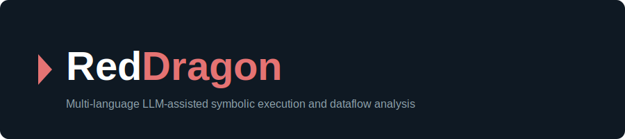
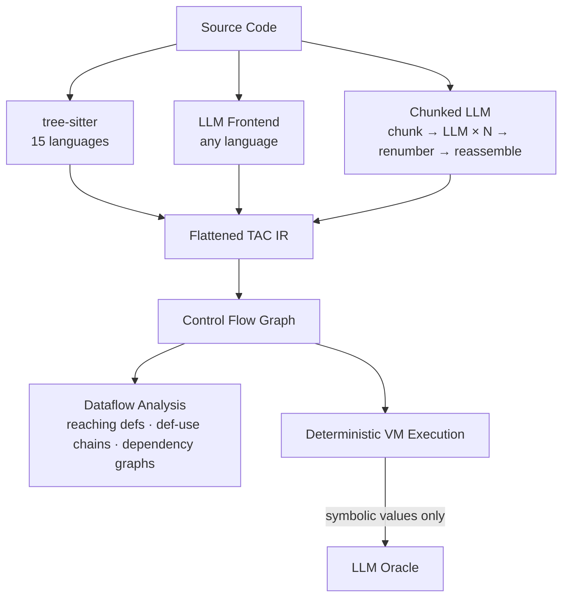
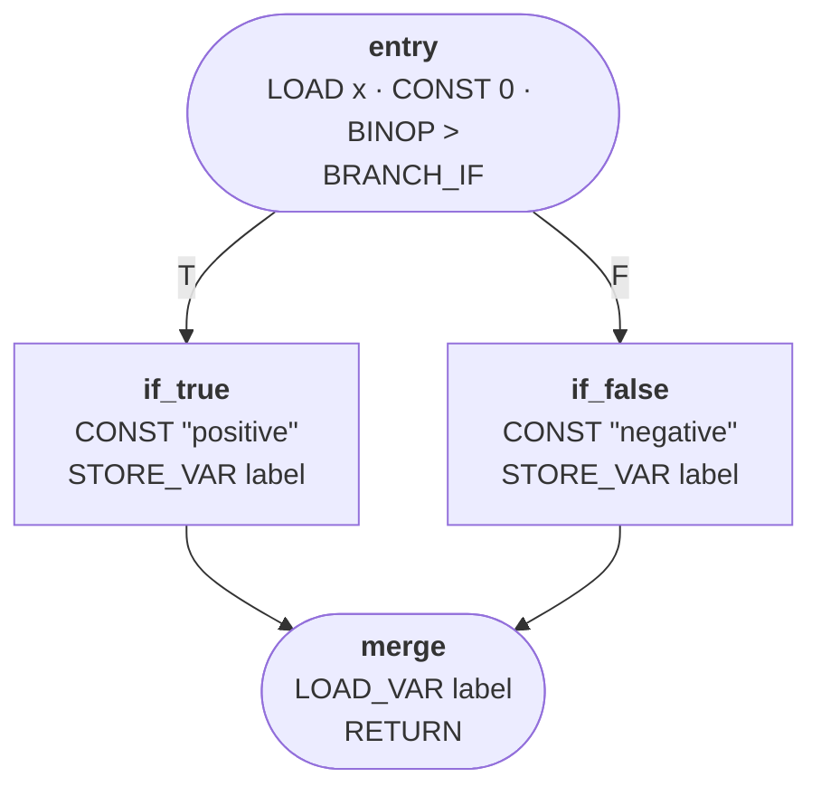

<p align="center">
  
</p>

# RedDragon

 [](presentation/index.html) [](LICENSE.md)

**RedDragon** is a multi-language source code analysis toolkit that:

- **Parses** source in 15 languages via tree-sitter, or any language via LLM-based lowering (including chunked lowering for large files)
- **Lowers** to a universal flattened three-address code IR (~19 opcodes) with structured source location traceability (every IR instruction from deterministic frontends carries its originating AST span; LLM frontends lack AST nodes and produce `NO_SOURCE_LOCATION`) — the LLM frontend uses the LLM as a **compiler frontend**, constrained by a formal IR schema with concrete patterns
- **Builds** control flow graphs from IR instructions
- **Analyses** data flow via iterative reaching definitions, def-use chains, and variable dependency graphs
- **Executes** programs symbolically via a deterministic VM — tracking data flow through incomplete programs with missing imports or unknown externals entirely without LLM calls

## How it works



For programs with concrete inputs and no external dependencies, the entire execution is **deterministic with 0 LLM calls**.

### Execution replay in Rev-Eng TUI


> Step-by-step execution replay via [Rev-Eng TUI](https://github.com/avishek-sen-gupta/reddragon-codescry-tui) — IR with current instruction highlighted, Frame (registers + locals) and Heap (objects + path conditions) in side-by-side panes.

## Setup

Requires Python >= 3.10 and [Poetry](https://python-poetry.org/).

```bash
poetry install
```

Set your API key for the LLM backend (only needed for `--frontend llm` or when execution encounters symbolic values):

```bash
export ANTHROPIC_API_KEY=sk-...          # for Claude (default)
export OPENAI_API_KEY=sk-...             # for OpenAI
export HUGGING_FACE_API_TOKEN=hf_...     # for HuggingFace Inference Endpoints
# Ollama requires no API key (runs locally at localhost:11434)
```

## Usage

```bash
poetry run python interpreter.py myfile.py -v            # run on a file
poetry run python interpreter.py myfile.py --ir-only      # inspect IR only
poetry run python interpreter.py myfile.py --cfg-only     # inspect CFG only
poetry run python interpreter.py example.js -l javascript  # non-Python source
poetry run python interpreter.py myfile.py -f llm -v       # LLM frontend
poetry run python interpreter.py myfile.py -f chunked_llm  # chunked LLM frontend
poetry run python interpreter.py example.cob -l cobol -f llm  # unsupported language via LLM
poetry run python interpreter.py myfile.py --mermaid        # output CFG as Mermaid flowchart
poetry run python interpreter.py myfile.py --mermaid --function foo  # CFG for a single function
```

| Flag | Description |
|------|-------------|
| `-v` | Print IR, CFG, and step-by-step execution |
| `-l` | Source language (default: `python`) |
| `-b` | LLM backend: `claude`, `openai`, `ollama`, `huggingface` (default: `claude`) |
| `-n` | Maximum interpretation steps (default: 100) |
| `-f` | Frontend: `deterministic`, `llm`, `chunked_llm` (default: `deterministic`) |
| `--ir-only` | Print the IR and exit |
| `--cfg-only` | Print the CFG and exit |
| `--mermaid` | Output CFG as a Mermaid flowchart diagram and exit |
| `--function` | Extract CFG for a single function (use with `--mermaid` or `--cfg-only`) |

## Supported languages

15 deterministic tree-sitter frontends (0 LLM calls, sub-millisecond latency):

Python, JavaScript, TypeScript, Java, Ruby, Go, PHP, C#, C, C++, Rust, Kotlin, Scala, Lua, Pascal

Control flow constructs (if/else, while, for, for-of/foreach, switch, break/continue, try/catch/finally, do-while) are lowered into real LABEL+BRANCH IR rather than `SYMBOLIC` placeholders.

<details>
<summary><strong>Language-specific features</strong> (click to expand)</summary>

| Language | Supported constructs |
|----------|---------------------|
| **Python** | list/dict/set comprehensions (including nested), generator expressions, with statements, decorators, lambdas, yield/await, assert, import/from-import, walrus operator (`:=`), match statements (3.10+), delete, slicing, f-string interpolation, list patterns |
| **JS/TS** | destructuring, for-of/for-in loops, switch, do-while, new expressions, template string substitutions, regex literals, spread/sequence/yield/await expressions, function expressions, class static blocks, labeled statements, abstract classes (TS), import/export statements |
| **Ruby** | symbols, ranges, regex, lambdas, string/symbol arrays (`%w`/`%i`), case/when, modules, global/class variables, heredocs, if/unless/while/until modifiers, ternary operator, unary operators, `self`, singleton classes/methods, element reference (array indexing) |
| **PHP** | switch, do-while, match expressions, arrow functions, scoped calls (`Class::method`), namespaces, interfaces, traits, enums, static variables, goto/labels, anonymous functions (closures), null-safe access (`?->`), class constant access, property declarations, yield, heredoc/nowdoc |
| **Java** | records, instanceof, method references (`Type::method`), lambdas, class literals (`Type.class`), do-while, assert, labeled statements, synchronized blocks, static initializers, explicit constructor invocations (`super()`/`this()`), annotation type declarations, scoped identifiers (`java.lang.System`) |
| **C#** | await, yield, switch expressions (C# 8), lock, using statements, checked/fixed blocks, events, typeof, is-check, property declarations, lambdas, null-conditional access (`?.`), local functions, tuples, is-pattern expressions, array initializer expressions |
| **C** | pointer dereference/address-of, sizeof, compound literals, struct/union/enum definitions, initializer lists, goto/labels, typedef, char literals |
| **C++** | field initializer lists, delete expressions, enum class, array subscript expressions |
| **Kotlin** | do-while, object declarations (singletons), companion objects, enum classes, not-null assertion (`!!`), is-check, type aliases, elvis operator (`?:`), infix expressions, indexing expressions, type casts (`as`), conjunction/disjunction expressions, hex literals |
| **Go** | defer, go, switch/type-switch/select, channel send/receive, slices, type assertions, func literals, labeled statements, const declarations, goto |
| **Rust** | traits, enums, const/static/type items, try (`?`), await, async blocks, mod/unsafe blocks, type casts (`as`), scoped identifiers (`HashMap::new`) |
| **Scala** | for-comprehensions, traits, case classes, lazy vals, do-while, type definitions, `new` expressions, throw expressions |
| **Lua** | anonymous functions, varargs, goto/labels |
| **Pascal** | field access, array indexing, unary operators, case-of, repeat-until, set literals, const/type declarations, parenthesized expressions |

</details>

All constructs above produce real IR for proper data-flow analysis. Unsupported constructs emit `SYMBOLIC` with a descriptive hint rather than crashing. For unlisted languages, use `--frontend llm`.

## Example: CFG

```python
def classify(x):
    if x > 0:
        label = "positive"
    else:
        label = "negative"
    return label
```



Function bodies appear as subgraphs with dashed call edges (`-.->|"call"|`) connecting `CALL_FUNCTION` sites to function entry blocks. Blocks with more than 6 instructions are collapsed to show the first 4 lines, an `... (N more)` placeholder, and the terminator — keeping CFG diagrams readable without hiding critical branch/return instructions. All 15 frontends produce the same CFG shape for equivalent logic.

## Example: symbolic execution (0 LLM calls)

```python
def factorial(n):
    if n <= 1:
        return 1
    else:
        return n * factorial(n - 1)

result = factorial(5)
```

```
[step 4]  call factorial(5) → dispatch to func_factorial_0
[step 53] binop 1 <= 1 = True   ← base case
[step 56] return 1               ← unwind begins
[step 57] 2 * 1 = 2 → 3 * 2 = 6 → 4 * 6 = 24 → 5 * 24 = 120
[step 65] store_var result 120

Final state: result = 120  (67 steps, 0 LLM calls)
```

The VM also handles classes with heap allocation, method dispatch, field access, closures with shared mutable environments (capture-by-reference — mutations inside closures persist across calls and are visible to sibling closures from the same scope), and builtins (`len`, `range`, `print`, `int`, `str`, etc.) — all deterministically. The interpreter's execution engine is split into focused modules: `interpreter/vm_types.py` (VM data types), `interpreter/cfg_types.py` (CFG data types), `interpreter/run_types.py` (pipeline config/stats types), `interpreter/registry.py` (function/class registry), `interpreter/builtins.py` (built-in function table), and `interpreter/executor.py` (opcode handlers and dispatch).

## Symbolic data flow

When the interpreter encounters incomplete information (missing imports, unknown externals), it creates symbolic values rather than erroring:

- `process(items)` where `process` is unresolved → `sym_N [process(sym_M)]`
- `obj.method(arg)` on a symbolic object → `sym_N [sym_M.method(arg)]`
- `obj.field` on a symbolic object → `sym_N` (deduplicated across repeated accesses)
- `sym_0 + 1` → `sym_N [sym_0 + 1]` (symbolic arithmetic with constraints)
- `branch_if sym_0` → takes true branch, records path condition

This means data flow through programs with missing dependencies is traced entirely deterministically with **0 LLM calls**.

## Dataflow analysis

Iterative intraprocedural analysis on the CFG: **reaching definitions**, **def-use chains**, and **variable dependency graphs** (transitive closure).

### Example: dependency graph

```python
def process_order(price, quantity, tax_rate, has_discount):
    subtotal = price * quantity
    tax = subtotal * tax_rate
    if has_discount:
        discount = subtotal * 0.1
        total = subtotal + tax - discount
    else:
        total = subtotal + tax
    return total
```


`total` transitively depends on all four parameters. Dashed edge = conditional dependency.

## LLM frontend

The LLM frontend (`--frontend llm`) sends source to an LLM constrained by a formal IR schema — the LLM acts as a **compiler frontend**, not a reasoning engine. The prompt provides all 19 opcode schemas, concrete patterns for functions/classes/control flow, and a full worked example. On malformed JSON, the call is retried up to 3 times.

The **chunked LLM frontend** (`--frontend chunked_llm`) handles large files by decomposing them into per-function/class chunks via tree-sitter, lowering each independently, then renumbering registers/labels and reassembling. Failed chunks produce `SYMBOLIC` placeholders.

| Provider | Flag | Notes |
|----------|------|-------|
| Claude | `-b claude` | Best quality, requires `ANTHROPIC_API_KEY` |
| OpenAI | `-b openai` | Requires `OPENAI_API_KEY` |
| HuggingFace | `-b huggingface` | Inference Endpoints, requires `HUGGING_FACE_API_TOKEN` |
| Ollama | `-b ollama` | Local, no API key needed |

## Programmatic API

All CLI pipelines are available as composable functions — no argparse required:

```python
from interpreter import lower_source, dump_ir, build_cfg_from_source, dump_cfg, dump_mermaid, extract_function_source, ir_stats

# Parse and lower to IR
instructions = lower_source(source, language="python")

# Get IR as text
ir_text = dump_ir(source, language="python")

# Build a CFG (optionally scoped to a single function)
cfg = build_cfg_from_source(source, function_name="my_func")

# Get CFG or Mermaid text
cfg_text = dump_cfg(source)
mermaid = dump_mermaid(source, function_name="my_func")

# Extract raw source text of a named function (recursive — finds methods and nested functions)
fn_source = extract_function_source(source, "my_func", language="python")

# Get opcode frequency counts
stats = ir_stats(source, language="python")  # e.g. {"CONST": 3, "STORE_VAR": 2, "BINOP": 1}
```

### Standalone VM execution

`execute_cfg` runs a pre-built CFG without re-running the full parse → lower → build pipeline — useful for programmatic use where you build/customize the CFG and registry independently:

```python
from interpreter import execute_cfg, VMConfig
from interpreter.cfg import build_cfg
from interpreter.registry import build_registry

instructions = lower_source(source, language="python")
cfg = build_cfg(instructions)
registry = build_registry(instructions, cfg)

vm, stats = execute_cfg(cfg, "entry", registry, VMConfig(max_steps=200))
# stats.steps, stats.llm_calls, stats.final_heap_objects, ...
```

| Function | Returns | Purpose |
|---|---|---|
| `lower_source(source, language, frontend_type, backend)` | `list[IRInstruction]` | Parse + lower source to IR |
| `dump_ir(source, language, frontend_type, backend)` | `str` | IR text output |
| `build_cfg_from_source(source, language, frontend_type, backend, function_name)` | `CFG` | Parse → lower → optionally slice → build CFG |
| `dump_cfg(source, language, frontend_type, backend, function_name)` | `str` | CFG text output |
| `dump_mermaid(source, language, frontend_type, backend, function_name)` | `str` | Mermaid flowchart output |
| `ir_stats(source, language, frontend_type, backend)` | `dict[str, int]` | Opcode frequency counts |
| `extract_function_source(source, function_name, language)` | `str` | Raw source text of a named function (recursive AST walk) |
| `execute_cfg(cfg, entry_point, registry, config)` | `(VMState, ExecutionStats)` | Execute a pre-built CFG from a given entry point |
| `execute_traced(source, language, function_name, entry_point, frontend_type, backend, max_steps)` | `ExecutionTrace` | Parse → lower → CFG → execute with per-step VMState snapshots for replay |

Functions compose hierarchically: `dump_ir` calls `lower_source`; `dump_cfg` and `dump_mermaid` call `build_cfg_from_source`, which calls `lower_source`. Full execution is available via `interpreter.run()`, via `execute_cfg()` for standalone VM execution with a pre-built CFG, or via `execute_traced()` for step-by-step replay with VMState snapshots at each instruction.

## Testing

```bash
poetry run pytest tests/ -v          # all tests
poetry run pytest tests/unit/ -v     # unit tests only
poetry run pytest tests/integration/ -v  # integration tests only
```

Tests are organised into `tests/unit/` (pure logic, no I/O) and `tests/integration/` (LLM calls, databases, external repos). Unit tests use dependency injection (no real LLM calls). Covers all 15 language frontends, LLM client/frontend/chunked frontend, CFG building, dataflow analysis, closures (including mutation persistence and shared environments), symbolic execution, factory routing, and the composable API layer.

The **Rosetta cross-language test suite** (`tests/unit/rosetta/`) implements 8 classic algorithms (factorial iterative/recursive, fibonacci, GCD, bubble sort, is-prime, fizzbuzz, interprocedural calls) in all 15 languages and verifies they all produce clean, structurally consistent IR — catching frontend gaps, degenerate lowerings, and cross-language inconsistencies. Each problem tests entry label presence, minimum instruction count, zero unsupported SYMBOLIC nodes, required opcode presence, operator spot-checks, and aggregate cross-language variance. Beyond IR lowering, **VM execution verification** runs 7 algorithms (all except fizzbuzz) through the VM across all 15 executable languages and asserts correct computed results (e.g. factorial=120, fib(10)=55, gcd(48,18)=6, sorted arrays, interprocedural double_add(3,4)=14) with zero LLM fallback calls — proving cross-language semantic correctness end-to-end. All frontends emit **canonical Python-form literals** (`"None"`, `"True"`, `"False"`) in IR CONST operands — language-native forms (`nil`, `null`, `undefined`, `NULL`, `true`, `false`) are canonicalized at lowering time so the VM's `_parse_const()` handles a single canonical set. Built-in array constructors (`arrayOf`, `intArrayOf`, `Array`) enable heap-allocated array creation for Kotlin/Scala programs.

The **Exercism integration test suite** (`tests/unit/exercism/`) extends coverage by pulling canonical test data from [Exercism's problem-specifications](https://github.com/exercism/problem-specifications) and running solutions in all 15 languages. Each exercise has separate solution files per language and is parametrized across all canonical test cases — testing argument substitution, multi-case execution, and cross-language consistency. A `scripts/exercism_harvest.py` utility fetches new canonical data from GitHub.

| Exercise | Constructs tested | Cases | Lowering | Cross-lang | Execution | Total |
|----------|-------------------|-------|----------|------------|-----------|-------|
| **leap** | modulo, boolean logic, short-circuit eval | 9 | 15 | 2 | 270 | **287** |
| **collatz-conjecture** | while loop, conditional, integer division | 4 | 15 | 2 | 120 | **137** |
| **difference-of-squares** | while loop, accumulator, function composition | 9 (3 properties × 3) | 15 | 2 | 270 | **287** |
| **two-fer** | string concatenation, string literals, function call with string arg/return | 3 | 15 | 2 | 90 | **107** |
| **hamming** | string indexing, character comparison, while loop, counter, multi-arg functions | 5 | 15 | 2 | 150 | **167** |
| **reverse-string** | backward iteration, string indexing, string building char-by-char | 5 | 15 | 2 | 150 | **167** |
| **rna-transcription** | character comparison, multi-branch if, string building, char mapping | 6 | 15 | 2 | 180 | **197** |
| **perfect-numbers** | divisor loop, modulo, accumulator, three-way string return | 9 | 15 | 2 | 270 | **287** |
| **Total** | | **50** | **120** | **16** | **1500** | **1636** |

Combined with the Rosetta suite, the project has **3337 tests** (3337 passed, 2 xfailed) — all with zero LLM calls.

## Documentation

- **[VM Design Document](docs/notes-on-vm-design.md)** — Comprehensive technical deep-dive into the VM architecture: IR design, CFG construction, state model, execution engine, call dispatch, symbolic execution, closures, LLM fallback, dataflow analysis, and end-to-end worked examples with code references
- **[Frontend Design Document](docs/notes-on-frontend-design.md)** — Frontend subsystem architecture: Frontend ABC contract, tree-sitter parser layer, BaseFrontend dispatch table engine, all 15 language-specific frontends, LLM frontend with prompt engineering, chunked LLM frontend with register renumbering, factory routing, and lowering patterns reference
- **[Per-Language Frontend Design](docs/frontend-design/)** — Exhaustive per-language documentation of all 15 deterministic frontends: dispatch tables, overridden constants, language-specific lowering methods, canonical literal handling, and worked examples for each language
- **[Dataflow Design Document](docs/notes-on-dataflow-design.md)** — Dataflow analysis architecture: reaching definitions via GEN/KILL worklist fixpoint, def-use chain extraction, variable dependency graph construction with transitive closure, integration with IR/CFG, worked examples, and complexity analysis
- **[Architectural Decision Records](docs/architectural-design-decisions.md)** — Chronological log of key architectural decisions: IR design, deterministic VM, symbolic execution, closure semantics, LLM frontend strategy, dataflow analysis, modular package structure, and more

## See Also

- **[Codescry](https://github.com/avishek-sen-gupta/codescry)** — Repo surveying, integration detection, symbol resolution, and embedding-based signal classification
- **[Rev-Eng TUI](https://github.com/avishek-sen-gupta/reddragon-codescry-tui)** — Terminal UI that integrates Red Dragon and Codescry for interactive top-down reverse engineering of codebases
