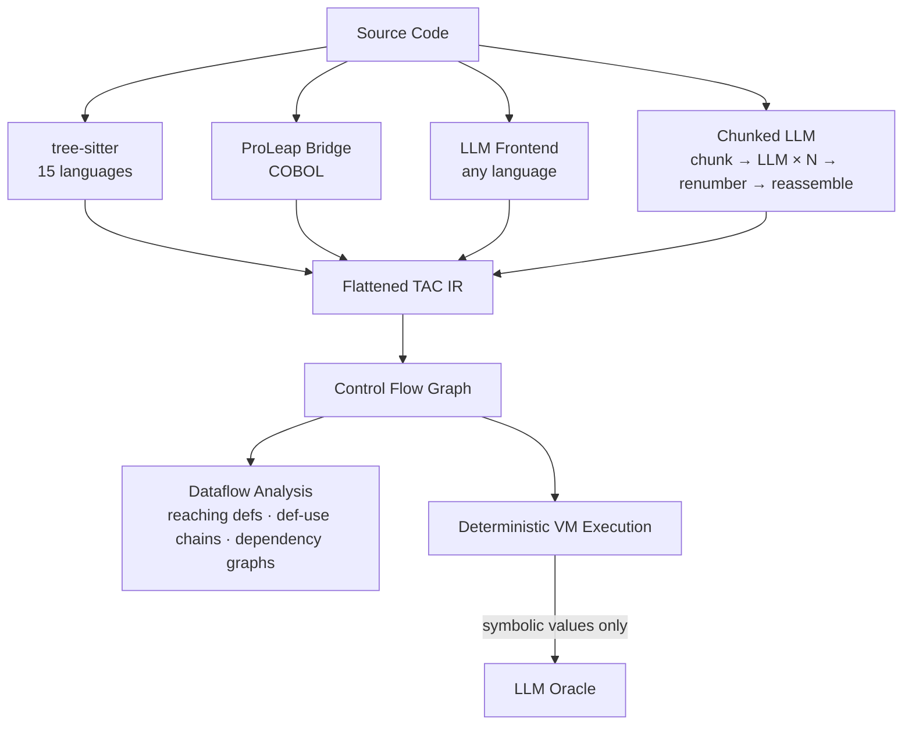
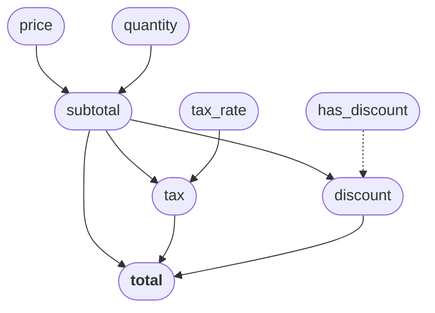

<p align="center">
  
</p>

# RedDragon

 [](presentation/index.html) [](LICENSE.md)

**RedDragon** is a multi-language source code analysis toolkit that:

- **Parses and lowers** source in 15 languages via tree-sitter, COBOL via ProLeap parser bridge, or any language via LLM-based lowering (including chunked lowering for large files) — each frontend owns its parsing internally; callers only provide `source: bytes`
- **Produces** a universal flattened three-address code IR (~27 opcodes, including 3 byte-addressed memory region opcodes and 2 named continuation opcodes) with structured source location traceability (every IR instruction from deterministic frontends carries its originating AST span; LLM frontends lack AST nodes and produce `NO_SOURCE_LOCATION`) — the LLM frontend uses the LLM as a **compiler frontend**, constrained by a formal IR schema with concrete patterns
- **Builds** control flow graphs from IR instructions
- **Analyses** data flow via iterative reaching definitions, def-use chains, and variable dependency graphs
- **Executes** programs symbolically via a deterministic VM — tracking data flow through incomplete programs with missing imports or unknown externals entirely without LLM calls — with a configurable **LLM plausible-value resolver** that can replace symbolic placeholders with concrete values for unresolved function/method calls

## How it works


```mermaid
flowchart TD
    SRC[Source Code] --> DET["tree-sitter<br>15 languages"]
    SRC --> COBOL["ProLeap Bridge<br>COBOL"]
    SRC --> LLM["LLM Frontend<br>any language"]
    SRC --> CHUNK["Chunked LLM<br>chunk → LLM × N → renumber → reassemble"]

    DET --> IR[Flattened TAC IR]
    COBOL --> IR
    LLM --> IR
    CHUNK --> IR

    IR --> CFG[Control Flow Graph]
    CFG --> DF["Dataflow Analysis<br>reaching defs · def-use chains · dependency graphs"]
    CFG --> VM[Deterministic VM Execution]
    VM -->|symbolic values only| ORACLE[LLM Oracle]
```

For programs with concrete inputs and no external dependencies, the entire execution is **deterministic with 0 LLM calls**.

### Execution replay in Rev-Eng TUI


> Step-by-step execution replay via [Rev-Eng TUI](https://github.com/avishek-sen-gupta/reddragon-codescry-tui) — IR with current instruction highlighted, Frame (registers + locals) and Heap (objects + path conditions) in side-by-side panes.

## Setup

Requires Python >= 3.10 and [Poetry](https://python-poetry.org/).

```bash
poetry install
```

### ProLeap COBOL Bridge (optional)

The COBOL frontend requires the ProLeap bridge JAR (JDK 17+, Maven). ProLeap is vendored as a git submodule:

```bash
git submodule update --init                # fetch the ProLeap submodule
cd proleap-bridge && ./build.sh            # builds ProLeap + bridge in one step
# Produces: target/proleap-bridge-0.1.0-shaded.jar
```

Standalone usage (pipe COBOL source or pass file path):

```bash
cat myprogram.cbl | java -jar proleap-bridge/target/proleap-bridge-0.1.0-shaded.jar
java -jar proleap-bridge/target/proleap-bridge-0.1.0-shaded.jar myprogram.cbl
java -jar proleap-bridge/target/proleap-bridge-0.1.0-shaded.jar -format TANDEM myprogram.cbl
```

Set your API key for the LLM backend (only needed for `--frontend llm` or when execution encounters symbolic values):

```bash
export ANTHROPIC_API_KEY=sk-...          # for Claude (default)
export OPENAI_API_KEY=sk-...             # for OpenAI
export HUGGING_FACE_API_TOKEN=hf_...     # for HuggingFace Inference Endpoints
# Ollama requires no API key (runs locally at localhost:11434)
```

## Usage

```bash
poetry run python interpreter.py myfile.py -v            # run on a file
poetry run python interpreter.py myfile.py --ir-only      # inspect IR only
poetry run python interpreter.py myfile.py --cfg-only     # inspect CFG only
poetry run python interpreter.py example.js -l javascript  # non-Python source
poetry run python interpreter.py myfile.py -f llm -v       # LLM frontend
poetry run python interpreter.py myfile.py -f chunked_llm  # chunked LLM frontend
poetry run python interpreter.py example.cob -l cobol         # COBOL via ProLeap bridge
export PROLEAP_BRIDGE_JAR=/path/to/bridge.jar                 # optional: custom bridge JAR path
poetry run python interpreter.py myfile.py --mermaid        # output CFG as Mermaid flowchart
poetry run python interpreter.py myfile.py --mermaid --function foo  # CFG for a single function
```

| Flag | Description |
|------|-------------|
| `-v` | Print IR, CFG, and step-by-step execution |
| `-l` | Source language (default: `python`) |
| `-b` | LLM backend: `claude`, `openai`, `ollama`, `huggingface` (default: `claude`) |
| `-n` | Maximum interpretation steps (default: 100) |
| `-f` | Frontend: `deterministic`, `llm`, `chunked_llm`, `cobol` (default: `deterministic`) |
| `--ir-only` | Print the IR and exit |
| `--cfg-only` | Print the CFG and exit |
| `--mermaid` | Output CFG as a Mermaid flowchart diagram and exit |
| `--function` | Extract CFG for a single function (use with `--mermaid` or `--cfg-only`) |

## Supported languages

15 deterministic tree-sitter frontends (0 LLM calls, sub-millisecond latency):

Python, JavaScript, TypeScript, Java, Ruby, Go, PHP, C#, C, C++, Rust, Kotlin, Scala, Lua, Pascal

Control flow constructs (if/else, while, for, for-of/foreach, switch, break/continue, try/catch/finally, do-while) are lowered into real LABEL+BRANCH IR rather than `SYMBOLIC` placeholders.

<details>
<summary><strong>Language-specific features</strong> (click to expand)</summary>

| Language | Supported constructs |
|----------|---------------------|
| **Python** | list/dict/set comprehensions (including nested), generator expressions, with statements, decorators, lambdas, yield/await, assert, import/from-import, walrus operator (`:=`), match statements (3.10+), delete, slicing, f-string interpolation, list/dict/splat patterns, ellipsis (`...`), splat/spread (`*args`, `**kwargs` in expressions), expression lists, dotted names |
| **JS/TS** | destructuring, for-of/for-in loops, switch, do-while, new expressions, template string substitutions, regex literals, spread/sequence/yield/await expressions, function expressions, class static blocks, labeled statements, abstract classes (TS), import/export statements, public field definitions (TS), class field definitions (`#private = 0`), export clauses (`export { a, b }`), with statements, abstract method signatures (TS), namespaces/internal modules (TS) |
| **Ruby** | symbols, ranges, regex, lambdas, string/symbol arrays (`%w`/`%i`), case/when, case/in pattern matching, modules, global/class variables, heredocs, if/unless/while/until modifiers, ternary operator, unary operators, `self`, singleton classes/methods, element reference (array indexing), string interpolation (`"Hello #{expr}"`), heredoc interpolation (`<<~HEREDOC\nHello #{expr}\nHEREDOC`), hash key symbols, `super`, `yield`, delimited symbols (`:"dynamic"`), `retry` |
| **PHP** | switch, do-while, match expressions, arrow functions, scoped calls (`Class::method`), namespaces, interfaces, traits, enums, static variables, goto/labels, anonymous functions (closures), null-safe access (`?->`), null-safe method calls (`?->method()`), class constant access, property declarations, yield, heredoc/nowdoc, string interpolation (`"Hello $name"` / `"Hello {$expr}"` / heredoc interpolation), relative scope (`self::`/`static::`), dynamic variable names (`$$x`), global declarations, include/require_once expressions, variadic unpacking (`...$arr`) |
| **Java** | records, instanceof, method references (`Type::method`), lambdas, class literals (`Type.class`), do-while, assert, labeled statements, synchronized blocks, static initializers, explicit constructor invocations (`super()`/`this()`), annotation type declarations, scoped identifiers (`java.lang.System`), switch expressions (Java 14+, including expression_statement and throw in arms) |
| **C#** | await, yield, switch expressions (C# 8), lock, using statements, checked/fixed blocks, events, typeof, is-check, property declarations, lambdas, null-conditional access (`?.`), local functions, tuples, is-pattern expressions, declaration patterns, array initializer expressions, string interpolation (`$"Hello {expr}"` — format specifiers and alignment clauses are discarded as presentation-only), record declarations, verbatim strings (`@"..."`), constant patterns, delegate declarations, implicit object creation (`new()`), LINQ query expressions (`from...where...select`) |
| **C** | pointer dereference/address-of, sizeof, compound literals, struct/union/enum definitions, initializer lists, designated initializers (`.field = value`), goto/labels, typedef, char literals, function-like macros (`#define MAX(a, b) ...`) |
| **C++** | field initializer lists, delete expressions, enum class, array subscript expressions, C++20 concepts |
| **Kotlin** | do-while, object declarations (singletons), companion objects, enum classes, not-null assertion (`!!`), is-check, type tests (`is Type` in `when`), type aliases, elvis operator (`?:`), infix expressions, indexing expressions, type casts (`as`), conjunction/disjunction expressions, hex literals, character literals, string interpolation (`"$name"` / `"${expr}"`), multi-variable destructuring (`val (a, b) = pair`), range expressions (`1..10`), anonymous object literals (`object : Type { ... }`), labels (`outer@`) |
| **Go** | defer, go, switch/type-switch/select, channel send/receive (including `select` receive statements), slices, type assertions, func literals, labeled statements, const declarations, goto, multi-name var declarations (`var a, b = 1, 2`), var blocks (`var (...)`) |
| **Rust** | traits, enums, const/static/type items, try (`?`), await, async blocks, mod/unsafe blocks, type casts (`as`), scoped identifiers (`HashMap::new`), tuple destructuring (`let (a, b) = expr`), struct destructuring (`let Point { x, y } = p`), range expressions (`0..10`, `0..=n`), match pattern unwrap, tuple struct patterns (`Some(v)`), struct patterns in match, generic/turbofish syntax (`parse::<i32>()`), `if let`/`while let` conditions, trait function signatures (`fn area(&self) -> f64;`) |
| **Scala** | for-comprehensions, traits, case classes, lazy vals, do-while, type definitions, `new` expressions, throw expressions, string interpolation (`s"$name"` / `s"${expr}"`), tuple destructuring (`val (a, b) = expr`), operator identifiers, case class patterns (`Circle(r)`), typed patterns (`i: Int`), guards (`if condition`), tuple patterns in match, abstract function declarations, infix patterns (`head :: tail`), case blocks |
| **Lua** | anonymous functions, varargs, goto/labels |
| **Pascal** | field access, array indexing, unary operators, case-of, repeat-until, set literals, const/type/uses declarations, parenthesized expressions, try/except/finally, exception handlers (`on E: Exception do`), raise, ranges (`4..10`), with statements, inherited calls |

</details>

All constructs above produce real IR for proper data-flow analysis. All 15 frontends have **zero unsupported SYMBOLIC instructions** on the two-pass audit suite (`scripts/audit_all_frontends.py`), which combines dispatch-table coverage analysis (comparing AST node types against frontend dispatch tables with block-reachability classification) and runtime SYMBOLIC detection. A separate COBOL-specific audit (`scripts/audit_cobol_frontend.py`) checks all three layers of the ProLeap pipeline (bridge serialisation, Python dispatch, frontend lowering) and produces a per-type coverage matrix across ProLeap's 51 PROCEDURE DIVISION statement types plus a DATA DIVISION coverage matrix tracking 29 features across three layers (bridge extraction, Python modelling, frontend handling) — covering sections, entry types, and clauses (PIC, USAGE variants, VALUE, REDEFINES, OCCURS, etc.). For unlisted languages, use `--frontend llm`.

### COBOL frontend

The COBOL frontend uses the [ProLeap COBOL Parser](https://github.com/uwol/proleap-cobol-parser) via a subprocess bridge (requires JDK 17). It lowers DATA DIVISION fields to byte-addressed memory regions with PIC-driven encoding/decoding, SIGN IS LEADING/TRAILING [SEPARATE CHARACTER] support, JUSTIFIED RIGHT alignment, SYNCHRONIZED natural word boundary alignment, BLANK WHEN ZERO display semantics, OCCURS DEPENDING ON variable-length arrays, level-66 RENAMES field aliasing (simple and THRU range), level-88 condition name expansion (single-value, multi-value OR, and THRU range conditions), FILLER field disambiguation, multi-value VALUE clauses, and **32 of 51** PROCEDURE DIVISION statement types to standard IR (24 fully handled + 8 I/O stub types). Internally, the frontend is decomposed into 16 focused modules (`emit_context`, `field_resolution`, `condition_lowering`, `condition_name`, `condition_name_index`, `statement_dispatch`, `lower_data_division`, `lower_procedure`, `lower_perform`, `lower_arithmetic`, `lower_string_inspect`, `lower_search`, `lower_call`, `lower_io`, `figurative_constants`, `data_layout`) — `cobol_frontend.py` is a slim ~100-line orchestrator. See the [COBOL frontend design document](docs/frontend-design/cobol.md) for full details.

| Category | Statements |
|----------|-----------|
| **Arithmetic** | MOVE, ADD, SUBTRACT, MULTIPLY, DIVIDE, COMPUTE |
| **Control flow** | IF/ELSE, EVALUATE/WHEN, PERFORM (simple/THRU/TIMES/UNTIL/VARYING), GO TO, STOP RUN |
| **No-ops** | CONTINUE, EXIT, CANCEL |
| **Data manipulation** | INITIALIZE, SET (TO / UP BY / DOWN BY) |
| **String operations** | STRING, UNSTRING, INSPECT (TALLYING / REPLACING) |
| **Table operations** | SEARCH (linear, with VARYING index and AT END), OCCURS (single-dimension arrays with literal/field subscripts) |
| **Inter-program** | CALL (symbolic, with USING/GIVING parameter passing), ENTRY, ALTER |
| **I/O (stub)** | ACCEPT, READ, WRITE, OPEN, CLOSE, REWRITE, START, DELETE — via injectable `CobolIOProvider` |

## Example: CFG

```python
def classify(x):
    if x > 0:
        label = "positive"
    else:
        label = "negative"
    return label
```


```mermaid
flowchart TD
    entry(["<b>entry</b><br>LOAD x · CONST 0 · BINOP ><br>BRANCH_IF"])
    if_true["<b>if_true</b><br>CONST &quot;positive&quot;<br>STORE_VAR label"]
    if_false["<b>if_false</b><br>CONST &quot;negative&quot;<br>STORE_VAR label"]
    merge(["<b>merge</b><br>LOAD_VAR label<br>RETURN"])

    entry -- T --> if_true
    entry -- F --> if_false
    if_true --> merge
    if_false --> merge
```

Function bodies appear as subgraphs with dashed call edges (`-.->|"call"|`) connecting `CALL_FUNCTION` sites to function entry blocks. Blocks with more than 6 instructions are collapsed to show the first 4 lines, an `... (N more)` placeholder, and the terminator — keeping CFG diagrams readable without hiding critical branch/return instructions. All 15 frontends produce the same CFG shape for equivalent logic.

## Example: symbolic execution (0 LLM calls)

```python
def factorial(n):
    if n <= 1:
        return 1
    else:
        return n * factorial(n - 1)

result = factorial(5)
```

```
[step 4]  call factorial(5) → dispatch to func_factorial_0
[step 53] binop 1 <= 1 = True   ← base case
[step 56] return 1               ← unwind begins
[step 57] 2 * 1 = 2 → 3 * 2 = 6 → 4 * 6 = 24 → 5 * 24 = 120
[step 65] store_var result 120

Final state: result = 120  (67 steps, 0 LLM calls)
```

The VM also handles classes with heap allocation, method dispatch, field access, closures with shared mutable environments (capture-by-reference — mutations inside closures persist across calls and are visible to sibling closures from the same scope), byte-addressed memory regions (`ALLOC_REGION`/`WRITE_REGION`/`LOAD_REGION` for COBOL-style REDEFINES overlays), named continuations (`SET_CONTINUATION`/`RESUME_CONTINUATION` for COBOL PERFORM return semantics), and builtins (`len`, `range`, `print`, `int`, `str`, byte-manipulation primitives, etc.) — all deterministically. The interpreter's execution engine is split into focused modules: `interpreter/vm_types.py` (VM data types), `interpreter/cfg_types.py` (CFG data types), `interpreter/run_types.py` (pipeline config/stats types), `interpreter/registry.py` (function/class registry), `interpreter/builtins.py` (built-in function table), `interpreter/executor.py` (opcode handlers and dispatch), and `interpreter/cobol/` (COBOL type system, EBCDIC tables, and IR encoder/decoder builders).

## Symbolic data flow

When the interpreter encounters incomplete information (missing imports, unknown externals), it creates symbolic values rather than erroring:

- `process(items)` where `process` is unresolved → `sym_N [process(sym_M)]`
- `obj.method(arg)` on a symbolic object → `sym_N [sym_M.method(arg)]`
- `obj.field` on a symbolic object → `sym_N` (deduplicated across repeated accesses)
- `sym_0 + 1` → `sym_N [sym_0 + 1]` (symbolic arithmetic with constraints)
- `branch_if sym_0` → takes true branch, records path condition

This means data flow through programs with missing dependencies is traced entirely deterministically with **0 LLM calls**.

### Configurable unresolved call resolution

When the VM encounters a call to an unresolved function (e.g., `math.sqrt(16)`), the default behavior creates symbolic values that propagate through subsequent computation. The `UnresolvedCallStrategy` enum controls this:

- **`SYMBOLIC`** (default) — creates symbolic placeholders: `math.sqrt(16) → sym_N`, subsequent `sym_N + 1 → sym_M` (precision death)
- **`LLM`** — makes a lightweight LLM call to get a plausible concrete value: `math.sqrt(16) → 4.0`, subsequent `4.0 + 1 = 5.0` (precision preserved), with support for side effects via `heap_writes`/`var_writes`

```python
from interpreter.run import run
from interpreter.run_types import UnresolvedCallStrategy

vm = run(source, language="python", unresolved_call_strategy=UnresolvedCallStrategy.LLM)
```

## Dataflow analysis

Iterative intraprocedural analysis on the CFG: **reaching definitions**, **def-use chains**, and **variable dependency graphs** (transitive closure).

### Example: dependency graph

```python
def process_order(price, quantity, tax_rate, has_discount):
    subtotal = price * quantity
    tax = subtotal * tax_rate
    if has_discount:
        discount = subtotal * 0.1
        total = subtotal + tax - discount
    else:
        total = subtotal + tax
    return total
```


```mermaid
flowchart TD
    price([price]) --> subtotal
    quantity([quantity]) --> subtotal
    subtotal([subtotal]) --> tax
    tax_rate([tax_rate]) --> tax
    subtotal --> discount
    has_discount([has_discount]) -.-> discount([discount])
    subtotal --> total
    tax([tax]) --> total
    discount --> total(["<b>total</b>"])
```

`total` transitively depends on all four parameters. Dashed edge = conditional dependency.

## LLM frontend

The LLM frontend (`--frontend llm`) sends source to an LLM constrained by a formal IR schema — the LLM acts as a **compiler frontend**, not a reasoning engine. The prompt provides all 19 opcode schemas, concrete patterns for functions/classes/control flow, and a full worked example. On malformed JSON, the call is retried up to 3 times.

The **chunked LLM frontend** (`--frontend chunked_llm`) handles large files by decomposing them into per-function/class chunks via tree-sitter, lowering each independently, then renumbering registers/labels and reassembling. Failed chunks produce `SYMBOLIC` placeholders.

| Provider | Flag | Notes |
|----------|------|-------|
| Claude | `-b claude` | Best quality, requires `ANTHROPIC_API_KEY` |
| OpenAI | `-b openai` | Requires `OPENAI_API_KEY` |
| HuggingFace | `-b huggingface` | Inference Endpoints, requires `HUGGING_FACE_API_TOKEN` |
| Ollama | `-b ollama` | Local, no API key needed |

## Programmatic API

All CLI pipelines are available as composable functions — no argparse required:

```python
from interpreter import lower_source, dump_ir, build_cfg_from_source, dump_cfg, dump_mermaid, extract_function_source, ir_stats
from interpreter.constants import Language

# Parse and lower to IR (Language enum or raw string)
instructions = lower_source(source, language=Language.PYTHON)
instructions = lower_source(source, language="javascript")  # strings still accepted

# Get IR as text
ir_text = dump_ir(source, language=Language.PYTHON)

# Build a CFG (optionally scoped to a single function)
cfg = build_cfg_from_source(source, function_name="my_func")

# Get CFG or Mermaid text
cfg_text = dump_cfg(source)
mermaid = dump_mermaid(source, function_name="my_func")

# Extract raw source text of a named function (recursive — finds methods and nested functions)
fn_source = extract_function_source(source, "my_func", language=Language.PYTHON)

# Get opcode frequency counts
stats = ir_stats(source, language=Language.PYTHON)  # e.g. {"CONST": 3, "STORE_VAR": 2, "BINOP": 1}
```

### Standalone VM execution

`execute_cfg` runs a pre-built CFG without re-running the full parse → lower → build pipeline — useful for programmatic use where you build/customize the CFG and registry independently:

```python
from interpreter import execute_cfg, VMConfig
from interpreter.cfg import build_cfg
from interpreter.registry import build_registry

instructions = lower_source(source, language=Language.PYTHON)
cfg = build_cfg(instructions)
registry = build_registry(instructions, cfg)

vm, stats = execute_cfg(cfg, "entry", registry, VMConfig(max_steps=200))
# stats.steps, stats.llm_calls, stats.final_heap_objects, ...
```

| Function | Returns | Purpose |
|---|---|---|
| `lower_source(source, language, frontend_type, backend)` | `list[IRInstruction]` | Parse + lower source to IR |
| `dump_ir(source, language, frontend_type, backend)` | `str` | IR text output |
| `build_cfg_from_source(source, language, frontend_type, backend, function_name)` | `CFG` | Parse → lower → optionally slice → build CFG |
| `dump_cfg(source, language, frontend_type, backend, function_name)` | `str` | CFG text output |
| `dump_mermaid(source, language, frontend_type, backend, function_name)` | `str` | Mermaid flowchart output |
| `ir_stats(source, language, frontend_type, backend)` | `dict[str, int]` | Opcode frequency counts |
| `extract_function_source(source, function_name, language)` | `str` | Raw source text of a named function (recursive AST walk) |
| `execute_cfg(cfg, entry_point, registry, config)` | `(VMState, ExecutionStats)` | Execute a pre-built CFG from a given entry point |
| `execute_traced(source, language, function_name, entry_point, frontend_type, backend, max_steps)` | `ExecutionTrace` | Parse → lower → CFG → execute with per-step VMState snapshots for replay |

Functions compose hierarchically: `dump_ir` calls `lower_source`; `dump_cfg` and `dump_mermaid` call `build_cfg_from_source`, which calls `lower_source`. Full execution is available via `interpreter.run()`, via `execute_cfg()` for standalone VM execution with a pre-built CFG, or via `execute_traced()` for step-by-step replay with VMState snapshots at each instruction.

## Testing

```bash
poetry run pytest tests/ -v          # all tests (parallel by default via pytest-xdist)
poetry run pytest tests/unit/ -v     # unit tests only
poetry run pytest tests/integration/ -v  # integration tests only
poetry run pytest tests/ -n 0 -v     # disable parallel execution
```

Tests are organised into `tests/unit/` (pure logic, no I/O) and `tests/integration/` (LLM calls, databases, external repos). Unit tests use dependency injection (no real LLM calls). Covers all 15 language frontends, LLM client/frontend/chunked frontend, CFG building, dataflow analysis, closures (including mutation persistence and shared environments, cross-language via Rosetta), class/object instantiation and field access (cross-language), exception handling structure (cross-language), symbolic execution, factory routing, and the composable API layer.

### Rosetta cross-language suite

The **Rosetta suite** (`tests/unit/rosetta/`) implements 11 cross-language test sets (8 algorithms + closures + classes + exceptions) in all 15 languages and verifies they all produce clean, structurally consistent IR. Each problem tests:

- Entry label presence and minimum instruction count
- Zero unsupported `SYMBOLIC` nodes
- Required opcode presence and operator spot-checks
- Aggregate cross-language variance

**VM execution verification** runs 7 algorithms plus closures, classes, and exceptions through the VM across all 15 languages and asserts correct computed results (factorial=120, fib(10)=55, gcd(48,18)=6, sorted arrays, interprocedural double_add(3,4)=14, closure make_adder(10)(5)=15, counter=3, try-body=-1) with zero LLM calls.

All frontends emit **canonical Python-form literals** (`"None"`, `"True"`, `"False"`) — language-native forms (`nil`, `null`, `undefined`, `NULL`, `true`, `false`) are canonicalized at lowering time.

### Exercism integration suite

The **Exercism suite** (`tests/unit/exercism/`) pulls canonical test data from [Exercism's problem-specifications](https://github.com/exercism/problem-specifications) and runs solutions in all 15 languages. Each exercise is parametrized across all canonical test cases.

<details>
<summary><strong>Exercism exercise breakdown</strong> (click to expand)</summary>

| Exercise | Constructs tested | Cases | Execution | Total |
|----------|-------------------|-------|-----------|-------|
| **leap** | modulo, boolean logic, short-circuit eval | 9 | 270 | **287** |
| **collatz-conjecture** | while loop, conditional, integer division | 4 | 120 | **137** |
| **difference-of-squares** | while loop, accumulator, function composition | 9 | 270 | **287** |
| **two-fer** | string concatenation, string literals | 3 | 90 | **107** |
| **hamming** | string indexing, character comparison, while loop | 5 | 150 | **167** |
| **reverse-string** | backward iteration, string building | 5 | 150 | **167** |
| **rna-transcription** | multi-branch if, char mapping | 6 | 180 | **197** |
| **perfect-numbers** | divisor loop, three-way return | 9 | 270 | **287** |
| **triangle** | nested ifs, validity guards, float sides | 21 | 630 | **647** |
| **space-age** | float division, string-to-number mapping | 8 | 240 | **257** |
| **grains** | exponentiation, large integers (2^63) | 8 | 240 | **257** |
| **isogram** | nested while loops, case-insensitive comparison | 14 | 420 | **437** |
| **nth-prime** | nested loops, trial division, primality testing | 3 | 90 | **107** |
| **resistor-color** | string-to-integer mapping, string equality | 3 | 90 | **107** |
| **pangram** | nested loops, letter search, toLowerChar helper | 11 | 330 | **347** |
| **bob** | string classification, multi-branch return | 22 | 616 | **633** |
| **luhn** | charToDigit helper, right-to-left traversal, modulo | 22 | 660 | **677** |
| **acronym** | toUpperChar helper, word boundary detection | 9 | 252 | **269** |
| **Total** | | **171** | **5068** | **5374** |

</details>

### COBOL frontend tests

The COBOL test suite covers ASG round-trip, typed statement hierarchy (32 types), PIC parsing, data layout, frontend lowering, PERFORM loop variants, section PERFORM, SEARCH, STRING/UNSTRING/INSPECT, CALL/ALTER/ENTRY/CANCEL lowering, I/O provider (NullIOProvider/StubIOProvider with REWRITE/START/DELETE and executor integration), parser bridge, numeric encoding (COMP-3 packed BCD, COMP/BINARY big-endian two's complement, COMP-1/COMP-2 IEEE 754 floats), SIGN clause variants (leading/trailing, embedded/separate), JUSTIFIED RIGHT alignment, SYNCHRONIZED natural alignment, OCCURS DEPENDING ON metadata, level-66 RENAMES field aliasing (simple and THRU range), level-88 condition name expansion (single-value, multi-value OR, THRU range, mixed discrete+range), condition name index, FILLER disambiguation, multi-value VALUE clauses, and end-to-end fixture tests.

### COBOL integration tests

The COBOL integration suite (`tests/integration/test_cobol_programs.py`) exercises the full pipeline from real `.cbl` source code through the ProLeap Java bridge, ASG construction, IR lowering, CFG building, and VM execution. 62 tests cover initial values, ADD/SUBTRACT (including GIVING), MULTIPLY/DIVIDE (including GIVING), COMPUTE, MOVE, IF/ELSE, PERFORM TIMES/UNTIL/VARYING, nested PERFORM, GO TO, EVALUATE/WHEN, string moves, INITIALIZE, SET TO/UP BY/DOWN BY, SEARCH with WHEN, INSPECT TALLYING/REPLACING, CALL, STRING concatenation, UNSTRING splitting, OCCURS (elementary MOVE, field subscript, PERFORM VARYING loop), level-88 condition names (single/multi-value, THRU ranges, mixed discrete+range, true/false branches), EVALUATE TRUE with condition names, PERFORM UNTIL with condition names, FILLER field disambiguation, and BLANK WHEN ZERO. A separate E2E feature suite (`test_cobol_e2e_features.py`) exercises multi-feature composition: all arithmetic forms in one program, control-flow composition, string operations, level-88 conditions, paragraph PERFORMs, OCCURS with subscripts, and BLANK WHEN ZERO. Tests skip gracefully when the ProLeap bridge JAR is not available.

### Test totals

**8266 tests** (8204 unit + 62 integration passed, 4 skipped, 3 xfailed) — all with zero LLM calls.

## Documentation

- **[VM Design Document](docs/notes-on-vm-design.md)** — Comprehensive technical deep-dive into the VM architecture: IR design, CFG construction, state model, execution engine, call dispatch, symbolic execution, closures, LLM fallback, dataflow analysis, and end-to-end worked examples with code references
- **[Frontend Design Document](docs/notes-on-frontend-design.md)** — Frontend subsystem architecture: Frontend ABC contract, tree-sitter parser layer, BaseFrontend dispatch table engine, all 15 language-specific frontends, LLM frontend with prompt engineering, chunked LLM frontend with register renumbering, factory routing, and lowering patterns reference
- **[Per-Language Frontend Design](docs/frontend-design/)** — Exhaustive per-language documentation of all 15 deterministic frontends and the COBOL frontend: dispatch tables, overridden constants, language-specific lowering methods, canonical literal handling, and worked examples for each language
- **[COBOL Frontend Design](docs/frontend-design/cobol.md)** — ProLeap bridge architecture, PIC-driven encoding, 20-statement coverage matrix, PERFORM continuation semantics, SEARCH/STRING/INSPECT lowering patterns
- **[Dataflow Design Document](docs/notes-on-dataflow-design.md)** — Dataflow analysis architecture: reaching definitions via GEN/KILL worklist fixpoint, def-use chain extraction, variable dependency graph construction with transitive closure, integration with IR/CFG, worked examples, and complexity analysis
- **[Architectural Decision Records](docs/architectural-design-decisions.md)** — Chronological log of key architectural decisions: IR design, deterministic VM, symbolic execution, closure semantics, LLM frontend strategy, dataflow analysis, modular package structure, and more

## See Also

- **[Codescry](https://github.com/avishek-sen-gupta/codescry)** — Repo surveying, integration detection, symbol resolution, and embedding-based signal classification
- **[Rev-Eng TUI](https://github.com/avishek-sen-gupta/reddragon-codescry-tui)** — Terminal UI that integrates Red Dragon and Codescry for interactive top-down reverse engineering of codebases
