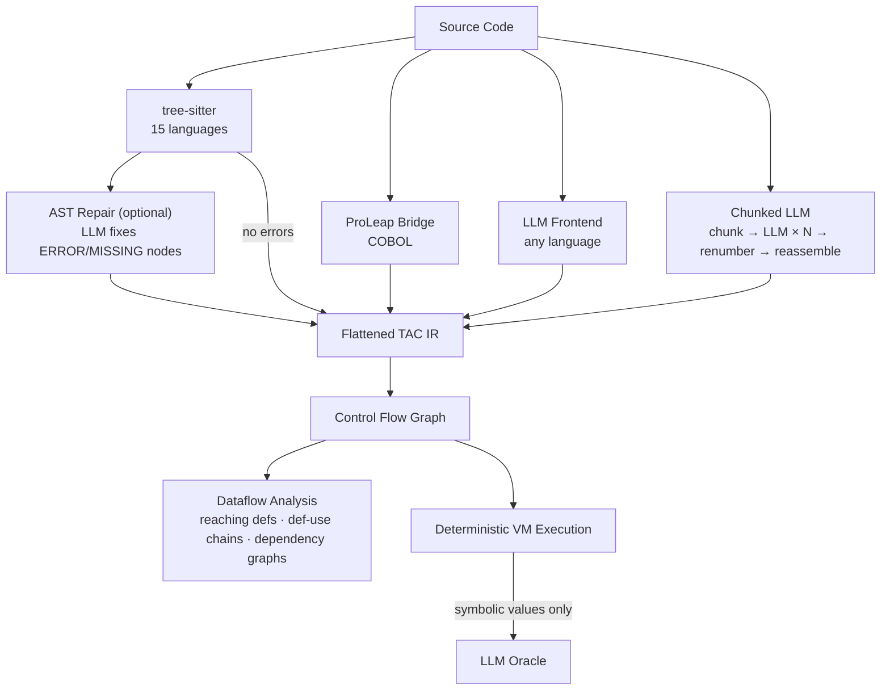
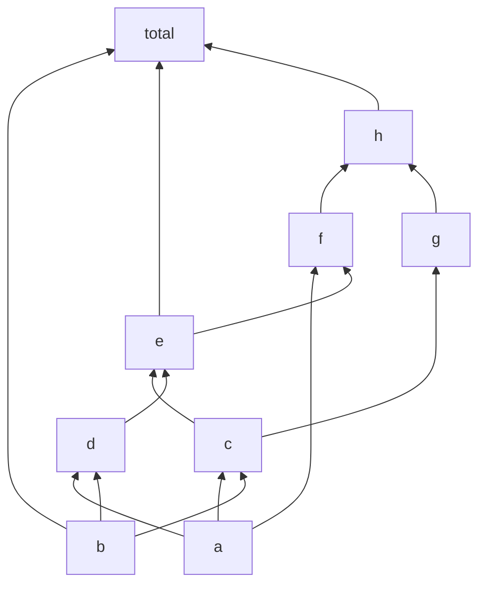

<p align="center">
  
</p>

# RedDragon

 [](presentation/technical-presentation.html) [](presentation/overview-presentation.html) [](LICENSE.md)

**RedDragon** is an experiment in building infrastructure for **"executing" frequently-incomplete code** — the kind found in legacy code, decompiled binaries, partial extracts, and codebases with missing dependencies. It explores three ideas:

1. **Deterministic language frontends with LLM-assisted repair** — tree-sitter frontends (15 languages) and a ProLeap bridge (COBOL) handle well-formed source deterministically. When tree-sitter hits malformed syntax, an optional **LLM repair loop** fixes only the broken fragments and re-parses, maximising deterministic coverage for real-world incomplete code. All paths produce the same universal [34-opcode IR](docs/ir-reference.md).
2. **Full LLM frontends for unsupported languages** — for languages without a tree-sitter frontend, an LLM lowers source to IR entirely — supporting any language without new parser code. A chunked variant splits large files into per-function chunks via tree-sitter, lowering each independently. Both produce the same [34-opcode IR](docs/ir-reference.md).
3. **A VM that integrates LLMs to produce plausible state changes** when execution hits missing dependencies, unresolved imports, or unknown externals — keeping execution moving through incomplete programs instead of halting at the first unknown.

When source is complete and all dependencies are present, the entire pipeline (parse → lower → execute) is **deterministic with 0 LLM calls**. LLMs are only invoked at the boundaries where information is genuinely missing.

**Note that "execution" is a tricky concept, when dealing with these many languages.** It is important to cover the big-ticket features of the supported languages, but this project makes no claims to cover all features of every language exhaustively, because that would imply (potentially) writing full-fledged compiler frontends for every language. I have taken some liberties in terms of how some of the language features are implemented at a global / language level, and I hope that this will not detract from the inherent usefulness of this toolkit.

Concretely, RedDragon does the following:

- **Parses and lowers** source in 15 languages via tree-sitter (with optional LLM-assisted repair), COBOL via ProLeap bridge, or **any language** via full LLM-based lowering — each frontend owns its parsing internally; callers only provide `source: bytes`
- **Produces** a universal flattened three-address code [IR (34 opcodes)](docs/ir-reference.md) with structured source location traceability
- **Extracts and infers types** — see [Type system](#type-system) below
- **Builds** control flow graphs from IR instructions
- **Analyses** data flow via iterative reaching definitions, def-use chains, and variable dependency graphs
- **Executes** programs via a deterministic VM with **write-time type coercion** and a configurable **LLM plausible-value resolver** for unresolved calls — see [VM features](#vm-features) below

### Type system

RedDragon has a three-phase type system: **frontend extraction**, **static inference**, and **runtime coercion**. All types are represented as `TypeExpr` algebraic data types (`ScalarType`, `ParameterizedType`, `UnionType`, `FunctionType`, `TypeVar`, `UnknownType`) with no string roundtrips. 13 statically-typed frontends extract type annotations during lowering; `infer_types()` propagates types to fixpoint across 15 opcodes (covering self/this typing, generics, union widening, overload resolution, interface hierarchies, and 60+ builtin return types); and an immutable `TypeEnvironment` drives write-time coercion at runtime via pluggable `TypeConversionRules`. All VM storage (`registers`, `local_vars`, `HeapObject.fields`, `ClosureEnvironment.bindings`) stores `TypedValue` exclusively, and `_resolve_reg()` returns `TypedValue` directly — preserving parameterized type information (e.g. `pointer(scalar("Dog"))`) through the register→handler→storage pipeline.

9 block-scoped frontends use LLVM-style name mangling to disambiguate shadowed variables in nested blocks, loops, and catch clauses. Function-scoped languages (Python, JavaScript `var`, Ruby, etc.) bypass this. See the full [Type System Design Document](docs/type-system.md) for architecture, algorithms, per-opcode inference rules, and runtime coercion details.

### VM features

The VM executes programs deterministically, tracking data flow through incomplete programs with missing imports or unknown externals entirely **without LLM calls**.

- **Write-time type coercion** — coerces register values to their statically-inferred types at the point of write (e.g. Float→Int via `math.trunc` for array indices), so all downstream reads get correctly-typed values
- **Class inheritance and method resolution** — all 10 OOP frontends (Java, Python, C#, Kotlin, Ruby, JavaScript, TypeScript, Scala, PHP, C++) extract parent class information into a class symbol table (`ClassRef` dataclass with name, label, and parents). The registry pre-linearizes parent chains via BFS, and the executor walks the parent chain on method miss — enabling inherited method dispatch, method overrides, multi-level inheritance, and method overload accumulation (multiple methods with the same name preserved as `list[str]`) across all supported languages. **Overload resolution** uses a composable `OverloadResolver` (strategy + ambiguity handler): `ArityThenTypeStrategy` ranks candidates by arity distance then type compatibility score (exact=2, coercion/subtype=1, neutral=0, mismatch=-1). `DefaultTypeCompatibility` receives `TypedValue` args directly and uses `TypeGraph.is_subtype_expr()` for inheritance-aware dispatch (e.g. `foo(Dog)` beats `foo(Animal)` when passing a `Dog`), with `_COMPATIBLE_PAIRS` handling primitive coercion (Int↔Float, Bool→Int) separately from subtyping
- **Field initializer lowering** — instance field initializers (e.g. `int count = 0` in Java, `var count: Int = 0` in Kotlin, `public $count = 0` in PHP) are lowered as `STORE_FIELD` instructions prepended to every constructor body, matching how real compilers (javac, Roslyn, kotlinc, scalac) handle them. Classes without explicit constructors get a synthetic constructor (`__init__` or `__construct` for PHP). This ensures heap object fields are properly populated at construction time, enabling correct method chaining (`obj.method().method()`) across Java, C#, Kotlin, Scala, and PHP. C++ `*this` dereferences in return statements are handled transparently, passing through the `this` reference without spurious `LOAD_FIELD`. Lua table-based OOP uses a different mechanism: dotted function declarations (`function T.f()`) emit `STORE_FIELD` to populate the table, and dotted calls (`T.f()`) emit `LOAD_FIELD` + `CALL_UNKNOWN` — treating dot syntax as field access + function call rather than method dispatch (see ADR-104)
- **Property accessor interception** — Kotlin custom property accessors (`get() = field + 1`, `set(value) { field = value * 2 }`) are lowered as synthetic methods (`__get_<prop>__`, `__set_<prop>__`) with the `field` keyword resolved to raw `LOAD_FIELD`/`STORE_FIELD` on the backing field. Navigation expressions (`this.x`) are intercepted to call the getter/setter when registered. Pascal property declarations (`property Name: string read FName write SetName;`) reuse the same infrastructure: field-targeted accessors emit direct `LOAD_FIELD`/`STORE_FIELD` on the backing field, method-targeted accessors emit `CALL_METHOD` to the named procedure, and variable-to-class type tracking (`_pascal_var_types`) enables interception of dot access on external objects (`foo.Name`). The common property-accessor infrastructure in `common/property_accessors.py` is reusable by other frontends (C#, JS/TS, Scala)
- **Default parameter resolution** — a shared `__resolve_default__` IR helper function checks `len(arguments) > param_index` at runtime and returns either the caller-provided argument or the pre-evaluated default value. Wired for all 10 frontends that support default parameters (Python, JavaScript, TypeScript, Ruby, C#, C++, Kotlin, Scala, PHP, Pascal). Languages without default parameters (C, Go, Java, Rust, Lua) are excluded
- **LLM plausible-value resolver** — optionally replaces symbolic placeholders with concrete values for unresolved function/method calls

## How it works


```mermaid
flowchart TD
    SRC[Source Code] --> DET["tree-sitter<br>15 languages"]
    SRC --> COBOL["ProLeap Bridge<br>COBOL"]
    SRC --> LLM["LLM Frontend<br>any language"]
    SRC --> CHUNK["Chunked LLM<br>chunk → LLM × N → renumber → reassemble"]

    DET --> REPAIR["AST Repair (optional)<br>LLM fixes ERROR/MISSING nodes"]
    REPAIR --> IR[Flattened TAC IR]
    DET -->|no errors| IR
    COBOL --> IR
    LLM --> IR
    CHUNK --> IR

    IR --> CFG[Control Flow Graph]
    CFG --> DF["Dataflow Analysis<br>reaching defs · def-use chains · dependency graphs"]
    CFG --> VM[Deterministic VM Execution]
    VM -->|symbolic values only| ORACLE[LLM Oracle]
```

For programs with concrete inputs and no external dependencies, the entire execution is **deterministic with 0 LLM calls**.

### Execution replay in Rev-Eng TUI


> Step-by-step execution replay via [Rev-Eng TUI](https://github.com/avishek-sen-gupta/reddragon-codescry-tui) — IR with current instruction highlighted, Frame (registers + locals) and Heap (objects + path conditions) in side-by-side panes.

### Built-in pipeline visualizer

An interactive TUI for stepping through the full pipeline (source → AST → IR → CFG → execution) is included in `viz/`:

```bash
# Single-language mode
poetry run python -m viz viz/examples/pointer_demo.c -l c
poetry run python -m viz viz/examples/factorial.py -l python

# Compare mode — side-by-side across languages
poetry run python -m viz compare c:viz/examples/pointer_demo.c rust:viz/examples/pointer_demo.rs

# Lowering trace — interactive exploration of how frontend lowers AST to IR
poetry run python -m viz lower viz/examples/factorial.py -l python

# Coverage matrix — cross-language frontend handler availability
poetry run python -m viz coverage
poetry run python -m viz coverage -l python,javascript,rust
```

Six synchronized panels: **Source** (span-highlighted), **AST** (collapsible tree, toggle `a`), **IR** (grouped by CFG block), **VM State** (heap/stack/registers with diff highlighting), **CFG** (box-drawing graph, toggle `g`), and **Step** (delta summary). Arrow keys step forward/backward, space toggles auto-play, `q` quits.

The **lowering trace** mode shows four panels: source with highlighted spans, a collapsible tree of handler invocations (which handler processed which AST node), handler details (emitted IR, dispatch type, module), and the full IR output. Click any node in the trace tree to see its handler, emitted instructions, and source location.

The **coverage matrix** mode displays a cross-language grid showing which AST node types each frontend handles, distinguishing language-specific handlers (`✓`) from shared/common handlers (`✓*`). Supports filtering by node type name.

## Setup

### Prerequisites

- **Python >= 3.10**
- **Poetry**
- **JDK 17+** (COBOL frontend only)
- **Maven** (COBOL frontend only)

### Full build (including COBOL)

```bash
git clone --recurse-submodules https://github.com/avishek-sen-gupta/red-dragon.git
cd red-dragon

# 1. Python dependencies
poetry install

# 2. ProLeap COBOL bridge (requires JDK 17+ and Maven)
cd proleap-bridge && ./build.sh && cd ..
# Produces: proleap-bridge/target/proleap-bridge-0.1.0-shaded.jar

# 3. Verify
poetry run python -m pytest tests/unit/ -x -q       # unit tests (no external deps)
poetry run python -m pytest tests/integration/ -x -q # integration tests (needs ProLeap JAR)
```

### Minimal build (without COBOL)

```bash
git clone https://github.com/avishek-sen-gupta/red-dragon.git
cd red-dragon
poetry install
poetry run python -m pytest tests/unit/ -x -q
```

All 15 tree-sitter frontends and the LLM frontends work without JDK/Maven. COBOL integration tests skip gracefully when the ProLeap JAR is not present.

### ProLeap bridge standalone usage

```bash
cat myprogram.cbl | java -jar proleap-bridge/target/proleap-bridge-0.1.0-shaded.jar
java -jar proleap-bridge/target/proleap-bridge-0.1.0-shaded.jar myprogram.cbl
java -jar proleap-bridge/target/proleap-bridge-0.1.0-shaded.jar -format TANDEM myprogram.cbl
```

### LLM API keys (optional)

Only needed for `--frontend llm` or when execution encounters symbolic values:

```bash
export ANTHROPIC_API_KEY=sk-...          # for Claude (default)
export OPENAI_API_KEY=sk-...             # for OpenAI
export HUGGING_FACE_API_TOKEN=hf_...     # for HuggingFace Inference Endpoints
# Ollama requires no API key (runs locally at localhost:11434)
```

## Usage

```bash
poetry run python interpreter.py myfile.py -v            # run on a file
poetry run python interpreter.py myfile.py --ir-only      # inspect IR only
poetry run python interpreter.py myfile.py --cfg-only     # inspect CFG only
poetry run python interpreter.py example.js -l javascript  # non-Python source
poetry run python interpreter.py myfile.py -f llm -v       # LLM frontend
poetry run python interpreter.py myfile.py -f chunked_llm  # chunked LLM frontend
poetry run python interpreter.py example.cob -l cobol         # COBOL via ProLeap bridge
export PROLEAP_BRIDGE_JAR=/path/to/bridge.jar                 # optional: custom bridge JAR path
poetry run python interpreter.py myfile.py --mermaid        # output CFG as Mermaid flowchart
poetry run python interpreter.py myfile.py --mermaid --function foo  # CFG for a single function
```

| Flag | Description |
|------|-------------|
| `-v` | Print IR, CFG, and step-by-step execution |
| `-l` | Source language (default: `python`) |
| `-b` | LLM backend: `claude`, `openai`, `ollama`, `huggingface` (default: `claude`) |
| `-n` | Maximum interpretation steps (default: 100) |
| `-f` | Frontend: `deterministic`, `llm`, `chunked_llm`, `cobol` (default: `deterministic`) |
| `--ir-only` | Print the IR and exit |
| `--cfg-only` | Print the CFG and exit |
| `--mermaid` | Output CFG as a Mermaid flowchart diagram and exit |
| `--function` | Extract CFG for a single function (use with `--mermaid` or `--cfg-only`) |

### Programmatic API

All CLI pipelines are available as composable functions — no argparse required.

#### Deterministic (no LLM calls)

```python
from interpreter import lower_source, lower_and_infer, dump_ir, build_cfg_from_source, dump_cfg, dump_mermaid, extract_function_source, ir_stats, run
from interpreter.constants import Language

source = """
def factorial(n):
    if n <= 1:
        return n
    return n * factorial(n - 1)
result = factorial(6)
"""

# Parse and lower to IR via tree-sitter (0 LLM calls)
instructions = lower_source(source, language=Language.PYTHON)
instructions = lower_source(source, language="javascript")  # strings still accepted

# Get IR as text
ir_text = dump_ir(source, language=Language.PYTHON)

# Build a CFG (optionally scoped to a single function)
cfg = build_cfg_from_source(source, function_name="factorial")

# Get CFG or Mermaid text
cfg_text = dump_cfg(source)
mermaid = dump_mermaid(source, function_name="factorial")

# Extract raw source text of a named function (recursive — finds methods and nested functions)
fn_source = extract_function_source(source, "factorial", language=Language.PYTHON)

# Lower + type inference in one call (propagates frontend type seeds)
instructions, env = lower_and_infer(source, language=Language.PYTHON)
print(env.var_types)         # {"result": "Int", ...}
print(env.get_func_signature("factorial"))  # FunctionSignature(params=(...), return_type="Int")

# Get opcode frequency counts
stats = ir_stats(source, language=Language.PYTHON)  # e.g. {"CONST": 3, "STORE_VAR": 2, ...}

# Full pipeline: parse → lower → CFG → execute (deterministic, 0 LLM calls)
vm = run(source, language=Language.PYTHON, verbose=True)
frame = vm.call_stack[0]
print(frame.local_vars["result"])  # 720
```

#### With LLM calls

```python
from interpreter import lower_source, run
from interpreter.constants import Language
from interpreter import constants
from interpreter.run_types import UnresolvedCallStrategy

# LLM frontend: the LLM acts as a compiler frontend, lowering source to IR
# Works for any language, even those without a tree-sitter frontend
instructions = lower_source(
    "x = math.sqrt(16)\ny = x + 1\n",
    language=Language.PYTHON,
    frontend_type=constants.FRONTEND_LLM,       # or "chunked_llm" for large files
    backend="claude",                            # or "openai", "ollama", "huggingface"
)

# LLM resolver: deterministic frontend + LLM resolves external/missing dependencies
# math.sqrt and math.floor are external — the LLM provides plausible concrete values
vm = run(
    "import math\nx = math.sqrt(16)\ny = math.floor(7.8)\n",
    language=Language.PYTHON,
    unresolved_call_strategy=UnresolvedCallStrategy.LLM,
    backend="claude",
)
frame = vm.call_stack[0]
print(frame.local_vars["x"])  # 4.0 (resolved by LLM)
print(frame.local_vars["y"])  # 7   (resolved by LLM)

# LLM frontend for an unsupported language (no tree-sitter frontend needed)
from interpreter.llm_client import get_llm_client
from interpreter.llm_frontend import LLMFrontend
from interpreter.constants import LLMProvider
from interpreter.cfg import build_cfg
from interpreter.registry import build_registry
from interpreter import execute_cfg, VMConfig

haskell_source = "factorial 0 = 1\nfactorial n = n * factorial (n - 1)\nx = factorial 5\n"
llm_client = get_llm_client(provider=LLMProvider.CLAUDE)  # or "claude" (StrEnum)
frontend = LLMFrontend(llm_client=llm_client, language="haskell")
instructions = frontend.lower(haskell_source.encode("utf-8"))

cfg = build_cfg(instructions)
registry = build_registry(instructions, cfg)
vm, stats = execute_cfg(cfg, cfg.entry, registry, VMConfig(max_steps=200))
```

#### Standalone VM execution

`execute_cfg` runs a pre-built CFG without re-running the full parse → lower → build pipeline — useful for programmatic use where you build/customize the CFG and registry independently:

```python
from interpreter import lower_source, execute_cfg, VMConfig
from interpreter.constants import Language
from interpreter.cfg import build_cfg
from interpreter.registry import build_registry

instructions = lower_source(source, language=Language.PYTHON)
cfg = build_cfg(instructions)
registry = build_registry(instructions, cfg)

vm, stats = execute_cfg(cfg, "entry", registry, VMConfig(max_steps=200))
# stats.steps, stats.llm_calls, stats.final_heap_objects, ...
```

| Function | Returns | Purpose |
|---|---|---|
| `lower_source(source, language, frontend_type, backend)` | `list[IRInstruction]` | Parse + lower source to IR |
| `lower_and_infer(source, language, frontend_type, backend)` | `(list[IRInstruction], TypeEnvironment)` | Lower + type inference with frontend type seeds |
| `dump_ir(source, language, frontend_type, backend)` | `str` | IR text output |
| `build_cfg_from_source(source, language, frontend_type, backend, function_name)` | `CFG` | Parse → lower → optionally slice → build CFG |
| `dump_cfg(source, language, frontend_type, backend, function_name)` | `str` | CFG text output |
| `dump_mermaid(source, language, frontend_type, backend, function_name)` | `str` | Mermaid flowchart output |
| `ir_stats(source, language, frontend_type, backend)` | `dict[str, int]` | Opcode frequency counts |
| `extract_function_source(source, function_name, language)` | `str` | Raw source text of a named function (recursive AST walk) |
| `execute_cfg(cfg, entry_point, registry, config)` | `(VMState, ExecutionStats)` | Execute a pre-built CFG from a given entry point |
| `execute_traced(source, language, function_name, entry_point, frontend_type, backend, max_steps)` | `ExecutionTrace` | Parse → lower → CFG → execute with per-step VMState snapshots for replay |

Functions compose hierarchically: `dump_ir` calls `lower_source`; `dump_cfg` and `dump_mermaid` call `build_cfg_from_source`, which calls `lower_source`. Full execution is available via `interpreter.run()`, via `execute_cfg()` for standalone VM execution with a pre-built CFG, or via `execute_traced()` for step-by-step replay with VMState snapshots at each instruction.

## Supported languages

15 deterministic tree-sitter frontends (0 LLM calls):

Python, JavaScript, TypeScript, Java, Ruby, Go, PHP, C#, C, C++, Rust, Kotlin, Scala, Lua, Pascal

Control flow constructs (if/else, while, for, for-of/foreach, switch, break/continue, try/catch/finally, do-while) are lowered into real LABEL+BRANCH IR rather than `SYMBOLIC` placeholders. For-each style loops (for-of, for-in, range-for, enhanced-for) use DECL_VAR/LOAD_VAR for the loop index counter so that SSA-immutable registers correctly advance each iteration. Built-in functions `len()` and `keys()` produce concrete results from heap objects, and Lua `ipairs()`/`pairs()` wrappers are stripped at lowering time, ensuring all for-each loops terminate correctly.

<details>
<summary><strong>Language-specific features</strong> (click to expand)</summary>

| Language | Supported constructs |
|----------|---------------------|
| **Python** | list/dict/set comprehensions (including nested), generator expressions, with statements, decorators, lambdas, yield/await, assert, import/from-import, walrus operator (`:=`), match statements (3.10+), delete, slicing, f-string interpolation, list/dict/splat patterns, ellipsis (`...`), splat/spread (`*args`, `**kwargs` in expressions), expression lists, dotted names |
| **JS/TS** | destructuring (including rest patterns `[a, ...rest]` and `{a, ...rest}`), for-of/for-in loops, switch, do-while, new expressions, template string substitutions, regex literals, spread/sequence/yield/await expressions, function expressions, class static blocks, labeled statements, abstract classes (TS), import/export statements, public field definitions (TS), class field definitions (`#private = 0`), export clauses (`export { a, b }`), with statements, abstract method signatures (TS), namespaces/internal modules (TS) |
| **Ruby** | symbols, ranges, regex, lambdas, string/symbol arrays (`%w`/`%i`), case/when, case/in pattern matching, modules, global/class variables, heredocs, if/unless/while/until modifiers, ternary operator, unary operators, `self`, singleton classes/methods, element reference (array indexing), string interpolation (`"Hello #{expr}"`), heredoc interpolation (`<<~HEREDOC\nHello #{expr}\nHEREDOC`), hash key symbols, `super`, `yield`, delimited symbols (`:"dynamic"`), `retry`, class instantiation (`Counter.new()`), instance variable field semantics (`@var` → `LOAD_FIELD`/`STORE_FIELD`), `initialize` → `__init__` constructor mapping, scope resolution (`Module::Class`), rescue modifier (`expr rescue fallback`), array slicing (`arr[1..3]` inclusive, `arr[1...3]` exclusive, `arr[start, length]` positional) |
| **PHP** | switch, do-while, match expressions, arrow functions, scoped calls (`Class::method`), namespaces, interfaces, traits, enums, static variables, goto/labels, anonymous functions (closures), null-safe access (`?->`), null-safe method calls (`?->method()`), class constant access, property declarations, yield, heredoc/nowdoc, string interpolation (`"Hello $name"` / `"Hello {$expr}"` / heredoc interpolation), relative scope (`self::`/`static::`), dynamic variable names (`$$x`), global declarations, include/require_once expressions, variadic unpacking (`...$arr`), `print` intrinsic, `clone` expressions, `const` declarations, error suppression (`@expr`), `exit`/`die`, `declare`, `unset` |
| **Java** | records, instanceof, method references (`Type::method`), lambdas, class literals (`Type.class`), do-while, assert, labeled statements, synchronized blocks, static initializers, explicit constructor invocations (`super()`/`this()`), annotation type declarations, scoped identifiers (`java.lang.System`), switch expressions (Java 14+, including expression_statement, throw in arms, and `yield` in block arms), hex floating point literals (`0x1.0p10`) |
| **C#** | await, yield, switch expressions (C# 8), lock, using statements, checked/fixed blocks, events, typeof, is-check, property declarations, lambdas, null-conditional access (`?.`), local functions, tuples, is-pattern expressions, declaration patterns, array initializer expressions, string interpolation (`$"Hello {expr}"` — format specifiers and alignment clauses are discarded as presentation-only), record declarations, verbatim strings (`@"..."`), constant patterns, delegate declarations, implicit object creation (`new()`), LINQ query expressions (`from...where...select`), throw expressions (`x ?? throw new ...`), goto/labeled statements, `default` expressions, `sizeof` expressions, `checked`/`unchecked` expressions, `out`/`ref`/`in` parameter modifiers with pass-by-reference semantics (callee writes propagate to caller via ADDRESS_OF/Pointer infrastructure) |
| **C** | pointer dereference/address-of, function pointers (`int (*fp)(int,int) = &add; (*fp)(3,5)`) including function-pointer return types (`int (*get_op(int))(int,int)`), struct pointers with arrow operator (`p->x`, pass-by-pointer, linked structures), sizeof, compound literals, struct/union/enum definitions, initializer lists (positional and designated), struct-aware initializer lists (`struct Node n = {3, 0}` and `{.value = 3}` emit `NEW_OBJECT` + `STORE_FIELD`), goto/labels, typedef, char literals, function-like macros (`#define MAX(a, b) ...`), `extern "C"` linkage specifications |
| **C++** | lambda expressions (closures), field initializer lists, delete expressions, enum class, array subscript expressions, C++20 concepts, constructor field storage (VM-injected `this`), C++17 structured bindings (`auto [a, b] = expr;`) |
| **Kotlin** | do-while, object declarations (singletons), companion objects, enum classes, not-null assertion (`!!`), is-check, type tests (`is Type` in `when`), type aliases, elvis operator (`?:`) with short-circuit throw, infix expressions, indexing expressions, type casts (`as`), conjunction/disjunction expressions, hex literals, character literals, string interpolation (`"$name"` / `"${expr}"`), multi-variable destructuring (`val (a, b) = pair`), range expressions (`1..10`), anonymous object literals (`object : Type { ... }`), anonymous function expressions (`fun(x: Int): Int { ... }`), `when` as statement and expression, labels (`outer@`), unsigned literals (`42u`, `42UL`), callable references (`::functionName`), spread expressions (`*array`), wildcard imports (`import foo.*`), `subList`/`substring` method builtins, primary constructor `val` params (`class Node(val x: Int)`) |
| **Go** | defer, go, switch/type-switch/select, channel send/receive (including `select` receive statements), slices, type assertions, func literals, labeled statements, const declarations, goto, multi-name var declarations (`var a, b = 1, 2`), var blocks (`var (...)`), type conversions (`int(x)`, `[]byte(s)`), generic types (`Foo[int]`), rune literals (`'a'`), blank identifier (`_`), fallthrough (no-op) |
| **Rust** | closures (`\|x\| expr`), traits, enums, const/static/type items, try (`?`), await, async blocks, mod/unsafe blocks, type casts (`as`), scoped identifiers (`HashMap::new`), tuple destructuring (`let (a, b) = expr`), struct destructuring (`let Point { x, y } = p`), range expressions and slicing (`arr[0..10]`, `arr[0..=n]`), match pattern unwrap, tuple struct patterns (`Some(v)`), struct patterns in match, or-patterns in match (`1 \| 2 => ...`), generic/turbofish syntax (`parse::<i32>()`), `if let`/`while let` conditions, trait function signatures (`fn area(&self) -> f64;`), unit expression (`()`), raw string literals (`r"..."`, `r#"..."#`), negative literals in match patterns (`-1 => ...`), Box auto-deref (`Box::new(x).field` and `Box::new(x).method()` delegate through `__method_missing__` / `__boxed__` chain including `Box<Box<T>>` multi-level) |
| **Scala** | for-comprehensions, traits, case classes, lazy vals, do-while, type definitions, `new` expressions with argument passing, throw expressions, string interpolation (`s"$name"` / `s"${expr}"`), tuple destructuring (`val (a, b) = expr`), operator identifiers, case class patterns (`Circle(r)`), typed patterns (`i: Int`), guards (`if condition`), tuple patterns in match, abstract function declarations, infix patterns (`head :: tail`), case blocks, generic/parameterized calls (`foo[Int](x)`), postfix expressions (`list sorted`), stable type identifiers (`pkg.Class`), export declarations (Scala 3), array indexing (`arr(i)` read/write via apply semantics), primary constructor `val` params (`class Node(val x: Int)`) |
| **Lua** | anonymous functions, varargs, goto/labels, method calls (`obj:method()`), dotted function declarations (`function T.f()` emits STORE_FIELD), dotted function calls (`T.f()` emits LOAD_FIELD + CALL_UNKNOWN) |
| **Pascal** | nested functions, field access, array indexing, unary operators, case-of, repeat-until, set literals, const/type/uses declarations, parenthesized expressions, try/except/finally, exception handlers (`on E: Exception do`), raise, ranges (`4..10`), with statements, inherited calls, for-in loops, goto/labels, class declarations, property declarations (`property Name: string read FName write SetName;` with field/method accessor support) |

</details>

## Example: CFG

```python
def classify(x):
    if x > 0:
        label = "positive"
    else:
        label = "negative"
    return label
```


```mermaid
flowchart TD
    entry(["<b>entry</b><br>LOAD x · CONST 0 · BINOP ><br>BRANCH_IF"])
    if_true["<b>if_true</b><br>CONST &quot;positive&quot;<br>STORE_VAR label"]
    if_false["<b>if_false</b><br>CONST &quot;negative&quot;<br>STORE_VAR label"]
    merge(["<b>merge</b><br>LOAD_VAR label<br>RETURN"])

    entry -- T --> if_true
    entry -- F --> if_false
    if_true --> merge
    if_false --> merge
```

Function bodies appear as subgraphs with dashed call edges (`-.->|"call"|`) connecting `CALL_FUNCTION` sites to function entry blocks. Blocks with more than 6 instructions are collapsed to show the first 4 lines, an `... (N more)` placeholder, and the terminator — keeping CFG diagrams readable without hiding critical branch/return instructions. All 15 frontends produce the same CFG shape for equivalent logic.

## Example: deterministic execution (0 LLM calls)

```python
def factorial(n):
    if n <= 1:
        return 1
    else:
        return n * factorial(n - 1)

result = factorial(5)
```

```
[step 4]  call factorial(5) → dispatch to func_factorial_0
[step 53] binop 1 <= 1 = True   ← base case
[step 56] return 1               ← unwind begins
[step 57] 2 * 1 = 2 → 3 * 2 = 6 → 4 * 6 = 24 → 5 * 24 = 120
[step 65] store_var result 120

Final state: result = 120  (67 steps, 0 LLM calls)
```

The VM also handles — all deterministically:

- **Classes & Arrays** — heap allocation via `Pointer(base, offset)` with parameterized types (`Pointer[ClassName]`, `Pointer[ElementType]`), method dispatch with overload resolution (arity + type + subtype-aware scoring via TypeGraph), field access
- **Closures** — shared mutable environments (capture-by-reference); mutations persist across calls and are visible to sibling closures
- **Byte-addressed memory regions** — `ALLOC_REGION`/`WRITE_REGION`/`LOAD_REGION` for COBOL-style REDEFINES overlays
- **Named continuations** — `SET_CONTINUATION`/`RESUME_CONTINUATION` for COBOL PERFORM return semantics
- **Data layout preservation** — COBOL field names, offsets, lengths, and type metadata attached to `VMState.data_layout` after execution
- **Builtins** — `len`, `range`, `print`, `int`, `str`, `slice`, `arrayOf`/`listOf`, byte-manipulation primitives, etc. Method builtins (`subList`, `substring`, `slice`) dispatch through `METHOD_TABLE` for Kotlin/Java-style collection operations. All builtins return a `BuiltinResult(value, new_objects, heap_writes)` (defined in `vm_types.py`) instead of raw values — no builtin directly mutates `vm.heap`. Heap mutations are expressed as data in the result and applied uniformly via `StateUpdate`, keeping builtins pure and side-effect-free.

The execution engine is split into focused modules: `vm_types.py`, `cfg_types.py`, `run_types.py`, `registry.py`, `builtins.py`, `executor.py` (opcode handlers), and `cobol/` (COBOL type system, EBCDIC tables, IR encoder/decoder builders).

## Handling incomplete programs

When the interpreter encounters incomplete information (missing imports, unknown externals), it creates symbolic placeholder values rather than erroring:

- `process(items)` where `process` is unresolved → `sym_N [process(sym_M)]`
- `obj.method(arg)` on a symbolic object → `sym_N [sym_M.method(arg)]`
- `obj.field` on a symbolic object → `sym_N` (deduplicated across repeated accesses)
- `sym_0 + 1` → `sym_N [sym_0 + 1]` (symbolic arithmetic with constraints)
- `branch_if sym_0` → takes true branch, records path condition

This means data flow through programs with missing dependencies is traced entirely deterministically with **0 LLM calls**.

### Configurable unresolved call resolution

When the VM encounters a call to an unresolved function (e.g., `math.sqrt(16)`), the default behavior creates symbolic values that propagate through subsequent computation. The `UnresolvedCallStrategy` enum controls this:

- **`SYMBOLIC`** (default) — creates symbolic placeholders: `math.sqrt(16) → sym_N`, subsequent `sym_N + 1 → sym_M` (precision death)
- **`LLM`** — makes a lightweight LLM call to get a plausible concrete value: `math.sqrt(16) → 4.0`, subsequent `4.0 + 1 = 5.0` (precision preserved), with support for side effects via `heap_writes`/`var_writes`

```python
from interpreter.run import run
from interpreter.run_types import UnresolvedCallStrategy

vm = run(source, language="python", unresolved_call_strategy=UnresolvedCallStrategy.LLM)
```

## Dataflow analysis

Iterative intraprocedural analysis on the CFG: **reaching definitions**, **def-use chains**, and **variable dependency graphs** (both direct and transitive closure). Covers all value-producing opcodes including byte-addressed memory region operations (`ALLOC_REGION`, `LOAD_REGION`, `WRITE_REGION`), ensuring complete dataflow tracking for COBOL programs.

### Example: dependency graph

```python
a = 1
b = 2
c = a + b
d = a * b
e = c + d
f = e - a

def square(x):
    return x * x

g = square(c)
h = g + f
total = h + e + b
```

Diamond dependencies (`c` and `d` both depend on `a` and `b`), function calls (`g = square(c)`), and multi-operand expressions (`total = h + e + b`). The direct dependency graph ([docs/graph.md](docs/graph.md)):


```mermaid
flowchart BT
    a["a"]
    b["b"]
    c["c"]
    d["d"]
    e["e"]
    f["f"]
    g["g"]
    h["h"]
    total["total"]
    a --> c
    b --> c
    a --> d
    b --> d
    c --> e
    d --> e
    a --> f
    e --> f
    c --> g
    f --> h
    g --> h
    b --> total
    e --> total
    h --> total
```

`total` directly depends on `h`, `e`, and `b`. The transitive closure adds `a`, `c`, `d`, `f`, and `g`. See [`scripts/demo_dataflow.py`](scripts/demo_dataflow.py) for the full pipeline (lowering → CFG → reaching definitions → dependency graph → Mermaid visualisation).

## LLM frontend

The LLM frontend (`--frontend llm`) sends source to an LLM constrained by a formal [IR schema](docs/ir-reference.md) — the LLM acts as a **compiler frontend**, not a reasoning engine. The prompt provides all 31 opcode schemas, concrete patterns for functions/classes/control flow, a worked example for function definitions, and a worked example for array initialization (showing that each value and index needs a dedicated CONST register). An explicit rule warns against confusing register names with stored values. On malformed JSON, the call is retried up to 3 times.

The **chunked LLM frontend** (`--frontend chunked_llm`) handles large files by decomposing them into per-function/class chunks via tree-sitter, lowering each independently, then renumbering registers/labels and reassembling. Failed chunks produce `SYMBOLIC` placeholders.

All providers are accessed through [LiteLLM](https://github.com/BerriAI/litellm), a unified completion interface that routes to provider-specific APIs internally.

| Provider | Flag | Notes |
|----------|------|-------|
| Claude | `-b claude` | Requires `ANTHROPIC_API_KEY` |
| OpenAI | `-b openai` | Requires `OPENAI_API_KEY` |
| HuggingFace | `-b huggingface` | Inference Endpoints, requires `HUGGING_FACE_API_TOKEN` |
| Ollama | `-b ollama` | Local, no API key needed |

Demo scripts exercising the LLM integration:

```bash
poetry run python scripts/demo_llm_e2e.py             # LLM frontend + LLM resolver (Python)
poetry run python scripts/demo_unsupported_language_haskell.py  # LLM frontend for Haskell (no tree-sitter)
poetry run python scripts/run_chunked_demo.py           # chunked LLM frontend
poetry run python scripts/demo_ast_repair.py            # LLM-assisted AST repair for malformed source
```

## LLM-assisted AST repair

When tree-sitter parses malformed source, it produces ERROR/MISSING nodes that fall through to `SYMBOLIC "unsupported:ERROR"`. The **AST repair** feature uses an LLM to fix broken syntax before deterministic lowering, maximising deterministic IR coverage for real-world incomplete code.

```python
from interpreter.frontend import get_frontend
from interpreter.llm_client import get_llm_client

repair_llm = get_llm_client(provider="claude")
frontend = get_frontend("python", repair_client=repair_llm)
ir = frontend.lower(malformed_source)
```

The repair is:
- **Optional** — enabled only when `repair_client` is provided to `get_frontend()`
- **Centralised** — wraps any deterministic frontend via decorator; all 15 languages get it for free
- **Retry-capable** — configurable max attempts (`RepairConfig(max_retries=3)`)
- **Safe** — if all retries fail, falls back to the original source (ERROR nodes become SYMBOLIC as before)

## Testing

```bash
poetry run pytest tests/ -v          # all tests (parallel by default via pytest-xdist)
poetry run pytest tests/unit/ -v     # unit tests only
poetry run pytest tests/integration/ -v  # integration tests only
poetry run pytest tests/ -n 0 -v     # disable parallel execution
```

Tests are organised into `tests/unit/` (pure logic, no I/O) and `tests/integration/` (LLM calls, databases, external repos). Unit tests use dependency injection (no real LLM calls).

**Coverage areas:**

- **Language frontends** — all 15 tree-sitter frontends, LLM frontend, chunked LLM frontend
- **CFG and dataflow** — CFG building, reaching definitions, def-use chains, dependency graphs
- **Cross-language semantics** — closures (mutation persistence, accumulator semantics, nested-function and lambda forms), classes with method dispatch and overload resolution (12 languages), field access, exception handling, destructuring, variable scoping
- **Frontend type extraction** — 13 statically-typed frontends verified to populate `TypeEnvironmentBuilder` with register types, variable types, function return types, parameter types, and this/self class typing from source-level annotations
- **Static type inference** — type propagation through 15 opcode chains, builtin return types, RETURN backfill, UNOP refinement, class method/field tracking, region tagging, CALL_UNKNOWN resolution, array element tracking, function signatures across 13 languages; comprehensive cross-language integration tests covering BINOP (int+int, int+float, comparison→Bool), UNOP (not/!→Bool, Lua #→Int), return backfill, typed param seeding, field tracking, CALL_METHOD return types, and NEW_OBJECT typing across all 15 languages
- **VM execution** — deterministic execution, write-time type coercion, factory routing
- **Composable API** — `lower_source`, `lower_and_infer`, `dump_ir`, `build_cfg_from_source`, etc.

### Rosetta cross-language suite

The **Rosetta suite** (`tests/unit/rosetta/`) implements 25 cross-language test sets and verifies they produce clean, structurally consistent IR:

- **21 algorithms + closures + classes + exceptions + variable scoping** — all 15 languages
- **closures-lambda** — 5 languages with lambda/arrow syntax (Python, JS, TS, Kotlin, Scala)
- **destructuring** — 6 languages (Python, JS, TS, Rust, Scala, Kotlin) in variable declarations; for-loop destructuring in JS/TS (`for (const [k, v] of arr)`), Kotlin (`for ((a, b) in pairs)`), and C++ (`for (auto [a, b] : pairs)`); C++ declaration-level structured bindings (`auto [a, b] = expr;`)
- **nested functions** — 12 languages (Python, JS, TS, Rust, Lua, Ruby, Go, Kotlin, Scala, PHP, C#, Pascal)

Each problem tests:

- Entry label presence and minimum instruction count
- Zero unsupported `SYMBOLIC` nodes
- Required opcode presence and operator spot-checks
- Aggregate cross-language variance

**VM execution verification** runs algorithms, closures, classes, exceptions, destructuring, nested functions, and variable scoping through the VM with zero LLM calls, asserting correct computed results:

| Test | Expected |
|------|----------|
| factorial | 120 |
| fib(10) | 55 |
| gcd(48, 18) | 6 |
| sorting | sorted arrays |
| interprocedural double_add(3, 4) | 14 |
| closure make_adder(10)(5) | 15 |
| counter | 3 |
| try-body | -1 |
| destructured a+b | 15 |
| nested outer(3) | 11 |
| callee(99) with caller's x=42 | 198, x preserved |
| ack(2, 3) | 9 |
| isqrt(49) binary search | 7 |
| higher-order apply(double, 5) | 10 |
| pattern matching dispatch(2) | 20 |
| linked list sum_list(3) | 6 |
| string concat | "hello world" |
| ternary abs(-5) | 5 |
| boolean (a AND NOT b) OR false | True |
| bitwise (12 & 10) ^ 5 | 13 |
| unary -(-7) | 7 |
| array accumulate sum([1..5]) | 15 |
| method chaining counter.inc().inc().get() | 2 |
| nested loops count pairs(1..4) | 6 |

**Inner function scoping** is verified for 9 languages (Python, JavaScript, TypeScript, Rust, Go, Kotlin, Scala, C#, Pascal) — inner functions are inaccessible outside the enclosing scope (the VM produces a symbolic value instead of a concrete result).

**Python comprehension scoping** follows Python 3 semantics — loop variables in list, dict, set comprehensions and generator expressions are scoped to the comprehension body using `enter_block_scope`/`exit_block_scope` with name mangling, preventing leakage to the enclosing scope.

**Pointer aliasing** uses a KLEE-inspired promote-on-address-of model for C and Rust. The `ADDRESS_OF` opcode promotes primitive variables to heap-backed storage when their address is taken (`&x`), enabling `*ptr = 99` to correctly update the original variable. Supports nested pointers (`int **pp = &ptr`), pointer arithmetic (`ptr + n`, `ptr - ptr`), pointer comparison (`<`, `>`, `<=`, `>=`, `==`, `!=`), struct pointers (`ptr->field`), and array pointer decay. Dereference reads (`*ptr`) emit `LOAD_INDIRECT ptr` and dereference writes (`*ptr = val`) emit `STORE_INDIRECT ptr, val` as dedicated opcodes for pointer resolution through the executor.

All frontends emit **canonical Python-form literals** (`"None"`, `"True"`, `"False"`) — language-native forms (`nil`, `null`, `undefined`, `NULL`, `true`, `false`) are canonicalized at lowering time.

### Equivalence suite

The **equivalence suite** (`tests/unit/equivalence/`) verifies that all 15 frontends produce **structurally identical IR** for the same algorithm. Function bodies are extracted, LABEL pseudo-instructions stripped, and raw opcode sequences compared across all languages. Currently covers recursive and iterative factorial. Iterative factorial achieves full 15-language equivalence; recursive factorial has 4 frontends (kotlin, pascal, rust, scala) with minor redundant instructions pending cleanup.

### Exercism integration suite

The **Exercism suite** (`tests/unit/exercism/`) pulls canonical test data from [Exercism's problem-specifications](https://github.com/exercism/problem-specifications) and runs solutions in all 15 languages. Each exercise is parametrized across all canonical test cases.

<details>
<summary><strong>Exercism exercise breakdown</strong> (click to expand)</summary>

| Exercise | Constructs tested | Cases | Execution | Total |
|----------|-------------------|-------|-----------|-------|
| **leap** | modulo, boolean logic, short-circuit eval | 9 | 270 | **287** |
| **collatz-conjecture** | while loop, conditional, integer division | 4 | 120 | **137** |
| **difference-of-squares** | while loop, accumulator, function composition | 9 | 270 | **287** |
| **two-fer** | string concatenation, string literals | 3 | 90 | **107** |
| **hamming** | string indexing, character comparison, while loop | 5 | 150 | **167** |
| **reverse-string** | backward iteration, string building | 5 | 150 | **167** |
| **rna-transcription** | multi-branch if, char mapping | 6 | 180 | **197** |
| **perfect-numbers** | divisor loop, three-way return | 9 | 270 | **287** |
| **triangle** | nested ifs, validity guards, float sides | 21 | 630 | **647** |
| **space-age** | float division, string-to-number mapping | 8 | 240 | **257** |
| **grains** | exponentiation, large integers (2^63) | 8 | 240 | **257** |
| **isogram** | nested while loops, case-insensitive comparison | 14 | 420 | **437** |
| **nth-prime** | nested loops, trial division, primality testing | 3 | 90 | **107** |
| **resistor-color** | string-to-integer mapping, string equality | 3 | 90 | **107** |
| **pangram** | nested loops, letter search, toLowerChar helper | 11 | 330 | **347** |
| **bob** | string classification, multi-branch return | 22 | 616 | **633** |
| **luhn** | charToDigit helper, right-to-left traversal, modulo | 22 | 660 | **677** |
| **acronym** | toUpperChar helper, word boundary detection | 9 | 252 | **269** |
| **Total** | | **171** | **5068** | **5374** |

</details>

## Code quality

Static analysis tools run in CI as a report-only job (non-blocking). To run locally:

```bash
poetry run radon cc interpreter/ -s -n C       # cyclomatic complexity (grade C and above)
poetry run radon mi interpreter/ -s -n B        # maintainability index (grade B and below)
poetry run pylint interpreter/ --exit-zero      # linting (report only)
poetry run lint-imports                         # architectural import contracts
poetry run pydeps interpreter --no-show -T png  # dependency graph (requires graphviz)
```

| Tool | Purpose |
|------|---------|
| [radon](https://radon.readthedocs.io/) | Cyclomatic complexity and maintainability index |
| [pylint](https://pylint.readthedocs.io/) | Static linting (configured in `.pylintrc`) |
| [import-linter](https://import-linter.readthedocs.io/) | Architectural boundary contracts (configured in `.importlinter`) |
| [pydeps](https://github.com/thebjorn/pydeps) | Module dependency visualization |

Import-linter enforces two architectural contracts: the VM/executor/run layer must not import frontends, and the IR module must remain a leaf with no imports from other interpreter modules.

## Documentation

- **[VM Design Document](docs/notes-on-vm-design.md)** — Comprehensive technical deep-dive into the VM architecture: IR design, CFG construction, state model, execution engine, call dispatch, best-effort execution, closures, LLM fallback, dataflow analysis, and end-to-end worked examples with code references
- **[Frontend Design Document](docs/notes-on-frontend-design.md)** — Frontend subsystem overview: three frontend strategies (deterministic, LLM, chunked LLM), Frontend ABC contract, tree-sitter parser layer, LLM frontend with prompt engineering, chunked LLM frontend with register renumbering, factory routing, and end-to-end worked example
- **[Per-Language Frontend Design](docs/frontend-design/)** — Exhaustive per-language documentation of all 15 deterministic frontends and the COBOL frontend: BaseFrontend context-mode architecture, GrammarConstants, TreeSitterEmitContext, common lowerers, dispatch tables, language-specific lowering methods, and worked examples for each language
- **[COBOL Frontend Design](docs/frontend-design/cobol.md)** — ProLeap bridge architecture, PIC-driven encoding, 20-statement coverage matrix, PERFORM continuation semantics, SEARCH/STRING/INSPECT lowering patterns
- **[Type System Design Document](docs/type-system.md)** — Type system architecture: TypeGraph DAG with subtype/LUB queries, frontend type extraction and seeding, fixpoint inference algorithm with per-opcode dispatch, TypeConversionRules for operator coercion and assignment narrowing/widening, write-time coercion in the VM, and end-to-end worked examples with Mermaid diagrams
- **[Dataflow Design Document](docs/notes-on-dataflow-design.md)** — Dataflow analysis architecture: reaching definitions via GEN/KILL worklist fixpoint, def-use chain extraction, variable dependency graph construction with transitive closure, integration with IR/CFG, worked examples, and complexity analysis
- **[Architectural Decision Records](docs/architectural-design-decisions.md)** — Chronological log of key architectural decisions: IR design, deterministic VM, best-effort execution, closure semantics, LLM frontend strategy, dataflow analysis, modular package structure, and more

## Limitations

This is an experimental project. Key limitations to be aware of:

- **No standard library implementations.** Language standard libraries are not implemented. The VM provides a small set of builtins (string operations, basic I/O, arithmetic) but calls to standard library functions (e.g., `Collections.sort()` in Java, `itertools` in Python) will produce symbolic values or fall back to the LLM oracle.
- **Language feature coverage is evolving.** Frontend support for each language is tested through [Exercism](#exercism-integration-suite) and [Rosetta](#rosetta-cross-language-suite) cross-language suites, but not every language construct is covered. Edge cases in complex features (e.g., advanced pattern matching, generator expressions, async/await) may lower incorrectly or produce `SYMBOLIC` nodes. See the [Frontend Lowering Gap Analysis](docs/frontend-lowering-gaps.md) for detailed status — all 25 P0 gaps and 45+ P1 gaps have been resolved across 15 languages.
- **LLM frontends are non-deterministic.** The LLM and chunked-LLM frontends produce valid IR in most cases, but outputs can vary between runs and may occasionally generate structurally incorrect IR despite schema constraints and retries.
- **No concurrency or I/O modelling.** The VM is single-threaded and does not model file I/O, network calls, or concurrency primitives. Programs relying on these will hit symbolic boundaries.
- **COBOL frontend requires external tooling.** The ProLeap bridge needs JDK 17+ and a separately-built JAR. It is not included in the default Poetry install.

## See Also

- **[Codescry](https://github.com/avishek-sen-gupta/codescry)** — Repo surveying, integration detection, symbol resolution, and embedding-based signal classification
- **[Rev-Eng TUI](https://github.com/avishek-sen-gupta/reddragon-codescry-tui)** — Terminal UI that integrates Red Dragon and Codescry for interactive top-down analysis of codebases
