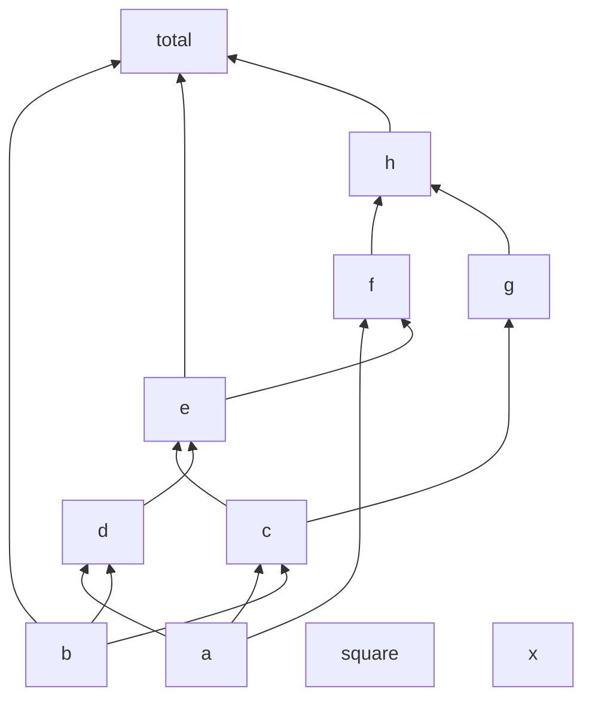

```mermaid
flowchart BT
    a["a"]
    b["b"]
    c["c"]
    d["d"]
    e["e"]
    f["f"]
    g["g"]
    h["h"]
    square["square"]
    total["total"]
    x["x"]
    a --> c
    b --> c
    a --> d
    b --> d
    c --> e
    d --> e
    a --> f
    e --> f
    c --> g
    f --> h
    g --> h
    b --> total
    e --> total
    h --> total
```
