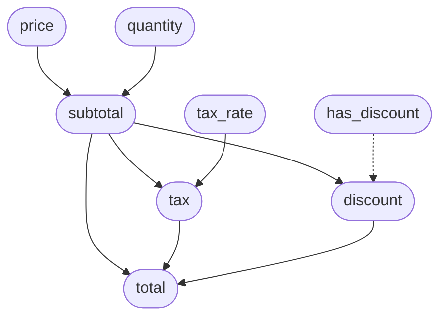

# RedDragon Dataflow Analysis Design Document

This document describes the design of the dataflow analysis subsystem — iterative reaching definitions, def-use chains, and variable dependency graphs computed over the IR control flow graph. It is intended for senior technical leads coming to the codebase from scratch.

---

## Table of Contents

1. [Overview](#1-overview)
2. [Data Types](#2-data-types)
3. [Definition and Use Extraction](#3-definition-and-use-extraction)
4. [Reaching Definitions](#4-reaching-definitions)
5. [Def-Use Chain Extraction](#5-def-use-chain-extraction)
6. [Dependency Graph Construction](#6-dependency-graph-construction)
7. [The analyze() Entry Point](#7-the-analyze-entry-point)
8. [Integration with the IR and CFG](#8-integration-with-the-ir-and-cfg)
9. [Worked Example](#9-worked-example)
10. [Complexity and Performance](#10-complexity-and-performance)
11. [Limitations](#11-limitations)
12. [Module Map](#12-module-map)

---

## 1. Overview

The dataflow analysis subsystem (`interpreter/dataflow.py`, ~430 lines) implements a classic **intraprocedural** analysis pipeline on the CFG:

```
CFG (BasicBlocks + edges)
        │
        ▼
┌───────────────────────┐
│ 1. Collect definitions│  ← every point where a variable/register is assigned
└───────────┬───────────┘
            ▼
┌───────────────────────┐
│ 2. Reaching defs      │  ← worklist fixpoint: which defs reach each block?
│    (GEN/KILL/IN/OUT)  │
└───────────┬───────────┘
            ▼
┌───────────────────────┐
│ 3. Def-use chains     │  ← link each use to the definition(s) it reads
└───────────┬───────────┘
            ▼
┌───────────────────────┐
│ 4. Dependency graph   │  ← named-variable → named-variable dependencies
│    (transitive close) │     (traces through register chains)
└───────────────────────┘
            │
            ▼
      DataflowResult
```

The analysis is **forward**, **may** (over-approximate), and **intraprocedural** (single function/module scope). It operates on the same `BasicBlock`/`CFG` structures and `IRInstruction` objects used by the VM.

---

## 2. Data Types

All types are defined at the top of `interpreter/dataflow.py`.

### Definition (`interpreter/dataflow.py:37`)

A single point where a variable or register is assigned:

```python
@dataclass(frozen=True)
class Definition:
    variable: str              # "x", "%0", "%3"
    block_label: str           # "entry", "if_true_1"
    instruction_index: int     # position within the block
    instruction: IRInstruction # the instruction that creates the def
```

Frozen (immutable and hashable) so it can be stored in sets. Equality is based on `(variable, block_label, instruction_index)`, not the instruction object.

### Use (`interpreter/dataflow.py:59`)

A single point where a variable or register is read:

```python
@dataclass(frozen=True)
class Use:
    variable: str
    block_label: str
    instruction_index: int
    instruction: IRInstruction
```

Parallel structure to `Definition`. Same equality/hash semantics.

### DefUseLink (`interpreter/dataflow.py:81`)

An edge from a definition to a use that reads it:

```python
@dataclass(frozen=True)
class DefUseLink:
    definition: Definition
    use: Use
```

One definition can feed into many uses; one use can have many reaching definitions (e.g., from different branches of an if/else).

### BlockDataflowFacts (`interpreter/dataflow.py:89`)

The four classic sets for each basic block:

```python
@dataclass
class BlockDataflowFacts:
    gen: set[Definition] = field(default_factory=set)       # last def of each var in this block
    kill: set[Definition] = field(default_factory=set)      # defs from OTHER blocks killed here
    reach_in: set[Definition] = field(default_factory=set)  # defs reaching block entry
    reach_out: set[Definition] = field(default_factory=set) # defs leaving block exit
```

These are **mutable** (updated during the fixpoint iteration), unlike the frozen `Definition`/`Use`/`DefUseLink`.

### DataflowResult (`interpreter/dataflow.py:99`)

The complete output of the analysis:

```python
@dataclass
class DataflowResult:
    definitions: list[Definition]
    block_facts: dict[str, BlockDataflowFacts]
    def_use_chains: list[DefUseLink]
    dependency_graph: dict[str, set[str]]    # var → set of vars it depends on
```

---

## 3. Definition and Use Extraction

### Which opcodes define values?

Two sets classify IR opcodes (`interpreter/dataflow.py:17`):

```python
_VALUE_PRODUCERS: frozenset[Opcode] = frozenset({
    Opcode.CONST, Opcode.LOAD_VAR, Opcode.LOAD_FIELD, Opcode.LOAD_INDEX,
    Opcode.NEW_OBJECT, Opcode.NEW_ARRAY,
    Opcode.BINOP, Opcode.UNOP,
    Opcode.CALL_FUNCTION, Opcode.CALL_METHOD, Opcode.CALL_UNKNOWN,
})

_VAR_DEFINERS: frozenset[Opcode] = frozenset({Opcode.STORE_VAR})
```

### _defs_of(instruction) (`interpreter/dataflow.py:109`)

Returns the variable/register names defined by an instruction:

```python
def _defs_of(instruction: IRInstruction) -> list[str]:
    if instruction.opcode == Opcode.STORE_VAR and len(instruction.operands) >= 1:
        return [instruction.operands[0]]                    # named variable
    if instruction.opcode in _VALUE_PRODUCERS and instruction.result_reg is not None:
        return [instruction.result_reg]                     # register
    if instruction.opcode == Opcode.SYMBOLIC and instruction.result_reg is not None:
        return [instruction.result_reg]                     # parameter register
    return []
```

Note the distinction: `STORE_VAR x %0` defines the named variable `x`; `%0 = CONST 42` defines the register `%0`. Both are tracked.

### _uses_of(instruction) (`interpreter/dataflow.py:120`)

Returns the variable/register names read by an instruction. This is a comprehensive case analysis:

```python
def _uses_of(instruction: IRInstruction) -> list[str]:
    op = instruction.opcode
    operands = instruction.operands

    if op == Opcode.CONST:              return []           # constants don't read anything
    if op == Opcode.LOAD_VAR:           return [operands[0]]       # reads the variable
    if op == Opcode.STORE_VAR:          return [operands[1]]       # reads the RHS register
    if op == Opcode.LOAD_FIELD:         return [operands[0]]       # reads object register
    if op == Opcode.STORE_FIELD:        return [operands[0], operands[2]]  # object + value
    if op == Opcode.LOAD_INDEX:         return [operands[0], operands[1]]  # array + index
    if op == Opcode.STORE_INDEX:        return [operands[0], operands[1], operands[2]]
    if op == Opcode.BINOP:              return [operands[1], operands[2]]  # lhs + rhs
    if op == Opcode.UNOP:               return [operands[1]]       # operand
    if op in (Opcode.CALL_FUNCTION, ...): return list(operands[1:]) # args (skip func name)
    if op == Opcode.BRANCH_IF:          return [operands[0]]       # condition
    if op == Opcode.RETURN:             return [operands[0]]       # return value
    if op == Opcode.THROW:              return [operands[0]]
    return []
```

### collect_all_definitions(cfg) (`interpreter/dataflow.py:154`)

Walks every block and every instruction, building the global definition list:

```python
def collect_all_definitions(cfg: CFG) -> list[Definition]:
    return [
        Definition(variable=var, block_label=label,
                   instruction_index=idx, instruction=inst)
        for label, block in cfg.blocks.items()
        for idx, inst in enumerate(block.instructions)
        for var in _defs_of(inst)
    ]
```

---

## 4. Reaching Definitions

### GEN and KILL sets

`compute_gen_kill()` (`interpreter/dataflow.py:179`) computes the two local sets for a single block:

**GEN** = the *last* definition of each variable within the block. If a block defines `x` twice, only the second definition is in GEN (it "generates" the definition that exits the block).

**KILL** = all definitions of variables that this block redefines, *from other blocks*. If a block redefines `x`, it kills every definition of `x` from everywhere else in the program.

```python
def compute_gen_kill(block, all_defs, defs_by_var):
    # 1. Collect this block's own definitions
    block_defs = [Definition(...) for idx, inst in block.instructions for var in _defs_of(inst)]

    # 2. GEN = last def of each variable (forward walk, last wins)
    gen_map: dict[str, Definition] = {}
    for d in block_defs:
        gen_map[d.variable] = d
    gen = set(gen_map.values())

    # 3. KILL = all defs of redefined vars, minus this block's own defs
    redefined_vars = {d.variable for d in block_defs}
    block_def_set = set(block_defs)
    kill = {d for var in redefined_vars
              for d in defs_by_var.get(var, set())
              if d not in block_def_set}

    return gen, kill
```

### Visual: GEN and KILL

```
Block B:                      Program has:
  %0 = CONST 1                  x defined in blocks A, B, C
  STORE_VAR x %0                 y defined in blocks A, B
  %1 = CONST 2
  STORE_VAR x %1     ← x redefined, second write wins

GEN(B) = {x@B:3}              only the LAST def of x
KILL(B) = {x@A:?, x@C:?}      all OTHER defs of x in the program
```

### Worklist fixpoint

`solve_reaching_definitions()` (`interpreter/dataflow.py:219`) implements the standard iterative algorithm:

```python
def solve_reaching_definitions(cfg: CFG) -> dict[str, BlockDataflowFacts]:
    all_defs = collect_all_definitions(cfg)
    defs_by_var = _build_defs_by_variable(all_defs)

    # Initialise GEN/KILL for each block
    facts: dict[str, BlockDataflowFacts] = {}
    for label, block in cfg.blocks.items():
        gen, kill = compute_gen_kill(block, all_defs, defs_by_var)
        facts[label] = BlockDataflowFacts(gen=gen, kill=kill)

    # Worklist iteration
    worklist: deque[str] = deque(cfg.blocks.keys())
    iteration = 0

    while worklist and iteration < constants.DATAFLOW_MAX_ITERATIONS:
        iteration += 1
        label = worklist.popleft()
        block_facts = facts[label]

        # reach_in = union of all predecessors' reach_out
        new_reach_in = reduce(
            set.union,
            [facts[p].reach_out for p in block.predecessors],
            set(),
        )

        # reach_out = GEN ∪ (reach_in - KILL)
        new_reach_out = block_facts.gen | (new_reach_in - block_facts.kill)

        if new_reach_out != block_facts.reach_out:
            block_facts.reach_in = new_reach_in
            block_facts.reach_out = new_reach_out
            worklist.extend(s for s in block.successors if s not in worklist)
        else:
            block_facts.reach_in = new_reach_in

    if iteration >= constants.DATAFLOW_MAX_ITERATIONS:
        logger.warning("Reaching definitions did not converge within %d iterations",
                       constants.DATAFLOW_MAX_ITERATIONS)

    return facts
```

### Dataflow equations

```
reach_in(B)  = ∪ { reach_out(P) | P ∈ predecessors(B) }
reach_out(B) = GEN(B) ∪ (reach_in(B) − KILL(B))
```

The algorithm is guaranteed to converge because:
- The lattice is the power set of all definitions (finite)
- The transfer function `GEN ∪ (IN − KILL)` is monotone
- Each iteration can only add elements to `reach_out`, never remove them

Convergence is capped at `DATAFLOW_MAX_ITERATIONS = 1000` (`interpreter/constants.py:26`) as a safety bound.

### Visual: reaching definitions on a diamond CFG

```
         ┌──────────┐
         │  entry    │  reach_out = {x@entry}
         │ x = 10   │
         └────┬─────┘
         ┌────┴─────┐
    ┌────▼────┐ ┌───▼─────┐
    │if_true  │ │if_false │
    │ x = 20  │ │ y = 30  │
    │         │ │         │
    └────┬────┘ └───┬─────┘
         └────┬─────┘
         ┌────▼─────┐
         │  merge   │  reach_in = {x@entry, x@if_true, y@if_false}
         │ use(x)   │  ← x has TWO reaching defs!
         │ use(y)   │  ← y has ONE reaching def
         └──────────┘
```

---

## 5. Def-Use Chain Extraction

`extract_def_use_chains()` (`interpreter/dataflow.py:265`) links every use to the definition(s) that can reach it.

### Algorithm

For each block, walk instructions forward while maintaining a `local_defs` map:

```python
def extract_def_use_chains(cfg, block_facts):
    chains: list[DefUseLink] = []

    for label, block in cfg.blocks.items():
        reach_in = block_facts[label].reach_in
        local_defs: dict[str, Definition] = {}

        for idx, inst in enumerate(block.instructions):
            uses = _uses_of(inst)
            for var in uses:
                use = Use(variable=var, block_label=label,
                          instruction_index=idx, instruction=inst)

                if var in local_defs:
                    # Local def shadows incoming defs
                    chains.append(DefUseLink(definition=local_defs[var], use=use))
                else:
                    # Link to all matching defs from reach_in
                    matching_defs = [d for d in reach_in if d.variable == var]
                    chains.extend(DefUseLink(definition=d, use=use)
                                  for d in matching_defs)

            # Update local defs AFTER processing uses
            # (def happens after use in the same instruction)
            for var in _defs_of(inst):
                local_defs[var] = Definition(variable=var, block_label=label,
                                             instruction_index=idx, instruction=inst)

    return chains
```

### Key design choice: local shadowing

Within a block, a local definition **shadows** all incoming definitions for subsequent uses. This is correct because within a single basic block, control flow is sequential — if `x` is defined at instruction 2 and used at instruction 5, only the local def can reach it.

```
Block B, reach_in has {x@A}:

  inst 0:  use(x)      → links to x@A (from reach_in)
  inst 1:  x = ...      → local_defs["x"] = x@B:1
  inst 2:  use(x)      → links to x@B:1 (local, shadows x@A)
```

### Important ordering: def after use

The local_defs update happens *after* processing uses for the same instruction. This handles the common pattern `x = x + 1`:

```
STORE_VAR x %0    ← uses %0 (links to %0's def), THEN defines x
```

The use of `%0` links to whatever definition produced `%0`, and only then does `x` get a new local definition.

---

## 6. Dependency Graph Construction

`build_dependency_graph()` (`interpreter/dataflow.py:313`) traces from named variable assignments back through register chains to discover which named variables influence which others.

### The problem

IR uses temporary registers as intermediaries:

```
%0 = LOAD_VAR price
%1 = LOAD_VAR quantity
%2 = BINOP * %0 %1
STORE_VAR subtotal %2
```

The def-use chains link `%0` → `BINOP`, `%1` → `BINOP`, `BINOP` → `STORE_VAR`. But we want to know that **`subtotal` depends on `price` and `quantity`** — not on `%0`, `%1`, `%2`.

### Algorithm

**Step 1: Build `produced_from` map** — for each defined variable/register, what does its defining instruction use?

```python
produced_from: dict[str, set[str]] = {}
for link in def_use_chains:
    defn = link.definition
    uses = _uses_of(defn.instruction)
    produced_from.setdefault(defn.variable, set()).update(uses)
```

**Step 2: Find all `STORE_VAR` assignments** — these are the named variable definitions we care about:

```python
store_var_defs: set[tuple[str, str]] = set()
for link in def_use_chains:
    use_inst = link.use.instruction
    if use_inst.opcode == Opcode.STORE_VAR:
        var_name = use_inst.operands[0]
        rhs_reg = use_inst.operands[1]
        store_var_defs.add((var_name, rhs_reg))
```

**Step 3: Trace registers back to named variables** via `_trace_to_named_vars()` (`interpreter/dataflow.py:386`):

```python
def _trace_to_named_vars(reg, produced_from, result, visited):
    if reg in visited:
        return                           # cycle detection
    visited.add(reg)

    if not _is_temporary_register(reg):
        result.add(reg)                  # found a named variable — stop
        return

    for source in produced_from.get(reg, set()):
        _trace_to_named_vars(source, produced_from, result, visited)
```

`_is_temporary_register()` (`interpreter/dataflow.py:376`) classifies registers:

```python
def _is_temporary_register(name: str) -> bool:
    if name.startswith("%"):
        return True                     # %0, %1, %2
    if not name.startswith("t"):
        return False
    rest = name[1:]
    return rest.isdigit() or rest.startswith("_")  # t0, t1, t_cond
```

**Step 4: Compute transitive closure** — if A depends on B and B depends on C, then A depends on C:

```python
changed = True
while changed:
    changed = False
    for var, deps in dep_graph.items():
        transitive = {td for d in deps if d in dep_graph for td in dep_graph[d]}
        new_deps = deps | transitive
        if new_deps != deps:
            dep_graph[var] = new_deps
            changed = True
```

### Visual: register chain tracing

```
Source:
  subtotal = price * quantity
  tax = subtotal * tax_rate
  total = subtotal + tax

IR:
  %0 = LOAD_VAR price
  %1 = LOAD_VAR quantity
  %2 = BINOP * %0 %1
  STORE_VAR subtotal %2       ← subtotal defined via %2

  %3 = LOAD_VAR subtotal
  %4 = LOAD_VAR tax_rate
  %5 = BINOP * %3 %4
  STORE_VAR tax %5            ← tax defined via %5

  %6 = LOAD_VAR subtotal
  %7 = LOAD_VAR tax
  %8 = BINOP + %6 %7
  STORE_VAR total %8          ← total defined via %8

Tracing:
  subtotal ← %2 ← {%0, %1} ← {price, quantity}
  tax      ← %5 ← {%3, %4} ← {subtotal, tax_rate}
  total    ← %8 ← {%6, %7} ← {subtotal, tax}

Direct deps:
  subtotal → {price, quantity}
  tax      → {subtotal, tax_rate}
  total    → {subtotal, tax}

Transitive closure:
  subtotal → {price, quantity}
  tax      → {subtotal, tax_rate, price, quantity}
  total    → {subtotal, tax, price, quantity, tax_rate}
```

---

## 7. The analyze() Entry Point

`analyze()` (`interpreter/dataflow.py:405`) orchestrates the full pipeline:

```python
def analyze(cfg: CFG) -> DataflowResult:
    logger.info("Starting dataflow analysis on CFG with %d blocks", len(cfg.blocks))

    all_defs = collect_all_definitions(cfg)
    logger.info("Collected %d definitions", len(all_defs))

    block_facts = solve_reaching_definitions(cfg)
    logger.info("Reaching definitions solved")

    def_use_chains = extract_def_use_chains(cfg, block_facts)
    logger.info("Extracted %d def-use chains", len(def_use_chains))

    dependency_graph = build_dependency_graph(def_use_chains)
    logger.info("Built dependency graph with %d variables", len(dependency_graph))

    return DataflowResult(
        definitions=all_defs,
        block_facts=block_facts,
        def_use_chains=def_use_chains,
        dependency_graph=dependency_graph,
    )
```

Each phase logs progress for debugging long-running analyses.

---

## 8. Integration with the IR and CFG

### What the analysis consumes

The dataflow analysis operates on **exactly the same** data structures used by the VM:

- `CFG` from `interpreter/cfg_types.py` — blocks, edges, entry point
- `BasicBlock` — label, instructions, successors, predecessors
- `IRInstruction` from `interpreter/ir.py` — opcode, result_reg, operands
- `Opcode` enum — determines which instructions define/use variables

This means dataflow analysis can run on CFGs built from any frontend (deterministic or LLM).

### How definitions map to opcodes

| Opcode | Defines | Uses |
|---|---|---|
| `CONST` | `result_reg` | (nothing) |
| `LOAD_VAR x` | `result_reg` | `x` |
| `STORE_VAR x %0` | `x` | `%0` |
| `BINOP + %0 %1` | `result_reg` | `%0`, `%1` |
| `UNOP - %0` | `result_reg` | `%0` |
| `CALL_FUNCTION f %0 %1` | `result_reg` | `%0`, `%1` (args) |
| `LOAD_FIELD %0 name` | `result_reg` | `%0` (object) |
| `STORE_FIELD %0 name %1` | (nothing) | `%0` (object), `%1` (value) |
| `LOAD_INDEX %0 %1` | `result_reg` | `%0`, `%1` |
| `STORE_INDEX %0 %1 %2` | (nothing) | `%0`, `%1`, `%2` |
| `BRANCH_IF %0` | (nothing) | `%0` (condition) |
| `RETURN %0` | (nothing) | `%0` |
| `SYMBOLIC "param:x"` | `result_reg` | (nothing) |
| `LABEL`, `BRANCH` | (nothing) | (nothing) |

Note that `STORE_FIELD` and `STORE_INDEX` do **not** define the object/array variable — they mutate heap state, which is not tracked by this analysis (see [Limitations](#11-limitations)).

---

## 9. Worked Example

### Source

```python
def process_order(price, quantity, tax_rate, has_discount):
    subtotal = price * quantity
    tax = subtotal * tax_rate
    if has_discount:
        discount = subtotal * 0.1
        total = subtotal + tax - discount
    else:
        total = subtotal + tax
    return total
```

### CFG

```
┌─────────────────────────────────┐
│ func_process_order_0            │
│ %0=SYMBOLIC param:price         │  defs: {%0}
│ STORE_VAR price %0              │  defs: {price}, uses: {%0}
│ %1=SYMBOLIC param:quantity      │  defs: {%1}
│ STORE_VAR quantity %1           │  defs: {quantity}
│ %2=SYMBOLIC param:tax_rate      │  defs: {%2}
│ STORE_VAR tax_rate %2           │  defs: {tax_rate}
│ %3=SYMBOLIC param:has_discount  │  defs: {%3}
│ STORE_VAR has_discount %3       │  defs: {has_discount}
│ %4=LOAD_VAR price               │  defs: {%4}, uses: {price}
│ %5=LOAD_VAR quantity            │  defs: {%5}, uses: {quantity}
│ %6=BINOP * %4 %5               │  defs: {%6}, uses: {%4, %5}
│ STORE_VAR subtotal %6           │  defs: {subtotal}, uses: {%6}
│ %7=LOAD_VAR subtotal            │  defs: {%7}, uses: {subtotal}
│ %8=LOAD_VAR tax_rate            │  defs: {%8}, uses: {tax_rate}
│ %9=BINOP * %7 %8               │  defs: {%9}, uses: {%7, %8}
│ STORE_VAR tax %9                │  defs: {tax}, uses: {%9}
│ %10=LOAD_VAR has_discount       │  defs: {%10}, uses: {has_discount}
│ BRANCH_IF %10                   │  uses: {%10}
└──────────┬──────────┬───────────┘
     T     │          │ F
┌──────────▼───┐  ┌───▼──────────┐
│ if_true      │  │ if_false     │
│ ...discount  │  │ ...total =   │
│ STORE_VAR    │  │   subtotal   │
│   discount   │  │   + tax      │
│ STORE_VAR    │  │              │
│   total      │  │              │
└──────┬───────┘  └──────┬───────┘
       └────────┬────────┘
       ┌────────▼────────┐
       │ merge           │
       │ LOAD_VAR total  │  ← total has 2 reaching defs!
       │ RETURN          │
       └─────────────────┘
```

### Reaching definitions at merge

```
reach_in(merge) = reach_out(if_true) ∪ reach_out(if_false)
                = {total@if_true, discount@if_true, subtotal@entry, tax@entry, ...}
                ∪ {total@if_false, subtotal@entry, tax@entry, ...}

At "LOAD_VAR total" in merge:
  → DefUseLink(total@if_true, use) AND DefUseLink(total@if_false, use)
  → Two reaching definitions for 'total'
```

### Dependency graph

```
Direct:
  subtotal → {price, quantity}
  tax      → {subtotal, tax_rate}
  discount → {subtotal}                    (conditional)
  total    → {subtotal, tax}              (from if_false path)
  total    → {subtotal, tax, discount}    (from if_true path)
  total    → {subtotal, tax, discount}    (merged)

Transitive:
  subtotal → {price, quantity}
  tax      → {subtotal, tax_rate, price, quantity}
  discount → {subtotal, price, quantity}
  total    → {subtotal, tax, discount, price, quantity, tax_rate}
```

This tells us that `total` transitively depends on **all four parameters**.

### As a Mermaid dependency graph



---

## 10. Complexity and Performance

### Time complexity

| Phase | Complexity | Notes |
|---|---|---|
| `collect_all_definitions` | O(I) | I = total instructions |
| `compute_gen_kill` (all blocks) | O(I + D) | D = total definitions |
| `solve_reaching_definitions` | O(iterations × B × D) | B = blocks, typically converges in ~B iterations |
| `extract_def_use_chains` | O(I × D_avg) | D_avg = avg reaching defs per use |
| `build_dependency_graph` | O(V^2) for transitive closure | V = named variables |

### Space complexity

| Structure | Size |
|---|---|
| `definitions` | O(I) |
| `block_facts` | O(B × D) for reach_in/out sets |
| `def_use_chains` | O(I × D_avg) |
| `dependency_graph` | O(V^2) worst case |

### Convergence bound

`DATAFLOW_MAX_ITERATIONS = 1000` is a safety cap. In practice, the worklist converges in O(B) iterations for acyclic CFGs and O(B × loop_depth) for loopy ones. A 1000-block CFG with deeply nested loops would need far fewer than 1000 iterations.

---

## 11. Limitations

### No alias analysis

The analysis cannot distinguish between different object references:

```python
a.field = 1
b.field = 2    # assumed independent — no points-to analysis
```

Heap mutations via `STORE_FIELD` and `STORE_INDEX` are not tracked as definitions of the object variable.

### No array subscript sensitivity

All array elements are treated as a single entity. `arr[0]` and `arr[1]` cannot be distinguished.

### No interprocedural analysis

The analysis is scoped to a single function/module. Function calls are treated as opaque — arguments establish def-use chains, but side effects inside the callee are not tracked.

### No must-alias analysis

The analysis is **may** (over-approximate): if a definition *might* reach a use on any path, it's included. There is no **must-reach** variant that says "this definition *definitely* reaches this use on all paths."

### Self-dependencies in loops

In loops, variables that are updated in terms of themselves (`x = x + 1`) correctly produce self-dependencies in the dependency graph. The fixpoint iteration handles this because the loop's back edge propagates `x`'s definition back to the loop header.

---

## 12. Module Map

```
interpreter/
├── dataflow.py          Main analysis: 430 lines
│   ├── Definition, Use, DefUseLink, BlockDataflowFacts, DataflowResult
│   ├── _defs_of(), _uses_of()
│   ├── collect_all_definitions()
│   ├── compute_gen_kill()
│   ├── solve_reaching_definitions()
│   ├── extract_def_use_chains()
│   ├── _trace_to_named_vars(), _is_temporary_register()
│   ├── build_dependency_graph()
│   └── analyze()              ← main entry point
│
├── cfg_types.py         BasicBlock, CFG (input to analysis)
├── cfg.py               build_cfg() (produces CFG from IR)
├── ir.py                IRInstruction, Opcode (what analysis examines)
└── constants.py         DATAFLOW_MAX_ITERATIONS = 1000

tests/unit/
└── test_dataflow.py     17 test cases, 413 lines
    ├── TestReachingDefinitions (5 tests)
    ├── TestDefUseChains (4 tests)
    ├── TestDependencyGraph (4 tests)
    ├── TestIntegration (3 tests)
    └── TestEdgeCases (1 test)
```

### Dependencies

```
constants.py
    ↑
ir.py ← constants.py
    ↑
cfg_types.py ← ir.py, constants.py
    ↑
cfg.py ← cfg_types.py
    ↑
dataflow.py ← constants.py, cfg_types.py (BasicBlock, CFG), ir.py (IRInstruction, Opcode)
```

The dataflow module has **no dependency** on the VM, executor, backend, or any frontend. It is a pure analysis pass over the CFG.

---

## Design Principles Summary

| Principle | Manifestation |
|---|---|
| **Classic textbook algorithm** | Worklist-based reaching definitions — well-understood, proven correct |
| **Frozen data types** | `Definition`, `Use`, `DefUseLink` are immutable and hashable for set operations |
| **Separation of concerns** | Analysis is independent of VM, frontends, and backends |
| **Register chain tracing** | Bridges the gap between IR registers and named variables |
| **Transitive closure** | Dependency graph answers "what ultimately affects this variable?" |
| **Safety bound** | `DATAFLOW_MAX_ITERATIONS` prevents non-termination on pathological inputs |
| **Progressive logging** | Each phase logs its output size for debugging |
| **Comprehensive case analysis** | `_uses_of()` handles every opcode explicitly — no default fallthrough |
