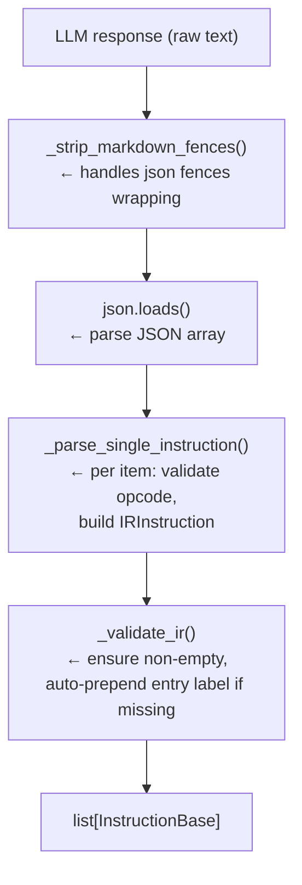

# RedDragon Frontend Design Document

This document describes the design of the frontend subsystem — the pipeline stages that transform source code into the universal IR consumed by the VM, CFG builder, and dataflow analysis. It is intended for senior technical leads coming to the codebase from scratch.

For per-language frontend documentation (one document per language), see [frontend-design/](frontend-design/).

---

## Table of Contents

1. [Overview](#1-overview)
2. [The Frontend Contract](#2-the-frontend-contract)
3. [IR — The Target Format](#3-ir--the-target-format)
4. [Tree-Sitter Parser Layer](#4-tree-sitter-parser-layer)
5. [Deterministic Frontend Architecture](#5-deterministic-frontend-architecture)
6. [LLM Frontend](#6-llm-frontend)
7. [Chunked LLM Frontend](#7-chunked-llm-frontend)
8. [LLM Client Abstraction](#8-llm-client-abstraction)
9. [Frontend Factory](#9-frontend-factory)
10. [End-to-End Worked Example](#10-end-to-end-worked-example)
11. [Symbol Table Pre-Pass](#11-symbol-table-pre-pass)
12. [Pattern Matching Infrastructure](#12-pattern-matching-infrastructure)
13. [Design Principles Summary](#13-design-principles-summary)

---

## 1. Overview

The frontend subsystem converts source code in any language into a universal flattened three-address code IR ([33 opcodes](ir-reference.md)). There are three frontend strategies:

| Strategy | Input | How | Speed | Languages |
|---|---|---|---|---|
| **Deterministic** | tree-sitter AST | Recursive descent over AST nodes | Sub-millisecond | 15 languages |
| **LLM** | Raw source text | Prompt an LLM to emit IR as JSON | Seconds | Any language |
| **Chunked LLM** | tree-sitter AST + raw source | Split into chunks via AST, LLM each chunk | Seconds × N | Any language |

All three produce the same `list[InstructionBase]` output, making the downstream VM, CFG, and dataflow analysis completely frontend-agnostic.


```mermaid
flowchart TD
    factory["get_frontend()\ninterpreter/frontend.py\n← factory"]

    det["Deterministic\n(BaseFrontend subclass)\n15 language frontends/"]
    llm["LLMFrontend\nllm_frontend.py\nLLMClient"]
    chunked["ChunkedLLMFrontend\nchunked_llm_frontend.py\nChunkExtractor, IRRenumberer\nwraps LLMFrontend"]

    factory --> det & llm & chunked

    det_impl["tree-sitter AST\n→ recursive descent"]
    llm_impl["LLM API call\n→ JSON parse"]
    chunked_impl["chunk → LLM × N\n→ renumber → merge"]

    det --> det_impl
    llm --> llm_impl
    chunked --> chunked_impl

    ir["list[InstructionBase]"]

    det_impl --> ir
    llm_impl --> ir
    chunked_impl --> ir
```

---

## 2. The Frontend Contract

The abstract interface is a single method defined in `interpreter/frontend.py`:

```python
class Frontend(ABC):
    @abstractmethod
    def lower(
        self,
        source: bytes,
        namespace_resolver: NamespaceResolver = _NULL_RESOLVER,
    ) -> list[InstructionBase]: ...
```

Returns a flat list of IR instructions, always starting with `LABEL "entry"`. Any frontend strategy — AST-based, LLM-based, or hybrid — plugs in identically. The optional `namespace_resolver` parameter (default: no-op `NamespaceResolver()`) allows the multi-file compiler to inject a language-specific resolver that intercepts qualified name references during lowering (e.g., `JavaNamespaceResolver` resolves `java.util.Arrays` to `LoadVar("Arrays")` instead of cascading `LOAD_FIELD` chains).

---

## 3. IR — The Target Format

The IR is defined in `interpreter/ir.py` — 33 opcodes covering value producers, control flow, stores, and special operations. Every frontend, regardless of source language, targets this same instruction set.

See the [IR Reference](ir-reference.md) for the complete opcode specification, instruction format, and common IR patterns.

Key conventions:

| Convention | Detail |
|---|---|
| **Registers** | SSA-like `%0`, `%1`, `%2` — fresh per frontend invocation |
| **Labels** | `entry`, `func_foo_0`, `if_true_1`, `end_foo_2`, ... |
| **Flattening** | Every expression decomposed into at most 3 operands (TAC) |
| **Entry label** | First instruction is always `LABEL "entry"` |
| **Function refs** | `<function:name@label>` or `<function:name@label#closure_id>` |
| **Class refs** | `<class:name@label>` |
| **Parameters** | `SYMBOLIC "param:x"` followed by `STORE_VAR x %reg` |
| **Source locations** | Deterministic frontends attach AST spans; LLM uses `NO_SOURCE_LOCATION` |

---

## 4. Tree-Sitter Parser Layer

The parser abstraction lives in `interpreter/parser.py`:

```python
class ParserFactory(ABC):
    @abstractmethod
    def get_parser(self, language: str): ...

class TreeSitterParserFactory(ParserFactory):
    def get_parser(self, language: str):
        import tree_sitter_language_pack as tslp
        return tslp.get_parser(language)
```

Key design choices:

- **Factory pattern** for parser creation — enables injecting test doubles.
- **Lazy import** of `tree_sitter_language_pack` — avoids loading all grammars at startup.
- **Thin wrapper** — `Parser` just delegates to the factory. The real work is in tree-sitter.

---

## 5. Deterministic Frontend Architecture

The deterministic frontend subsystem is documented in detail in [frontend-design/](frontend-design/README.md). This section provides a high-level summary.

### Three-layer architecture

1. **`BaseFrontend`** (`interpreter/frontends/_base.py`) — abstract base class with four `_build_*()` hook methods that subclasses override to return pure data (dispatch tables, grammar constants). See [base-frontend.md](frontend-design/base-frontend.md).

2. **`TreeSitterEmitContext`** (`interpreter/frontends/context.py`) — mutable dataclass holding all lowering state (registers, labels, instructions, scopes, type info). All lowering functions receive `ctx` as their first argument. See [base-frontend.md](frontend-design/base-frontend.md).

3. **Common lowerers** (`interpreter/frontends/common/`) — shared pure-function lowerers for expressions, assignments, control flow, declarations, and exceptions. See [base-frontend.md](frontend-design/base-frontend.md).

### How subclasses customise behaviour

Each language frontend overrides four `_build_*()` hooks:

```python
class BaseFrontend(Frontend):
    BLOCK_SCOPED: bool = False

    def _build_constants(self) -> GrammarConstants: ...
    def _build_stmt_dispatch(self) -> dict[str, Callable]: ...
    def _build_expr_dispatch(self) -> dict[str, Callable]: ...
    def _build_type_map(self) -> dict[str, str]: ...
```

These return pure data — a `GrammarConstants` frozen dataclass, two dispatch dicts mapping tree-sitter node types to pure functions `(ctx, node) → str|None`, and a type normalization map.

### Per-language directory structure

Each of the 15 language frontends lives in its own directory:

```
interpreter/frontends/<language>/
├── frontend.py          # BaseFrontend subclass — builds dispatch tables
├── node_types.py        # frozen dataclass of tree-sitter node type constants
├── expressions.py       # pure-function expression lowerers (ctx, node) → str
├── control_flow.py      # pure-function control flow lowerers (ctx, node) → None
├── declarations.py      # pure-function declaration lowerers (ctx, node) → None
└── (optional extras)    # e.g. assignments.py (Python, Ruby)
```

For detailed documentation of each language frontend, see:

| Language | Doc | Block-scoped |
|---|---|---|
| Python | [python.md](frontend-design/python.md) | No |
| JavaScript | [javascript.md](frontend-design/javascript.md) | No |
| TypeScript | [typescript.md](frontend-design/typescript.md) | Yes |
| Java | [java.md](frontend-design/java.md) | Yes |
| C | [c.md](frontend-design/c.md) | Yes |
| C++ | [cpp.md](frontend-design/cpp.md) | Yes |
| C# | [csharp.md](frontend-design/csharp.md) | Yes |
| Go | [go.md](frontend-design/go.md) | Yes |
| Rust | [rust.md](frontend-design/rust.md) | Yes |
| Kotlin | [kotlin.md](frontend-design/kotlin.md) | Yes |
| Scala | [scala.md](frontend-design/scala.md) | Yes |
| Ruby | [ruby.md](frontend-design/ruby.md) | No |
| PHP | [php.md](frontend-design/php.md) | No |
| Lua | [lua.md](frontend-design/lua.md) | No |
| Pascal | [pascal.md](frontend-design/pascal.md) | No |
| COBOL | [cobol.md](frontend-design/cobol.md) | N/A |

### Key design decisions

- **Graceful degradation**: Unknown AST node types produce `SYMBOLIC "unsupported:<type>"` rather than crashing, enabling partial lowering.
- **Block-scope tracking**: 9 block-scoped frontends use LLVM-style variable name mangling (`x$1`, `x$2`) to resolve shadowed variables. See the [Type System Design Document](type-system.md#block-scope-tracking-llvm-style).
- **Canonical literals**: All null/boolean values are canonicalized to Python-form (`"None"`, `"True"`, `"False"`) in the IR.
- **Lazy loading**: Only the requested language's frontend module is imported at runtime.

---

## 6. LLM Frontend

`interpreter/llm_frontend.py` uses an LLM as a compiler frontend — the LLM is constrained by a formal IR schema, not used for reasoning.

### Architecture

```python
class LLMFrontend(Frontend):
    DEFAULT_MAX_TOKENS = 4096
    DEFAULT_MAX_RETRIES = 3

    def __init__(self, llm_client: LLMClient, language: str = "python",
                 max_tokens: int = ..., max_retries: int = ...): ...

    def lower(self, tree: Any, source: bytes) -> list[InstructionBase]: ...
```

The `tree` parameter is **ignored** — the LLM works from raw source text only. This means it can handle any language, not just the 15 with tree-sitter grammars.

### Prompt engineering

`LLMFrontendPrompts.SYSTEM_PROMPT` (`interpreter/llm_frontend.py:23`) is a ~180-line prompt that includes:

1. **Instruction format specification** — JSON schema for each instruction
2. **Complete opcode reference** — all 33 opcodes with operand formats (see [IR Reference](ir-reference.md))
3. **Critical patterns** — exact templates for function definitions, class definitions, constructor calls, method calls, if/elif/else
4. **Full worked example** — Fibonacci function lowered to 30+ IR instructions
5. **Strict rules** — entry label mandatory, flattening required, literal formats

The prompt acts as a **formal specification** that constrains the LLM to produce valid IR rather than freeform output.

### Retry loop

`LLMFrontend.lower()` retries on parse failure:

```python
def lower(self, tree, source):
    last_error = None
    for attempt in range(1, self._max_retries + 1):
        raw_response = self._llm_client.complete(
            system_prompt=LLMFrontendPrompts.SYSTEM_PROMPT,
            user_message=f"Lower the following {language} source code into IR:\n\n{source}",
            max_tokens=self._max_tokens,
        )
        try:
            instructions = _parse_ir_response(raw_response)
        except IRParsingError as exc:
            last_error = exc
            continue
        instructions = _validate_ir(instructions)
        return instructions
    raise last_error
```

### Response parsing pipeline


```mermaid
flowchart TD
    raw["LLM response (raw text)"]
    strip["_strip_markdown_fences()\n← handles json fences wrapping"]
    parse["json.loads()\n← parse JSON array"]
    single["_parse_single_instruction()\n← per item: validate opcode,\nbuild IRInstruction"]
    validate["_validate_ir()\n← ensure non-empty,\nauto-prepend entry label if missing"]
    result["list[InstructionBase]"]

    raw --> strip --> parse --> single --> validate --> result
```

`_validate_ir()` is forgiving — if the LLM omits the entry label, it logs a warning and prepends one automatically.

---

## 7. Chunked LLM Frontend

`interpreter/chunked_llm_frontend.py` handles large files by decomposing them into per-function/class chunks via tree-sitter, lowering each independently, then reassembling.

### Components

```
ChunkedLLMFrontend
├── ChunkExtractor        ← splits source into SourceChunk objects
├── IRRenumberer          ← prevents register/label collisions across chunks
└── LLMFrontend (wrapped) ← lowers each chunk independently
```

### SourceChunk

```python
@dataclass(frozen=True)
class SourceChunk:
    chunk_type: str    # "function", "class", or "top_level"
    name: str          # function/class name, or "__top_level__"
    source_text: str
    start_line: int
```

### Chunk extraction

`ChunkExtractor.extract_chunks()` walks the tree-sitter root's children:

```
for each top-level child:
    ├── comment → skip
    ├── function/class node → flush pending top-level, add to functions_and_classes
    └── other statement → accumulate in top_level_pending

Final: flush remaining top_level_pending
Return: functions_and_classes + top_level_groups
```

Functions and classes come first in the output, then grouped top-level statements. This ordering ensures function/class definitions are lowered before the code that calls them.

### Register/label renumbering

`IRRenumberer` prevents collisions when merging IR from independent chunks:

**Registers**: `%0` → `%{N + offset}` where `offset` is the running total of registers from prior chunks.

**Labels**: All labels get a `_chunkN` suffix appended. `BRANCH_IF` labels (comma-separated) are handled specially — each part gets the suffix.

**Function references**: `<function:foo@func_foo_0>` → `<function:foo@func_foo_0_chunk2>` — the regex `(<(?:function|class):\w+@)(\w+)(>)` patches the label portion.

### Assembly pipeline

```
1. Parse tree (if None, use parser_factory)
2. Extract chunks via ChunkExtractor
3. For each chunk:
   a. Lower via wrapped LLMFrontend
   b. Strip the chunk's entry label (we'll prepend one global entry)
   c. Renumber registers/labels with _chunkN suffix
   d. Append to accumulated instructions
   e. On failure: insert SYMBOLIC placeholder, continue
4. Prepend single global LABEL "entry"
5. Return combined instructions
```

### Graceful degradation

If a chunk fails to lower (LLM error, parse error), a `SYMBOLIC` placeholder is inserted and processing continues:

```python
except (IRParsingError, Exception) as exc:
    logger.warning("chunk '%s' failed: %s — inserting placeholder", chunk.name, exc)
    placeholder = IRInstruction(
        opcode=Opcode.SYMBOLIC,
        result_reg=f"%{reg_offset}",
        operands=[f"chunk_error:{chunk.name}"],
    )
    all_instructions.append(placeholder)
    reg_offset += 1
    continue
```

---

## 8. LLM Client Abstraction

`interpreter/llm_client.py` defines the API client interface:

```python
class LLMClient(ABC):
    @abstractmethod
    def complete(self, system_prompt: str, user_message: str,
                 max_tokens: int = 4096) -> str: ...
```

Four implementations:

| Class | Provider | Default Model | Notes |
|---|---|---|---|
| `ClaudeLLMClient` | Anthropic | `claude-sonnet-4-20250514` | `anthropic.messages.create()` |
| `OpenAILLMClient` | OpenAI | `gpt-4o` | `response_format={"type":"json_object"}` |
| `OllamaLLMClient` | Ollama (local) | `qwen2.5-coder:7b-instruct` | OpenAI-compatible at `localhost:11434` |
| `HuggingFaceLLMClient` | HuggingFace | (endpoint-based) | OpenAI-compatible API |

Factory: `get_llm_client(provider, model, client)` routes to the correct class. All accept a pre-built API client for dependency injection in tests.

---

## 9. Frontend Factory

`get_frontend()` in `interpreter/frontend.py` is the single entry point:

```python
def get_frontend(language, frontend_type="deterministic",
                 llm_provider="claude", llm_client=None) -> Frontend:
    if frontend_type == "deterministic":
        return get_deterministic_frontend(language)

    if frontend_type in ("llm", "chunked_llm"):
        resolved_client = ...  # build or inject LLMClient
        inner_frontend = LLMFrontend(resolved_client, language=language, ...)

        if frontend_type == "chunked_llm":
            return ChunkedLLMFrontend(inner_frontend, TreeSitterParserFactory(), language)

        return inner_frontend

    raise ValueError(f"Unknown frontend type: {frontend_type}")
```

The chunked LLM frontend is constructed as a **wrapper** around a plain LLM frontend, using composition rather than inheritance.

---

## 10. End-to-End Worked Example

### Source (Python)

```python
def greet(name):
    return "Hello, " + name

msg = greet("world")
```

### Step 1: tree-sitter parse

Produces an AST with nodes: `module` → `function_definition` (name=`greet`, params=`name`, body=`return_statement`), `expression_statement` (assignment).

### Step 2: PythonFrontend.lower()

1. `ctx.emit(LABEL, label="entry")`
2. `ctx.lower_stmt(function_definition)` → `lower_function_def(ctx, node)`:
   - `ctx.emit(BRANCH, label="end_greet_1")` — skip body
   - `ctx.emit(LABEL, label="func_greet_0")` — function entry
   - `lower_params(ctx, params_node)`:
     - `%0 = SYMBOLIC "param:name"` + `STORE_VAR name %0`
   - `ctx.lower_block(body)` → `lower_return(ctx, node)`:
     - `ctx.lower_expr(binary_operator)` → `lower_binop(ctx, node)`:
       - `%1 = CONST "\"Hello, \""` (left operand)
       - `%2 = LOAD_VAR name` (right operand)
       - `%3 = BINOP + %1 %2`
     - `RETURN %3`
   - `%4 = CONST "None"` + `RETURN %4` — implicit return
   - `ctx.emit(LABEL, label="end_greet_1")`
   - `%5 = CONST "<function:greet@func_greet_0>"`
   - `STORE_VAR greet %5`
3. `ctx.lower_stmt(expression_statement)` → `lower_assignment(ctx, node)`:
   - `ctx.lower_expr(call)` → `lower_call(ctx, node)`:
     - `%6 = CONST "\"world\""` (argument)
     - `%7 = CALL_FUNCTION greet %6`
   - `STORE_VAR msg %7`

### Final IR

```
entry:
BRANCH end_greet_1
func_greet_0:
  %0 = SYMBOLIC "param:name"          # 1:10-1:14
  STORE_VAR name %0                    # 1:10-1:14
  %1 = CONST "\"Hello, \""            # 2:11-2:21
  %2 = LOAD_VAR name                   # 2:24-2:28
  %3 = BINOP + %1 %2                  # 2:11-2:28
  RETURN %3                            # 2:4-2:28
  %4 = CONST "None"
  RETURN %4
end_greet_1:
  %5 = CONST "<function:greet@func_greet_0>"
  STORE_VAR greet %5                   # 1:0-2:28
  %6 = CONST "\"world\""              # 4:12-4:19
  %7 = CALL_FUNCTION greet %6         # 4:6-4:20
  STORE_VAR msg %7                     # 4:0-4:20
```

Every instruction from the deterministic frontend carries its source location, enabling traceability back to the original source. The LLM frontend would produce equivalent IR (same opcodes, same structure) but with `<unknown>` source locations.

---

## 11. Symbol Table Pre-Pass

All 15 deterministic frontends run a Phase 2 symbol extraction pass (`_extract_symbols`) before IR lowering. This produces a `SymbolTable` (`interpreter/frontends/symbol_table.py`) containing `ClassInfo` (fields, methods, constants, parents), `FieldInfo`, and `FunctionInfo` for every declaration in the source.

The symbol table is available during lowering for:
- **Field resolution** — `resolve_field(class_name, field_name)` walks the parent chain via inherited `ClassInfo.parents` and returns the `FieldInfo` or `NULL_FIELD` sentinel (never `None`).
- **Implicit-this field reads** (Java, C#, C++) — bare identifier reads in instance methods check `resolve_field` against `_method_declared_names`; if the identifier names a class field not shadowed by a local, `LOAD_FIELD this` is emitted instead of `LOAD_VAR`.
- **Implicit-this field writes** (Java, C#, C++) — bare identifier assignments in constructors check `resolve_field`; if the identifier names a class field, `LOAD_VAR this` + `STORE_FIELD` is emitted instead of `STORE_VAR`.
- **Type seeding** — field types are seeded into the `TypeEnvironmentBuilder` at extraction time.

```python
# BaseFrontend lifecycle (simplified)
def lower(self, source: bytes) -> list[InstructionBase]:
    tree = self._parse(source)
    symbol_table = self._extract_symbols(tree, source)  # Phase 2 pre-pass
    return self._lower_with_context(tree, source, symbol_table=symbol_table)
```

**Per-language extractors:** OOP languages (JS, TS, Ruby, Kotlin, Scala, PHP) extract fields, methods, and parent chains. Struct languages (Go, C, Rust) extract struct fields and top-level functions. Java, C#, C++, Python, Pascal extract full class hierarchies. Lua returns an empty `SymbolTable`. COBOL uses `SymbolTable.from_data_layout()`.

`_method_declared_names` is reset at each method entry via `reset_method_scope()`, and updated by the `emit()` hook for every `DECL_VAR`/`STORE_VAR` emitted, tracking which identifiers have been locally declared so far in the current method body.

---

## 12. Pattern Matching Infrastructure

Pattern matching is implemented as a shared compiler layer (`interpreter/frontends/common/patterns.py`) that operates on a **Pattern ADT** and emits IR using existing opcodes — no new VM opcodes were introduced.

### Pattern ADT

| Type | Description | Example |
|------|-------------|---------|
| `LiteralPattern(value)` | Match a constant | `case 42:`, `case "ok":` |
| `WildcardPattern()` | Always match, no binding | `case _:` |
| `CapturePattern(name)` | Match and bind | `case x:` |
| `SequencePattern(elements)` | Match list/tuple by structure | `case [a, b]:` |
| `StarPattern(name)` | Rest capture in sequences | `case [first, *rest]:` |
| `MappingPattern(keys, patterns)` | Match dict by keys | `case {"x": x}:` |
| `ClassPattern(cls, args, kwargs)` | Match class instance | `case Point(x, y):` |
| `OrPattern(alternatives)` | Match any alternative | `case 1 \| 2 \| 3:` |
| `AsPattern(pattern, name)` | Match and bind whole subject | `case [_, _] as pair:` |
| `ValuePattern(dotted_name)` | Dotted constant lookup | `case Color.RED:` |

### compile_match compiler

`compile_match(ctx, subject_reg, cases)` implements the CPython linear chain model:

1. Each case becomes a sequence of `BRANCH_IF false → next_case` instructions (test chain)
2. All tests for a case pass → fall through to the binding section
3. Two-pass per case: all tests execute before any `STORE_VAR` bindings — prevents partial binding on failed matches
4. Guards (`if condition`) emit an additional `BRANCH_IF` after the binding section
5. After the case body, `BRANCH end_match` exits the chain

**OrPattern** with capture bindings uses a mini linear chain: each alternative is tested in a sub-chain; if a match is found, bindings are unified via the shared `AsPattern`/`CapturePattern` logic.

**StarPattern** in sequences:
- Switches from exact-length test (`len == n`) to minimum-length test (`len >= n`)
- Fixed elements before the star use literal indices; elements after use `len - distance_from_end`
- The star capture uses the `slice` builtin: `slice(subject, star_idx, len - after_count)`
- Wildcard star (`*_`) skips the slice emission entirely

**ClassPattern** positional args resolve `__match_args__` from the AST symbol table to map position → field name.

**ValuePattern** emits `LOAD_VAR` + `LOAD_FIELD` for dotted names (e.g. `Color.RED` → load `Color`, then field `RED`) and compares with `BINOP ==`.

### Language consumers

| Frontend | Parser | File |
|----------|--------|------|
| Python | `parse_pattern` | `interpreter/frontends/python/patterns.py` |
| C# | `parse_csharp_pattern` | `interpreter/frontends/csharp/patterns.py` |

Other languages can add their own `parse_pattern` function that maps their tree-sitter AST into the Pattern ADT. The `compile_match` compiler and all IR emission are shared.

---

## 13. Design Principles Summary

| Principle | Manifestation |
|---|---|
| **Single IR for all languages** | 33 opcodes are enough to represent 15 languages + COBOL + LLM output |
| **Pure-function dispatch tables** | Extensible via dict lookup, not if/elif chains |
| **GrammarConstants dataclass** | Same lowering logic handles different tree-sitter grammars |
| **Graceful degradation** | Unknown constructs → `SYMBOLIC`, not crashes |
| **Lazy loading** | Only the requested language's frontend is imported |
| **Composition over inheritance** | ChunkedLLMFrontend wraps LLMFrontend |
| **Retry on failure** | LLM frontend retries up to 3 times on parse errors |
| **Formal schema as prompt** | LLM constrained by IR specification, not open-ended reasoning |
| **Source traceability** | Every deterministic IR instruction carries its AST span |
| **DI-friendly** | Parser factories and LLM clients are injectable for testing |
