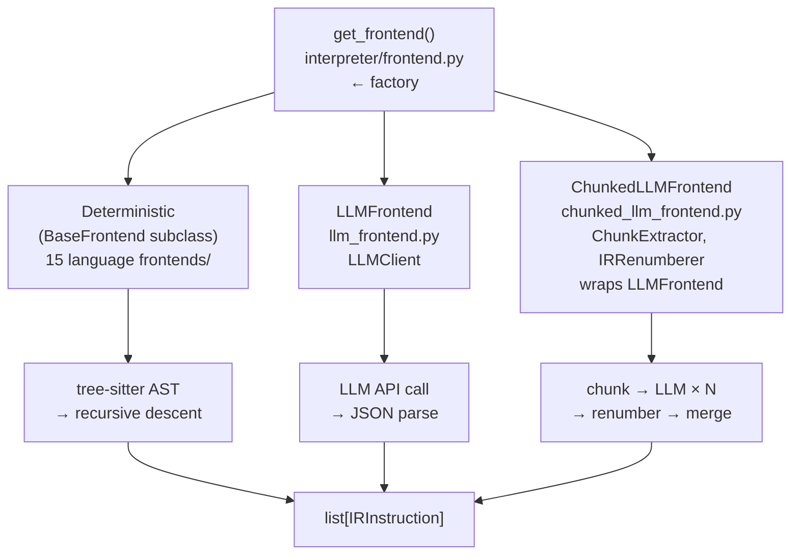
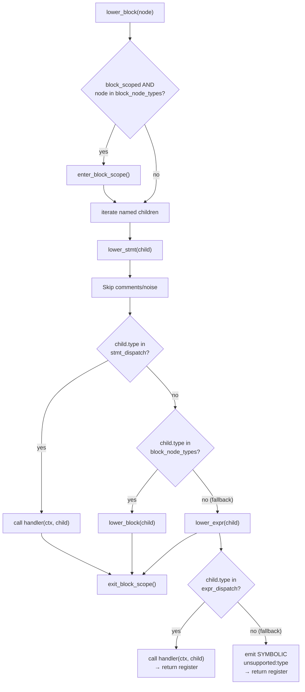
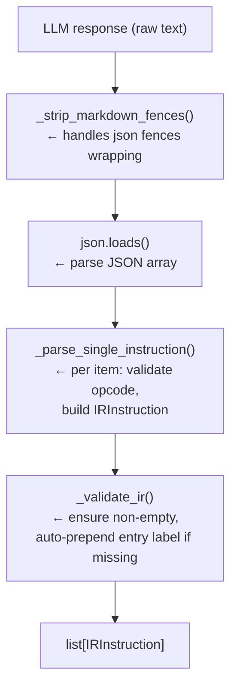

# RedDragon Frontend Design Document

This document describes the design of the frontend subsystem — the pipeline stages that transform source code into the universal IR consumed by the VM, CFG builder, and dataflow analysis. It is intended for senior technical leads coming to the codebase from scratch.

---

## Table of Contents

1. [Overview](#1-overview)
2. [The Frontend Contract](#2-the-frontend-contract)
3. [IR — The Target Format](#3-ir--the-target-format)
4. [Tree-Sitter Parser Layer](#4-tree-sitter-parser-layer)
5. [BaseFrontend — The Lowering Engine](#5-basefrontend--the-lowering-engine) (includes [Block-scope tracking](#block-scope-tracking))
6. [Language-Specific Frontends](#6-language-specific-frontends)
7. [LLM Frontend](#7-llm-frontend)
8. [Chunked LLM Frontend](#8-chunked-llm-frontend)
9. [LLM Client Abstraction](#9-llm-client-abstraction)
10. [Frontend Factory](#10-frontend-factory)
11. [Lowering Patterns Reference](#11-lowering-patterns-reference)
12. [Module Map](#12-module-map)
13. [End-to-End Worked Example](#13-end-to-end-worked-example)

---

## 1. Overview

The frontend subsystem converts source code in any language into a universal flattened three-address code IR ([27 opcodes](ir-reference.md)). There are three frontend strategies:

| Strategy | Input | How | Speed | Languages |
|---|---|---|---|---|
| **Deterministic** | tree-sitter AST | Recursive descent over AST nodes | Sub-millisecond | 15 languages |
| **LLM** | Raw source text | Prompt an LLM to emit IR as JSON | Seconds | Any language |
| **Chunked LLM** | tree-sitter AST + raw source | Split into chunks via AST, LLM each chunk | Seconds × N | Any language |

All three produce the same `list[IRInstruction]` output, making the downstream VM, CFG, and dataflow analysis completely frontend-agnostic.


```mermaid
flowchart TD
    factory["get_frontend()\ninterpreter/frontend.py\n← factory"]

    det["Deterministic\n(BaseFrontend subclass)\n15 language frontends/"]
    llm["LLMFrontend\nllm_frontend.py\nLLMClient"]
    chunked["ChunkedLLMFrontend\nchunked_llm_frontend.py\nChunkExtractor, IRRenumberer\nwraps LLMFrontend"]

    factory --> det & llm & chunked

    det_impl["tree-sitter AST\n→ recursive descent"]
    llm_impl["LLM API call\n→ JSON parse"]
    chunked_impl["chunk → LLM × N\n→ renumber → merge"]

    det --> det_impl
    llm --> llm_impl
    chunked --> chunked_impl

    ir["list[IRInstruction]"]

    det_impl --> ir
    llm_impl --> ir
    chunked_impl --> ir
```

---

## 2. The Frontend Contract

The abstract interface is minimal — a single method defined in `interpreter/frontend.py:12`:

```python
class Frontend(ABC):
    @abstractmethod
    def lower(self, tree, source: bytes) -> list[IRInstruction]: ...
```

- **`tree`**: A tree-sitter parse tree (or `None` for LLM frontends that don't need one).
- **`source`**: The raw source code bytes.
- **Returns**: A flat list of IR instructions, always starting with `LABEL "entry"`.

This design means any frontend strategy — AST-based, LLM-based, or hybrid — plugs in identically.

---

## 3. IR — The Target Format

The IR is defined in `interpreter/ir.py`. Every frontend, regardless of source language, targets this same instruction set.

### Opcode enum (`interpreter/ir.py:11`)

```python
class Opcode(str, Enum):
    # Value producers (write result_reg)
    CONST = "CONST"
    LOAD_VAR = "LOAD_VAR"
    LOAD_FIELD = "LOAD_FIELD"
    LOAD_INDEX = "LOAD_INDEX"
    NEW_OBJECT = "NEW_OBJECT"
    NEW_ARRAY = "NEW_ARRAY"
    BINOP = "BINOP"
    UNOP = "UNOP"
    CALL_FUNCTION = "CALL_FUNCTION"
    CALL_METHOD = "CALL_METHOD"
    CALL_UNKNOWN = "CALL_UNKNOWN"
    # Consumers / control flow
    STORE_VAR = "STORE_VAR"
    STORE_FIELD = "STORE_FIELD"
    STORE_INDEX = "STORE_INDEX"
    BRANCH_IF = "BRANCH_IF"
    BRANCH = "BRANCH"
    RETURN = "RETURN"
    THROW = "THROW"
    # Special
    SYMBOLIC = "SYMBOLIC"
    LABEL = "LABEL"
```

### IRInstruction (`interpreter/ir.py:63`)

```python
class IRInstruction(BaseModel):
    opcode: Opcode
    result_reg: str | None = None      # "%0", "%1", ... for value producers
    operands: list[Any] = []           # opcode-specific arguments
    label: str | None = None           # for LABEL and branch targets
    source_location: SourceLocation = NO_SOURCE_LOCATION
```

### Key IR conventions

| Convention | Detail |
|---|---|
| **Registers** | SSA-like `%0`, `%1`, `%2` — fresh per frontend invocation |
| **Labels** | `entry`, `func_foo_0`, `if_true_1`, `end_foo_2`, ... |
| **Flattening** | Every expression decomposed into at most 3 operands (TAC) |
| **Entry label** | First instruction is always `LABEL "entry"` |
| **Function refs** | `<function:name@label>` or `<function:name@label#closure_id>` |
| **Class refs** | `<class:name@label>` |
| **Parameters** | `SYMBOLIC "param:x"` followed by `STORE_VAR x %reg` |
| **Source locations** | Deterministic frontends attach AST spans; LLM uses `NO_SOURCE_LOCATION` |

### SourceLocation (`interpreter/ir.py:38`)

```python
class SourceLocation(BaseModel):
    start_line: int    # 1-based
    start_col: int     # 0-based
    end_line: int
    end_col: int
```

Tree-sitter frontends populate this from AST node spans via `_source_loc()` (`interpreter/frontends/_base.py:117`):

```python
def _source_loc(self, node) -> SourceLocation:
    s, e = node.start_point, node.end_point
    return SourceLocation(
        start_line=s[0] + 1, start_col=s[1],
        end_line=e[0] + 1, end_col=e[1],
    )
```

---

## 4. Tree-Sitter Parser Layer

The parser abstraction lives in `interpreter/parser.py`:

```python
class ParserFactory(ABC):
    @abstractmethod
    def get_parser(self, language: str): ...

class TreeSitterParserFactory(ParserFactory):
    def get_parser(self, language: str):
        import tree_sitter_language_pack as tslp
        return tslp.get_parser(language)

class Parser:
    def __init__(self, parser_factory: ParserFactory): ...
    def parse(self, source: str, language: str): ...
```

Key design choices:

- **Factory pattern** for parser creation — enables injecting test doubles.
- **Lazy import** of `tree_sitter_language_pack` — avoids loading all grammars at startup.
- **Thin wrapper** — `Parser` just delegates to the factory. The real work is in tree-sitter.

The parser produces a tree-sitter `Tree` object whose `root_node` the frontend traverses.

---

## 5. BaseFrontend and TreeSitterEmitContext — The Lowering Engine

The lowering engine is split across two classes:

- **`BaseFrontend`** (`interpreter/frontends/_base.py`) — the abstract base class that all 15 deterministic frontends inherit from. Handles parsing, context creation, and provides the subclass hook methods.
- **`TreeSitterEmitContext`** (`interpreter/frontends/context.py`) — a mutable dataclass that holds all lowering state (registers, labels, instructions, scopes, type info) and performs the recursive descent. All lowering functions receive `ctx` as their first argument.

### Architecture: context mode with pure-function dispatch

Each language frontend overrides four `_build_*()` hook methods on `BaseFrontend`:

```python
class BaseFrontend(Frontend):
    BLOCK_SCOPED: bool = False     # True for block-scoped languages

    def _build_constants(self) -> GrammarConstants: ...
    def _build_stmt_dispatch(self) -> dict[str, Callable]: ...
    def _build_expr_dispatch(self) -> dict[str, Callable]: ...
    def _build_type_map(self) -> dict[str, str]: ...
```

These return pure data — a `GrammarConstants` dataclass, two dispatch dicts mapping tree-sitter node types to pure functions `(ctx, node) → str|None`, and a type normalization map. `BaseFrontend.lower()` assembles these into a `TreeSitterEmitContext` and kicks off recursive descent:

```python
def lower(self, source: bytes) -> list[IRInstruction]:
    tree = self._parser_factory.get_parser(self._language).parse(source)
    constants = self._build_constants()
    return self._lower_with_context(tree.root_node, source, constants)

def _lower_with_context(self, root, source, constants):
    ctx = TreeSitterEmitContext(
        source=source,
        constants=constants,
        stmt_dispatch=self._build_stmt_dispatch(),
        expr_dispatch=self._build_expr_dispatch(),
        type_map=self._build_type_map(),
        block_scoped=self.BLOCK_SCOPED,
        ...
    )
    ctx.emit(Opcode.LABEL, label=constants.CFG_ENTRY_LABEL)
    ctx.lower_block(root)
    self._type_env_builder.var_scope_metadata = dict(ctx.var_scope_metadata)
    return ctx.instructions
```

### GrammarConstants

`GrammarConstants` (`interpreter/frontends/context.py`) is a frozen dataclass that centralizes all language-specific grammar field names, node type sets, and literal values:

```python
@dataclass(frozen=True)
class GrammarConstants:
    # Field names (tree-sitter child_by_field_name)
    func_name_field: str = "name"
    func_params_field: str = "parameters"
    func_body_field: str = "body"
    if_condition_field: str = "condition"
    if_consequence_field: str = "consequence"
    if_alternative_field: str = "alternative"
    while_condition_field: str = "condition"
    while_body_field: str = "body"
    for_condition_field: str = "condition"
    for_body_field: str = "body"
    for_update_field: str = "update"
    call_function_field: str = "function"
    call_arguments_field: str = "arguments"
    class_name_field: str = "name"
    class_body_field: str = "body"
    assign_left_field: str = "left"
    assign_right_field: str = "right"
    attr_object_field: str = "object"
    attr_attribute_field: str = "attribute"
    subscript_value_field: str = "value"
    subscript_index_field: str = "index"

    # Node type sets
    block_node_types: frozenset[str] = frozenset()    # types iterated by lower_block()
    comment_types: frozenset[str] = frozenset()       # filtered out
    noise_types: frozenset[str] = frozenset()         # filtered out

    # Canonical literals
    none_literal: str = "None"
    true_literal: str = "True"
    false_literal: str = "False"
    default_return_value: str = "None"     # C: "0", Rust/Scala: "()"

    # Special node types
    paren_expr_type: str = "parenthesized_expression"
    attribute_node_type: str = "attribute"
```

This replaces the old per-class attribute overrides. Each frontend returns a customized `GrammarConstants` from `_build_constants()`.

### TreeSitterEmitContext — state and recursive descent

`TreeSitterEmitContext` holds all mutable lowering state:

| Category | Fields |
|---|---|
| **Configuration** | `source`, `language`, `constants`, `type_map`, `stmt_dispatch`, `expr_dispatch`, `block_scoped` |
| **Counters** | `reg_counter`, `label_counter` |
| **Output** | `instructions: list[IRInstruction]` |
| **Loop tracking** | `loop_stack`, `break_target_stack` |
| **Type info** | `type_env_builder`, `_current_func_label`, `_current_class_name` |
| **Block scopes** | `_block_scope_stack`, `_scope_counter`, `_var_scope_metadata`, `_base_declared_vars` |

**Code generation primitives:**

| Method | Purpose |
|---|---|
| `fresh_reg() → str` | Generate `%0`, `%1`, ... |
| `fresh_label(prefix) → str` | Generate `if_true_0`, `while_cond_1`, ... |
| `emit(opcode, ..., node=...) → IRInstruction` | Emit instruction, auto-derive source location from AST node |
| `node_text(node) → str` | Extract source text from tree-sitter node |
| `source_loc(node) → SourceLocation` | Extract AST span |

**Recursive descent entry points:**

| Method | Behaviour |
|---|---|
| `lower_block(node)` | If node type is in `stmt_dispatch` and not in `block_node_types`, dispatch directly. Otherwise iterate named children, calling `lower_stmt()` on each. Auto-enters/exits block scopes if `block_scoped=True` and node type is in `block_node_types`. |
| `lower_stmt(node)` | Filter comments/noise. Check `stmt_dispatch` first; if found, call handler. Else check `block_node_types` for redirect to `lower_block()`. Else fallback to `lower_expr()`. |
| `lower_expr(node) → str` | Check `expr_dispatch`; if found, call handler and return register. Else emit `SYMBOLIC "unsupported:type"` and return register. |

**Dispatch flow:**


```mermaid
flowchart TD
    lb["lower_block(node)"]
    scope{"block_scoped AND\nnode in block_node_types?"}
    enter["enter_block_scope()"]
    iterate["iterate named children"]
    ls["lower_stmt(child)"]
    exit["exit_block_scope()"]
    skip["Skip comments/noise"]
    stmt_match{"child.type in\nstmt_dispatch?"}
    handler["call handler(ctx, child)"]
    block_match{"child.type in\nblock_node_types?"}
    redirect["lower_block(child)"]
    le["lower_expr(child)"]
    expr_match{"child.type in\nexpr_dispatch?"}
    handler2["call handler(ctx, child)\n→ return register"]
    symbolic["emit SYMBOLIC\nunsupported:type\n→ return register"]

    lb --> scope
    scope -- "yes" --> enter --> iterate
    scope -- "no" --> iterate
    iterate --> ls --> skip
    skip --> stmt_match
    stmt_match -- "yes" --> handler
    stmt_match -- "no" --> block_match
    block_match -- "yes" --> redirect
    block_match -- "no (fallback)" --> le
    le --> expr_match
    expr_match -- "yes" --> handler2
    expr_match -- "no (fallback)" --> symbolic
    handler --> exit
    redirect --> exit
    le --> exit
```

The **fallback to SYMBOLIC** is a critical design decision: unknown constructs produce a `SYMBOLIC` instruction with a descriptive hint rather than crashing. This enables graceful degradation — the VM can still execute the rest of the program symbolically.

### Common lowerers (`interpreter/frontends/common/`)

Shared pure-function lowerers used by multiple language frontends. Each function takes `(ctx: TreeSitterEmitContext, node)`:

**`common/expressions.py`** — expression lowerers:

| Function | Opcode(s) | Description |
|---|---|---|
| `lower_const_literal` | `CONST` | Number, string literals (raw text) |
| `lower_canonical_none` | `CONST "None"` | Null/nil/undefined → canonical `"None"` |
| `lower_canonical_true/false/bool` | `CONST "True"`/`"False"` | Boolean literals |
| `lower_identifier` | `LOAD_VAR` | Variable references (uses `ctx.resolve_var()` for block scoping) |
| `lower_paren` | (delegates) | Unwrap parenthesised expression |
| `lower_binop` | `BINOP` | Binary operators |
| `lower_comparison` | `BINOP` | Comparisons as binary ops |
| `lower_unop` | `UNOP` | Unary operators |
| `lower_call` | `CALL_FUNCTION` / `CALL_METHOD` / `CALL_UNKNOWN` | Function/method calls (three-way split) |
| `lower_attribute` | `LOAD_FIELD` | `obj.field` access |
| `lower_subscript` | `LOAD_INDEX` | `arr[i]` access |
| `lower_list_literal` | `NEW_ARRAY` + `STORE_INDEX` | List/array construction |
| `lower_dict_literal` | `NEW_OBJECT` + `STORE_INDEX` | Dictionary construction |
| `lower_store_target` | `STORE_VAR` / `STORE_FIELD` / `STORE_INDEX` | Assignment target dispatch (uses `ctx.resolve_var()` for block scoping) |

**`common/assignments.py`** — assignment/statement lowerers:

| Function | Pattern | Description |
|---|---|---|
| `lower_assignment` | `STORE_VAR` / `STORE_FIELD` / `STORE_INDEX` | Simple assignment |
| `lower_augmented_assignment` | `BINOP` + store | `x += 1` → load, binop, store |
| `lower_return` | `RETURN` | Return with optional value |
| `lower_expression_statement` | (delegates) | Unwrap expression statement |

**`common/control_flow.py`** — control flow lowerers:

| Function | Pattern | Description |
|---|---|---|
| `lower_if` | `BRANCH_IF` + labels | If/elif/else chains |
| `lower_while` | Labels + `BRANCH_IF` loop | While loops |
| `lower_c_style_for` | Init + condition + body + update | C-style for loops |
| `lower_break` / `lower_continue` | `BRANCH` | Loop control via stack |

**`common/declarations.py`** — declaration lowerers:

| Function | Description |
|---|---|
| `lower_function_def` | Function definitions with type extraction and parameter seeding |
| `lower_params` / `lower_param` | Parameter lowering with type seeding |
| `lower_class_def` | Class definitions with interface extraction |

**`common/exceptions.py`** — exception lowerers:

| Function | Description |
|---|---|
| `lower_raise_or_throw` | Raise/throw statements |
| `lower_try_catch` | Try/catch/finally with block-scoped catch variables |

**`common/node_types.py`** — `CommonNodeType` class with universal constants (parentheses, commas, etc.).

### Call lowering — three-way split

`lower_call()` in `common/expressions.py` distinguishes three call patterns by inspecting the function node's AST type:

```mermaid
flowchart TD
    call["call expression"]
    check{"func_node type?"}
    attr["CALL_METHOD\nobj_reg = lower_expr(object)\nmethod = node_text(attribute)\n→ CALL_METHOD obj_reg method arg1 arg2 ..."]
    ident["CALL_FUNCTION\nfunc_name = node_text(identifier)\n→ CALL_FUNCTION func_name arg1 arg2 ..."]
    other["CALL_UNKNOWN\ntarget_reg = lower_expr(func_node)\n→ CALL_UNKNOWN target_reg arg1 arg2 ..."]

    call --> check
    check -- "attribute /\nmember_expression" --> attr
    check -- "identifier" --> ident
    check -- "anything else" --> other
```

### Block-scope tracking

9 block-scoped frontends (Java, C, C++, C#, Rust, Go, Kotlin, Scala, TypeScript) set `BLOCK_SCOPED = True` on their frontend class. This enables LLVM-style variable name mangling in `TreeSitterEmitContext`:

- **`lower_block()`** automatically calls `enter_block_scope()`/`exit_block_scope()` when the node type is in `block_node_types` and `block_scoped=True`
- **`declare_block_var(name)`** — called by declaration lowerers (e.g. `lower_local_var_decl()`, `lower_let_decl()`). Returns the original name if no shadowing, or a mangled name (`x$1`, `x$2`) if the name shadows an outer scope
- **`resolve_var(name)`** — called by `lower_identifier()` and `lower_store_target()` to resolve reads/writes through the scope stack
- **Loop variables** — for-each style loops (`lower_enhanced_for`, `lower_range_for`, `lower_foreach`, `lower_for_in`, etc.) enter their own block scope before declaring the iteration variable, so `for (int x : list)` correctly shadows an outer `x`
- **Catch clause variables** — each catch clause enters a block scope before declaring the exception variable via `declare_block_var()` in `lower_try_catch()`

Function-scoped languages (Python, JavaScript `var`, Ruby, Lua, PHP, Pascal) set `BLOCK_SCOPED = False` and bypass scoping entirely.

Mangled names carry `VarScopeInfo(original_name, scope_depth)` metadata, propagated through `TypeEnvironmentBuilder` to the final `TypeEnvironment.var_scope_metadata`. See the [Type System Design Document](type-system.md#block-scope-tracking-llvm-style) for the full algorithm.

### Loop context tracking

Break and continue need to know which labels to jump to. `TreeSitterEmitContext` maintains two parallel stacks:

```python
loop_stack: list[dict[str, str]]      # {"continue": label, "end": label}
break_target_stack: list[str]          # break target labels
```

`push_loop()` and `pop_loop()` manage both stacks. `lower_break()` emits `BRANCH` to the top of `break_target_stack`; `lower_continue()` emits `BRANCH` to the `continue` label from `loop_stack`.

### Type seeding during lowering

`TreeSitterEmitContext` provides six methods for seeding type information during lowering, each calling `parse_type()` at the boundary to convert raw strings to `TypeExpr`:

| Method | Seeds |
|---|---|
| `seed_register_type(reg, type_name)` | Register type (e.g. `"%3" → Int`) |
| `seed_var_type(var_name, type_name)` | Variable type (e.g. `"x" → Int`) |
| `seed_param_type(param_name, type_hint)` | Parameter type for current function |
| `seed_func_return_type(func_label, return_type)` | Function return type |
| `seed_type_alias(alias_name, target_type)` | Type alias (e.g. `UserId → Int`) |
| `seed_interface_impl(class_name, interface_name)` | Interface implementation |

See the [Type System Design Document](type-system.md#phase-1-frontend-type-extraction) for the full extraction pipeline.

---

## 6. Language-Specific Frontends

### Per-language directory structure

Each language frontend lives in its own directory under `interpreter/frontends/` with a standard set of modules:

```
interpreter/frontends/<language>/
├── __init__.py          # re-exports FrontendClass
├── frontend.py          # BaseFrontend subclass — builds dispatch tables
├── node_types.py        # frozen dataclass of tree-sitter node type constants
├── expressions.py       # pure-function expression lowerers (ctx, node) → str
├── control_flow.py      # pure-function control flow lowerers (ctx, node) → None
├── declarations.py      # pure-function declaration lowerers (ctx, node) → None
└── (optional extras)    # e.g. assignments.py (Python, Ruby), pascal_constants.py
```

**The only exception** is TypeScript, which is a single file (`interpreter/frontends/typescript.py`) extending the JavaScript directory's frontend. Its node types live in `interpreter/frontends/typescript_node_types.py`.

### Registry and lazy loading

`interpreter/frontends/__init__.py` maps `Language` enum values to `"module.ClassName"` specs:

```python
_FRONTEND_CLASSES: dict[Language, str] = {
    Language.PYTHON: "python.PythonFrontend",
    Language.JAVASCRIPT: "javascript.JavaScriptFrontend",
    Language.TYPESCRIPT: "typescript.TypeScriptFrontend",
    Language.JAVA: "java.JavaFrontend",
    ...
}

def get_deterministic_frontend(language: Language, observer=NullFrontendObserver()) -> BaseFrontend:
    spec = _FRONTEND_CLASSES.get(language)
    module_name, class_name = spec.split(".")
    mod = importlib.import_module(f".{module_name}", package=__package__)
    cls = getattr(mod, class_name)
    return cls(TreeSitterParserFactory(), language, observer)
```

Only the requested language's module is imported — avoids loading all 15 tree-sitter grammars at startup.

### What each `frontend.py` does

Each `frontend.py` is a thin orchestrator (~100–150 lines) that:

1. **Returns a customized `GrammarConstants`** from `_build_constants()` — overriding field names, node type sets, and literals where the tree-sitter grammar differs from the defaults
2. **Builds `stmt_dispatch` and `expr_dispatch` dicts** from `_build_stmt_dispatch()` / `_build_expr_dispatch()` — wiring tree-sitter node types to pure lowering functions from `common/`, the language's own modules, or inline lambdas
3. **Returns a type normalization map** from `_build_type_map()` — mapping language-native type names to canonical forms (e.g. `"int"` → `"Int"`, `"String"` → `"String"`)
4. **Sets `BLOCK_SCOPED = True`** for block-scoped languages (Java, C, C++, C#, Rust, Go, Kotlin, Scala, TypeScript)

Example — Java (`interpreter/frontends/java/frontend.py`, 128 lines):

```python
class JavaFrontend(BaseFrontend):
    BLOCK_SCOPED = True

    def _build_constants(self) -> GrammarConstants:
        return GrammarConstants(
            attr_object_field="object",
            attr_attribute_field="field",
            attribute_node_type=JavaNodeType.FIELD_ACCESS,
            block_node_types=frozenset({JavaNodeType.BLOCK, ...}),
            none_literal="null", true_literal="true", false_literal="false",
            ...
        )

    def _build_stmt_dispatch(self) -> dict[str, Callable]:
        return {
            JavaNodeType.IF_STATEMENT: common_cf.lower_if,
            JavaNodeType.WHILE_STATEMENT: common_cf.lower_while,
            JavaNodeType.FOR_STATEMENT: common_cf.lower_c_style_for,
            JavaNodeType.ENHANCED_FOR: java_cf.lower_enhanced_for,
            JavaNodeType.METHOD_DECLARATION: java_decl.lower_method,
            JavaNodeType.CLASS_DECLARATION: java_decl.lower_class,
            ...
        }

    def _build_expr_dispatch(self) -> dict[str, Callable]:
        return {
            JavaNodeType.IDENTIFIER: common_expr.lower_identifier,
            JavaNodeType.NULL_LITERAL: common_expr.lower_canonical_none,
            JavaNodeType.METHOD_INVOCATION: java_expr.lower_method_invocation,
            ...
        }
```

### `node_types.py` — grammar constants

Each language defines a frozen dataclass of tree-sitter node type strings, eliminating magic strings from dispatch tables and lowering functions:

```python
@dataclass(frozen=True)
class JavaNodeType:
    IF_STATEMENT: str = "if_statement"
    WHILE_STATEMENT: str = "while_statement"
    FOR_STATEMENT: str = "for_statement"
    ENHANCED_FOR: str = "enhanced_for_statement"
    METHOD_DECLARATION: str = "method_declaration"
    FIELD_ACCESS: str = "field_access"
    ...
```

Instances are created once (e.g. `JNT = JavaNodeType()`) and referenced as `JNT.IF_STATEMENT` throughout the language's modules.

### Language-specific lowering modules

**`expressions.py`** — pure functions `(ctx, node) → str` for language-specific expression forms (e.g. Java method invocations, Go composite literals, Rust closures). Common expressions (identifiers, binary ops, calls) are wired to `common/expressions.py` functions.

**`control_flow.py`** — pure functions `(ctx, node) → None` for language-specific control flow (e.g. Java enhanced-for, Go range loops, Rust match expressions, Scala for-comprehensions). Common control flow (if, while, C-style for, break/continue) is wired to `common/control_flow.py` functions.

**`declarations.py`** — pure functions `(ctx, node) → None` for language-specific declarations (e.g. Java records, Go short variable declarations, Rust impl blocks, Kotlin companion objects). Common function/class definitions are wired to `common/declarations.py` functions.

Some languages have additional modules:
- **`python/assignments.py`**, **`ruby/assignments.py`** — override common assignment lowerers for tuple unpacking and multi-assignment
- **`pascal/pascal_constants.py`**, **`pascal/type_helpers.py`** — Pascal-specific constants and type conversion helpers

### Frontend characteristics

| Language | Block-scoped | Notable constructs |
|---|---|---|
| **Python** | No | for-in, list comprehensions, lambda, with, conditional expr, assert |
| **JavaScript** | No | var/let/const destructuring, arrow functions, template strings, switch, for-in/for-of, spread, await/yield |
| **TypeScript** | Yes | Extends JavaScript + type annotations (extracted for type env, otherwise lowered identically) |
| **Java** | Yes | Enhanced-for, records, instanceof, method refs, synchronized, static initializers |
| **C** | Yes | Pointers, sizeof, struct/union, goto, ternary, typedef |
| **C++** | Yes | Extends C + classes, templates, new/delete, range-for, structured bindings, lambdas |
| **C#** | Yes | Foreach, properties, LINQ-style expressions, using statements, nullable types |
| **Go** | Yes | Range loops, short var decl (`:=`), composite literals, goroutines/defer, channels |
| **Rust** | Yes | Let bindings with mut, match, closures, block expressions, macros, impl/trait |
| **Kotlin** | Yes | When-expression, companion objects, elvis operator, string templates, for-in |
| **Scala** | Yes | For-comprehensions, case classes, match, pattern matching, string interpolation |
| **Ruby** | No | Symbols, ranges, blocks/procs, heredocs, unless/until, begin/rescue |
| **PHP** | No | Namespaces, traits, match expressions, foreach, string interpolation |
| **Lua** | No | goto/labels, tables-as-objects, repeat-until, numeric/generic for |
| **Pascal** | No | Procedures vs functions, records, case-of, with-do, type declarations |

---

## 7. LLM Frontend

`interpreter/llm_frontend.py` uses an LLM as a compiler frontend — the LLM is constrained by a formal IR schema, not used for reasoning.

### Architecture

```python
class LLMFrontend(Frontend):
    DEFAULT_MAX_TOKENS = 4096
    DEFAULT_MAX_RETRIES = 3

    def __init__(self, llm_client: LLMClient, language: str = "python",
                 max_tokens: int = ..., max_retries: int = ...): ...

    def lower(self, tree: Any, source: bytes) -> list[IRInstruction]: ...
```

The `tree` parameter is **ignored** — the LLM works from raw source text only. This means it can handle any language, not just the 15 with tree-sitter grammars.

### Prompt engineering

`LLMFrontendPrompts.SYSTEM_PROMPT` (`interpreter/llm_frontend.py:23`) is a ~180-line prompt that includes:

1. **Instruction format specification** — JSON schema for each instruction
2. **Complete opcode reference** — all 27 opcodes with operand formats (see [IR Reference](ir-reference.md))
3. **Critical patterns** — exact templates for function definitions, class definitions, constructor calls, method calls, if/elif/else
4. **Full worked example** — Fibonacci function lowered to 30+ IR instructions
5. **Strict rules** — entry label mandatory, flattening required, literal formats

The prompt acts as a **formal specification** that constrains the LLM to produce valid IR rather than freeform output.

### Retry loop

`LLMFrontend.lower()` (`interpreter/llm_frontend.py:275`) retries on parse failure:

```python
def lower(self, tree, source):
    last_error = None
    for attempt in range(1, self._max_retries + 1):
        raw_response = self._llm_client.complete(
            system_prompt=LLMFrontendPrompts.SYSTEM_PROMPT,
            user_message=f"Lower the following {language} source code into IR:\n\n{source}",
            max_tokens=self._max_tokens,
        )
        try:
            instructions = _parse_ir_response(raw_response)
        except IRParsingError as exc:
            last_error = exc
            continue
        instructions = _validate_ir(instructions)
        return instructions
    raise last_error
```

### Response parsing pipeline


```mermaid
flowchart TD
    raw["LLM response (raw text)"]
    strip["_strip_markdown_fences()\n← handles json fences wrapping"]
    parse["json.loads()\n← parse JSON array"]
    single["_parse_single_instruction()\n← per item: validate opcode,\nbuild IRInstruction"]
    validate["_validate_ir()\n← ensure non-empty,\nauto-prepend entry label if missing"]
    result["list[IRInstruction]"]

    raw --> strip --> parse --> single --> validate --> result
```

`_validate_ir()` (`interpreter/llm_frontend.py:229`) is forgiving — if the LLM omits the entry label, it logs a warning and prepends one automatically:

```python
def _validate_ir(instructions):
    if not instructions:
        raise IRParsingError("LLM returned an empty instruction list")
    first = instructions[0]
    if not (first.opcode == Opcode.LABEL and first.label == "entry"):
        logger.warning("LLM response missing entry label — auto-prepending")
        instructions = [IRInstruction(opcode=Opcode.LABEL, label="entry")] + instructions
    return instructions
```

---

## 8. Chunked LLM Frontend

`interpreter/chunked_llm_frontend.py` handles large files by decomposing them into per-function/class chunks via tree-sitter, lowering each independently, then reassembling.

### Components

```
ChunkedLLMFrontend
├── ChunkExtractor        ← splits source into SourceChunk objects
├── IRRenumberer          ← prevents register/label collisions across chunks
└── LLMFrontend (wrapped) ← lowers each chunk independently
```

### SourceChunk (`interpreter/chunked_llm_frontend.py:19`)

```python
@dataclass(frozen=True)
class SourceChunk:
    chunk_type: str    # "function", "class", or "top_level"
    name: str          # function/class name, or "__top_level__"
    source_text: str
    start_line: int
```

### Chunk extraction

`ChunkExtractor.extract_chunks()` (`interpreter/chunked_llm_frontend.py:63`) walks the tree-sitter root's children:

```
for each top-level child:
    ├── comment → skip
    ├── function/class node → flush pending top-level, add to functions_and_classes
    └── other statement → accumulate in top_level_pending

Final: flush remaining top_level_pending
Return: functions_and_classes + top_level_groups
```

Functions and classes come first in the output, then grouped top-level statements. This ordering ensures function/class definitions are lowered before the code that calls them.

### Register/label renumbering

`IRRenumberer` (`interpreter/chunked_llm_frontend.py:152`) prevents collisions when merging IR from independent chunks:

**Registers**: `%0` → `%{N + offset}` where `offset` is the running total of registers from prior chunks.

**Labels**: All labels get a `_chunkN` suffix appended. `BRANCH_IF` labels (comma-separated) are handled specially — each part gets the suffix.

**Function references**: `<function:foo@func_foo_0>` → `<function:foo@func_foo_0_chunk2>` — the regex `(<(?:function|class):\w+@)(\w+)(>)` patches the label portion.

```python
def _renumber_operand(self, operand, offset, label_suffix):
    match = _REG_PATTERN.match(operand)
    if match:
        return f"%{int(match.group(1)) + offset}"
    ref_match = _FUNC_REF_LABEL_PATTERN.search(operand)
    if ref_match:
        return _FUNC_REF_LABEL_PATTERN.sub(
            lambda m: f"{m.group(1)}{m.group(2)}{label_suffix}{m.group(3)}", operand
        )
    return operand
```

### Assembly pipeline

`ChunkedLLMFrontend.lower()` (`interpreter/chunked_llm_frontend.py:261`):

```
1. Parse tree (if None, use parser_factory)
2. Extract chunks via ChunkExtractor
3. For each chunk:
   a. Lower via wrapped LLMFrontend
   b. Strip the chunk's entry label (we'll prepend one global entry)
   c. Renumber registers/labels with _chunkN suffix
   d. Append to accumulated instructions
   e. On failure: insert SYMBOLIC placeholder, continue
4. Prepend single global LABEL "entry"
5. Return combined instructions
```

### Graceful degradation

If a chunk fails to lower (LLM error, parse error), a `SYMBOLIC` placeholder is inserted and processing continues (`interpreter/chunked_llm_frontend.py:305`):

```python
except (IRParsingError, Exception) as exc:
    logger.warning("chunk '%s' failed: %s — inserting placeholder", chunk.name, exc)
    placeholder = IRInstruction(
        opcode=Opcode.SYMBOLIC,
        result_reg=f"%{reg_offset}",
        operands=[f"chunk_error:{chunk.name}"],
    )
    all_instructions.append(placeholder)
    reg_offset += 1
    continue
```

---

## 9. LLM Client Abstraction

`interpreter/llm_client.py` defines the API client interface:

```python
class LLMClient(ABC):
    @abstractmethod
    def complete(self, system_prompt: str, user_message: str,
                 max_tokens: int = 4096) -> str: ...
```

Four implementations:

| Class | Provider | Default Model | Notes |
|---|---|---|---|
| `ClaudeLLMClient` | Anthropic | `claude-sonnet-4-20250514` | `anthropic.messages.create()` |
| `OpenAILLMClient` | OpenAI | `gpt-4o` | `response_format={"type":"json_object"}` |
| `OllamaLLMClient` | Ollama (local) | `qwen2.5-coder:7b-instruct` | OpenAI-compatible at `localhost:11434` |
| `HuggingFaceLLMClient` | HuggingFace | (endpoint-based) | OpenAI-compatible API |

Factory: `get_llm_client(provider, model, client)` routes to the correct class. All accept a pre-built API client for dependency injection in tests.

---

## 10. Frontend Factory

`get_frontend()` in `interpreter/frontend.py:21` is the single entry point:

```python
def get_frontend(language, frontend_type="deterministic",
                 llm_provider="claude", llm_client=None) -> Frontend:
    if frontend_type == "deterministic":
        return get_deterministic_frontend(language)

    if frontend_type in ("llm", "chunked_llm"):
        resolved_client = ...  # build or inject LLMClient
        inner_frontend = LLMFrontend(resolved_client, language=language, ...)

        if frontend_type == "chunked_llm":
            return ChunkedLLMFrontend(inner_frontend, TreeSitterParserFactory(), language)

        return inner_frontend

    raise ValueError(f"Unknown frontend type: {frontend_type}")
```

The chunked LLM frontend is constructed as a **wrapper** around a plain LLM frontend, using composition rather than inheritance.

---

## 11. Lowering Patterns Reference

### Function definition

For `def foo(a, b): return a + b`:

```
BRANCH end_foo_1                          ← skip function body in linear flow
LABEL func_foo_0                          ← function entry point
  %0 = SYMBOLIC "param:a"                ← parameter declaration
  STORE_VAR a %0                          ← bind parameter to variable
  %1 = SYMBOLIC "param:b"
  STORE_VAR b %1
  ... body ...
  %N = CONST "None"                       ← implicit return at end
  RETURN %N
LABEL end_foo_1                           ← function exit
  %M = CONST "<function:foo@func_foo_0>"  ← function reference
  STORE_VAR foo %M                        ← register function by name
```

### Class definition

For `class Point: def __init__(self, x): self.x = x`:

```
BRANCH end_class_Point_1
LABEL class_Point_0
  ... nested function definitions (each using function pattern) ...
  BRANCH end___init___3
  LABEL func___init___2
    %0 = SYMBOLIC "param:self"
    STORE_VAR self %0
    %1 = SYMBOLIC "param:x"
    STORE_VAR x %1
    ... body ...
  LABEL end___init___3
    %M = CONST "<function:__init__@func___init___2>"
    STORE_VAR __init__ %M
LABEL end_class_Point_1
  %K = CONST "<class:Point@class_Point_0>"
  STORE_VAR Point %K
```

### If/elif/else

```
... compute condition ...
BRANCH_IF %cond "if_true_0,if_false_1"
LABEL if_true_0
  ... true body ...
  BRANCH if_end_2
LABEL if_false_1
  ... false body (or elif chain) ...
  BRANCH if_end_2
LABEL if_end_2
```

### While loop

```
LABEL while_cond_0
  ... compute condition ...
  BRANCH_IF %cond "while_body_1,while_end_2"
LABEL while_body_1
  ... body ...
  BRANCH while_cond_0               ← loop back
LABEL while_end_2
```

### For-in loop (Python-style)

```
%len = CALL_FUNCTION len %iterable
%i = CONST 0
LABEL for_cond_0
  %cond = BINOP < %i %len
  BRANCH_IF %cond "for_body_1,for_end_2"
LABEL for_body_1
  %elem = LOAD_INDEX %iterable %i
  STORE_VAR x %elem
  ... body ...
  %i_next = BINOP + %i 1
  STORE_VAR __i %i_next
  BRANCH for_cond_0
LABEL for_end_2
```

### Try/catch/finally

```
LABEL try_body_0
  ... try body ...
  BRANCH try_end_3 (or try_else if exists)
LABEL catch_0_1
  %exc = SYMBOLIC "caught_exception"
  STORE_VAR e %exc
  ... catch body ...
  BRANCH try_end_3
LABEL finally_2
  ... finally body ...
LABEL try_end_3
```

---

## 12. Module Map

```
interpreter/
├── frontend.py                    Frontend ABC + get_frontend() factory
├── parser.py                      ParserFactory ABC + TreeSitterParserFactory + Parser
├── ir.py                          Opcode enum + IRInstruction + SourceLocation
├── frontends/
│   ├── __init__.py                Lazy-loading registry + get_deterministic_frontend()
│   ├── _base.py                   BaseFrontend — subclass hooks, lower() entry point
│   ├── context.py                 TreeSitterEmitContext + GrammarConstants
│   ├── base_node_types.py         BaseNodeType — shared node type constants
│   ├── type_extraction.py         Type extraction helpers for frontends
│   ├── common/                    Shared pure-function lowerers
│   │   ├── expressions.py         Identifiers, literals, binops, calls, subscripts (~434 lines)
│   │   ├── assignments.py         Simple/augmented assignment, return (~71 lines)
│   │   ├── control_flow.py        If, while, C-style for, break/continue (~198 lines)
│   │   ├── declarations.py        Function/class definitions, params (~177 lines)
│   │   ├── exceptions.py          Try/catch/finally, raise/throw (~114 lines)
│   │   └── node_types.py          CommonNodeType — universal constants (~46 lines)
│   ├── python/                    PythonFrontend (function-scoped)
│   │   ├── frontend.py            Dispatch tables (~129 lines)
│   │   ├── node_types.py          PythonNodeType
│   │   ├── expressions.py         Lambda, conditional, list comp, f-strings
│   │   ├── control_flow.py        For-in, with, assert
│   │   ├── declarations.py        (minimal — delegates to common)
│   │   └── assignments.py         Tuple/pattern unpacking
│   ├── javascript/                JavaScriptFrontend (function-scoped)
│   │   ├── frontend.py            Dispatch tables (~102 lines)
│   │   ├── node_types.py          JSNodeType
│   │   ├── expressions.py         Arrow functions, template strings, spread, new, await/yield
│   │   ├── control_flow.py        For-in, for-of, do-while, switch
│   │   └── declarations.py        Var/let/const with destructuring
│   ├── typescript.py              TypeScriptFrontend — extends JavaScript (~569 lines)
│   ├── typescript_node_types.py   TSNodeType
│   ├── java/                      JavaFrontend (block-scoped)
│   │   ├── frontend.py            Dispatch tables (~128 lines)
│   │   ├── node_types.py          JavaNodeType
│   │   ├── expressions.py         Method invocations, object creation, instanceof
│   │   ├── control_flow.py        Enhanced-for, switch, synchronized
│   │   └── declarations.py        Methods, classes, records, interfaces
│   ├── c/                         CFrontend (block-scoped)
│   │   ├── frontend.py            Dispatch tables (~125 lines)
│   │   ├── node_types.py          CNodeType
│   │   ├── expressions.py         Pointers, sizeof, ternary, casts
│   │   ├── control_flow.py        Goto, do-while
│   │   └── declarations.py        Structs, unions, typedefs, function defs
│   ├── cpp/                       CppFrontend (block-scoped, extends C patterns)
│   │   ├── frontend.py            Dispatch tables (~109 lines)
│   │   ├── node_types.py          CppNodeType
│   │   ├── expressions.py         New/delete, lambdas, structured bindings
│   │   ├── control_flow.py        Range-for, try/catch with parameter extraction
│   │   └── declarations.py        Classes, templates, constructors, namespaces
│   ├── csharp/                    CSharpFrontend (block-scoped)
│   │   ├── frontend.py            Dispatch tables (~150 lines)
│   │   ├── node_types.py          CSharpNodeType
│   │   ├── expressions.py         Properties, nullable types, LINQ-style
│   │   ├── control_flow.py        Foreach, using, switch
│   │   └── declarations.py        Classes, interfaces, records, structs
│   ├── go/                        GoFrontend (block-scoped)
│   │   ├── frontend.py            Dispatch tables (~118 lines)
│   │   ├── node_types.py          GoNodeType
│   │   ├── expressions.py         Composite literals, type assertions, slices
│   │   ├── control_flow.py        Range loops, select, goroutines/defer
│   │   └── declarations.py        Short var decl, func/method decl, interfaces
│   ├── rust/                      RustFrontend (block-scoped)
│   │   ├── frontend.py            Dispatch tables (~144 lines)
│   │   ├── node_types.py          RustNodeType
│   │   ├── expressions.py         Closures, block expressions, macros, references
│   │   ├── control_flow.py        Match, loop, for-in, if-let
│   │   └── declarations.py        Let bindings, impl blocks, traits, structs
│   ├── kotlin/                    KotlinFrontend (block-scoped)
│   │   ├── frontend.py            Dispatch tables (~110 lines)
│   │   ├── node_types.py          KotlinNodeType
│   │   ├── expressions.py         When, elvis, string templates, lambdas
│   │   ├── control_flow.py        For-in, try/catch extraction
│   │   └── declarations.py        Classes, objects, companion objects, data classes
│   ├── scala/                     ScalaFrontend (block-scoped)
│   │   ├── frontend.py            Dispatch tables (~129 lines)
│   │   ├── node_types.py          ScalaNodeType
│   │   ├── expressions.py         Match, string interpolation, apply
│   │   ├── control_flow.py        For-comprehensions, try/catch
│   │   └── declarations.py        Case classes, traits, objects, vals/vars
│   ├── ruby/                      RubyFrontend (function-scoped)
│   │   ├── frontend.py            Dispatch tables (~118 lines)
│   │   ├── node_types.py          RubyNodeType
│   │   ├── expressions.py         Symbols, ranges, blocks/procs, heredocs
│   │   ├── control_flow.py        Unless/until, begin/rescue, case-when
│   │   ├── declarations.py        Methods, classes, modules
│   │   └── assignments.py         Multi-assignment, operator-assignment
│   ├── php/                       PhpFrontend (function-scoped)
│   │   ├── frontend.py            Dispatch tables (~132 lines)
│   │   ├── node_types.py          PhpNodeType
│   │   ├── expressions.py         String interpolation, match, arrays
│   │   ├── control_flow.py        Foreach, switch, goto
│   │   └── declarations.py        Functions, classes, traits, interfaces
│   ├── lua/                       LuaFrontend (function-scoped)
│   │   ├── frontend.py            Dispatch tables (~68 lines)
│   │   ├── node_types.py          LuaNodeType
│   │   ├── expressions.py         Tables-as-objects, string concatenation
│   │   ├── control_flow.py        Repeat-until, numeric/generic for, goto
│   │   └── declarations.py        Local functions, tables
│   └── pascal/                    PascalFrontend (function-scoped)
│       ├── frontend.py            Dispatch tables (~106 lines)
│       ├── node_types.py          PascalNodeType
│       ├── expressions.py         Set expressions, type casts
│       ├── control_flow.py        Case-of, with-do, repeat-until
│       ├── declarations.py        Procedures, functions, records, type declarations
│       ├── pascal_constants.py    Pascal-specific constants
│       └── type_helpers.py        Pascal type conversion helpers
├── llm_frontend.py                LLMFrontend + prompt templates + parse/validate
├── chunked_llm_frontend.py        ChunkedLLMFrontend + ChunkExtractor + IRRenumberer
└── llm_client.py                  LLMClient ABC + 4 providers + factory
```

### Dependency flow

```
ir.py ← constants.py
  ↑
frontend.py (ABC)
  ↑
parser.py (ParserFactory, Parser)
  ↑
frontends/context.py ← ir.py (GrammarConstants, TreeSitterEmitContext)
  ↑
frontends/_base.py ← context.py, frontend.py
  ↑
frontends/common/*.py ← context.py, ir.py (shared lowerers)
  ↑
frontends/<lang>/node_types.py (no deps — pure constants)
frontends/<lang>/{expressions,control_flow,declarations}.py ← context.py, common/*.py, node_types.py
frontends/<lang>/frontend.py ← _base.py, all of the above
  ↑
llm_client.py (LLMClient ABC + implementations)
  ↑
llm_frontend.py ← frontend.py, ir.py, llm_client.py
  ↑
chunked_llm_frontend.py ← frontend.py, ir.py, llm_frontend.py, parser.py
```

---

## 13. End-to-End Worked Example

### Source (Python)

```python
def greet(name):
    return "Hello, " + name

msg = greet("world")
```

### Step 1: tree-sitter parse

Produces an AST with nodes: `module` → `function_definition` (name=`greet`, params=`name`, body=`return_statement`), `expression_statement` (assignment).

### Step 2: PythonFrontend.lower()

1. `ctx.emit(LABEL, label="entry")`
2. `ctx.lower_stmt(function_definition)` → `lower_function_def(ctx, node)`:
   - `ctx.emit(BRANCH, label="end_greet_1")` — skip body
   - `ctx.emit(LABEL, label="func_greet_0")` — function entry
   - `lower_params(ctx, params_node)`:
     - `%0 = SYMBOLIC "param:name"` + `STORE_VAR name %0`
   - `ctx.lower_block(body)` → `lower_return(ctx, node)`:
     - `ctx.lower_expr(binary_operator)` → `lower_binop(ctx, node)`:
       - `%1 = CONST "\"Hello, \""` (left operand)
       - `%2 = LOAD_VAR name` (right operand)
       - `%3 = BINOP + %1 %2`
     - `RETURN %3`
   - `%4 = CONST "None"` + `RETURN %4` — implicit return
   - `ctx.emit(LABEL, label="end_greet_1")`
   - `%5 = CONST "<function:greet@func_greet_0>"`
   - `STORE_VAR greet %5`
3. `ctx.lower_stmt(expression_statement)` → `lower_assignment(ctx, node)`:
   - `ctx.lower_expr(call)` → `lower_call(ctx, node)`:
     - `%6 = CONST "\"world\""` (argument)
     - `%7 = CALL_FUNCTION greet %6`
   - `STORE_VAR msg %7`

### Final IR

```
entry:
BRANCH end_greet_1
func_greet_0:
  %0 = SYMBOLIC "param:name"          # 1:10-1:14
  STORE_VAR name %0                    # 1:10-1:14
  %1 = CONST "\"Hello, \""            # 2:11-2:21
  %2 = LOAD_VAR name                   # 2:24-2:28
  %3 = BINOP + %1 %2                  # 2:11-2:28
  RETURN %3                            # 2:4-2:28
  %4 = CONST "None"
  RETURN %4
end_greet_1:
  %5 = CONST "<function:greet@func_greet_0>"
  STORE_VAR greet %5                   # 1:0-2:28
  %6 = CONST "\"world\""              # 4:12-4:19
  %7 = CALL_FUNCTION greet %6         # 4:6-4:20
  STORE_VAR msg %7                     # 4:0-4:20
```

Every instruction from the deterministic frontend carries its source location, enabling traceability back to the original source. The LLM frontend would produce equivalent IR (same opcodes, same structure) but with `<unknown>` source locations.

---

## Design Principles Summary

| Principle | Manifestation |
|---|---|
| **Single IR for all languages** | 27 opcodes are enough to represent 15 languages + COBOL + LLM output |
| **Dispatch table pattern** | Extensible via dict lookup, not if/elif chains |
| **Overridable constants** | Same lowering logic handles different tree-sitter grammars |
| **Graceful degradation** | Unknown constructs → `SYMBOLIC`, not crashes |
| **Lazy loading** | Only the requested language's frontend is imported |
| **Composition over inheritance** | ChunkedLLMFrontend wraps LLMFrontend |
| **Retry on failure** | LLM frontend retries up to 3 times on parse errors |
| **Formal schema as prompt** | LLM constrained by IR specification, not open-ended reasoning |
| **Source traceability** | Every deterministic IR instruction carries its AST span |
| **DI-friendly** | Parser factories and LLM clients are injectable for testing |
