# RedDragon Frontend Design Document

This document describes the design of the frontend subsystem — the pipeline stages that transform source code into the universal IR consumed by the VM, CFG builder, and dataflow analysis. It is intended for senior technical leads coming to the codebase from scratch.

---

## Table of Contents

1. [Overview](#1-overview)
2. [The Frontend Contract](#2-the-frontend-contract)
3. [IR — The Target Format](#3-ir--the-target-format)
4. [Tree-Sitter Parser Layer](#4-tree-sitter-parser-layer)
5. [BaseFrontend — The Lowering Engine](#5-basefrontend--the-lowering-engine)
6. [Language-Specific Frontends](#6-language-specific-frontends)
7. [LLM Frontend](#7-llm-frontend)
8. [Chunked LLM Frontend](#8-chunked-llm-frontend)
9. [LLM Client Abstraction](#9-llm-client-abstraction)
10. [Frontend Factory](#10-frontend-factory)
11. [Lowering Patterns Reference](#11-lowering-patterns-reference)
12. [Module Map](#14-module-map)
13. [End-to-End Worked Example](#15-end-to-end-worked-example)

---

## 1. Overview

The frontend subsystem converts source code in any language into a universal flattened three-address code IR (~20 opcodes). There are three frontend strategies:

| Strategy | Input | How | Speed | Languages |
|---|---|---|---|---|
| **Deterministic** | tree-sitter AST | Recursive descent over AST nodes | Sub-millisecond | 15 languages |
| **LLM** | Raw source text | Prompt an LLM to emit IR as JSON | Seconds | Any language |
| **Chunked LLM** | tree-sitter AST + raw source | Split into chunks via AST, LLM each chunk | Seconds × N | Any language |

All three produce the same `list[IRInstruction]` output, making the downstream VM, CFG, and dataflow analysis completely frontend-agnostic.

```mermaid
flowchart TD
    factory["get_frontend()\ninterpreter/frontend.py\n← factory"]

    det["Deterministic\n(BaseFrontend subclass)\n15 language frontends/"]
    llm["LLMFrontend\nllm_frontend.py\nLLMClient"]
    chunked["ChunkedLLMFrontend\nchunked_llm_frontend.py\nChunkExtractor, IRRenumberer\nwraps LLMFrontend"]

    factory --> det & llm & chunked

    det_impl["tree-sitter AST\n→ recursive descent"]
    llm_impl["LLM API call\n→ JSON parse"]
    chunked_impl["chunk → LLM × N\n→ renumber → merge"]

    det --> det_impl
    llm --> llm_impl
    chunked --> chunked_impl

    ir["list[IRInstruction]"]

    det_impl --> ir
    llm_impl --> ir
    chunked_impl --> ir
```



---

## 2. The Frontend Contract

The abstract interface is minimal — a single method defined in `interpreter/frontend.py:12`:

```python
class Frontend(ABC):
    @abstractmethod
    def lower(self, tree, source: bytes) -> list[IRInstruction]: ...
```

- **`tree`**: A tree-sitter parse tree (or `None` for LLM frontends that don't need one).
- **`source`**: The raw source code bytes.
- **Returns**: A flat list of IR instructions, always starting with `LABEL "entry"`.

This design means any frontend strategy — AST-based, LLM-based, or hybrid — plugs in identically.

---

## 3. IR — The Target Format

The IR is defined in `interpreter/ir.py`. Every frontend, regardless of source language, targets this same instruction set.

### Opcode enum (`interpreter/ir.py:11`)

```python
class Opcode(str, Enum):
    # Value producers (write result_reg)
    CONST = "CONST"
    LOAD_VAR = "LOAD_VAR"
    LOAD_FIELD = "LOAD_FIELD"
    LOAD_INDEX = "LOAD_INDEX"
    NEW_OBJECT = "NEW_OBJECT"
    NEW_ARRAY = "NEW_ARRAY"
    BINOP = "BINOP"
    UNOP = "UNOP"
    CALL_FUNCTION = "CALL_FUNCTION"
    CALL_METHOD = "CALL_METHOD"
    CALL_UNKNOWN = "CALL_UNKNOWN"
    # Consumers / control flow
    STORE_VAR = "STORE_VAR"
    STORE_FIELD = "STORE_FIELD"
    STORE_INDEX = "STORE_INDEX"
    BRANCH_IF = "BRANCH_IF"
    BRANCH = "BRANCH"
    RETURN = "RETURN"
    THROW = "THROW"
    # Special
    SYMBOLIC = "SYMBOLIC"
    LABEL = "LABEL"
```

### IRInstruction (`interpreter/ir.py:63`)

```python
class IRInstruction(BaseModel):
    opcode: Opcode
    result_reg: str | None = None      # "%0", "%1", ... for value producers
    operands: list[Any] = []           # opcode-specific arguments
    label: str | None = None           # for LABEL and branch targets
    source_location: SourceLocation = NO_SOURCE_LOCATION
```

### Key IR conventions

| Convention | Detail |
|---|---|
| **Registers** | SSA-like `%0`, `%1`, `%2` — fresh per frontend invocation |
| **Labels** | `entry`, `func_foo_0`, `if_true_1`, `end_foo_2`, ... |
| **Flattening** | Every expression decomposed into at most 3 operands (TAC) |
| **Entry label** | First instruction is always `LABEL "entry"` |
| **Function refs** | `<function:name@label>` or `<function:name@label#closure_id>` |
| **Class refs** | `<class:name@label>` |
| **Parameters** | `SYMBOLIC "param:x"` followed by `STORE_VAR x %reg` |
| **Source locations** | Deterministic frontends attach AST spans; LLM uses `NO_SOURCE_LOCATION` |

### SourceLocation (`interpreter/ir.py:38`)

```python
class SourceLocation(BaseModel):
    start_line: int    # 1-based
    start_col: int     # 0-based
    end_line: int
    end_col: int
```

Tree-sitter frontends populate this from AST node spans via `_source_loc()` (`interpreter/frontends/_base.py:117`):

```python
def _source_loc(self, node) -> SourceLocation:
    s, e = node.start_point, node.end_point
    return SourceLocation(
        start_line=s[0] + 1, start_col=s[1],
        end_line=e[0] + 1, end_col=e[1],
    )
```

---

## 4. Tree-Sitter Parser Layer

The parser abstraction lives in `interpreter/parser.py`:

```python
class ParserFactory(ABC):
    @abstractmethod
    def get_parser(self, language: str): ...

class TreeSitterParserFactory(ParserFactory):
    def get_parser(self, language: str):
        import tree_sitter_language_pack as tslp
        return tslp.get_parser(language)

class Parser:
    def __init__(self, parser_factory: ParserFactory): ...
    def parse(self, source: str, language: str): ...
```

Key design choices:

- **Factory pattern** for parser creation — enables injecting test doubles.
- **Lazy import** of `tree_sitter_language_pack` — avoids loading all grammars at startup.
- **Thin wrapper** — `Parser` just delegates to the factory. The real work is in tree-sitter.

The parser produces a tree-sitter `Tree` object whose `root_node` the frontend traverses.

---

## 5. BaseFrontend — The Lowering Engine

`interpreter/frontends/_base.py` (~950 lines) contains the language-agnostic lowering engine that all 15 deterministic frontends inherit from.

### Architecture: dispatch tables

The central design pattern is **two dispatch tables** mapping tree-sitter node type names to handler methods:

```python
class BaseFrontend(Frontend):
    def __init__(self):
        self._reg_counter: int = 0
        self._label_counter: int = 0
        self._instructions: list[IRInstruction] = []
        self._source: bytes = b""
        self._loop_stack: list[dict[str, str]] = []
        self._break_target_stack: list[str] = []
        self._STMT_DISPATCH: dict[str, Callable] = {}   # ← subclass populates
        self._EXPR_DISPATCH: dict[str, Callable] = {}   # ← subclass populates
```

Subclasses populate these tables in their `__init__` with language-specific node types. The base class provides common handlers that most languages reuse.

### Overridable constants

Tree-sitter grammars use different field names for equivalent constructs. BaseFrontend exposes these as overridable class attributes (`interpreter/frontends/_base.py:25`):

```python
# Function definition fields
FUNC_NAME_FIELD: str = "name"
FUNC_PARAMS_FIELD: str = "parameters"
FUNC_BODY_FIELD: str = "body"

# If statement fields
IF_CONDITION_FIELD: str = "condition"
IF_CONSEQUENCE_FIELD: str = "consequence"
IF_ALTERNATIVE_FIELD: str = "alternative"

# Canonical literal constants (Python-form, shared by all frontends)
NONE_LITERAL: str = "None"
TRUE_LITERAL: str = "True"
FALSE_LITERAL: str = "False"
DEFAULT_RETURN_VALUE: str = "None"  # C: "0", Rust/Scala: "()"

# Attribute access node type
ATTRIBUTE_NODE_TYPE: str = "attribute"  # Python: "attribute", JS: "member_expression"
ATTR_OBJECT_FIELD: str = "object"
ATTR_ATTRIBUTE_FIELD: str = "attribute"  # Python: "attribute", JS: "property"
```

This enables the **same lowering logic** to work across grammars that structure equivalent constructs differently.

### Code generation primitives

Three primitives form the foundation (`interpreter/frontends/_base.py:79`):

```python
def _fresh_reg(self) -> str:
    r = f"%{self._reg_counter}"
    self._reg_counter += 1
    return r

def _fresh_label(self, prefix: str = "L") -> str:
    lbl = f"{prefix}_{self._label_counter}"
    self._label_counter += 1
    return lbl

def _emit(self, opcode, *, result_reg="", operands=[], label="",
          source_location=NO_SOURCE_LOCATION, node=None) -> IRInstruction:
    # Auto-derives source_location from node if not provided
    inst = IRInstruction(opcode=opcode, result_reg=result_reg or None, ...)
    self._instructions.append(inst)
    return inst
```

### Entry point

`lower()` (`interpreter/frontends/_base.py:128`) resets all state, emits the entry label, and kicks off recursive descent:

```python
def lower(self, tree, source: bytes) -> list[IRInstruction]:
    self._reg_counter = 0
    self._label_counter = 0
    self._instructions = []
    self._source = source
    self._loop_stack = []
    self._break_target_stack = []
    root = tree.root_node
    self._emit(Opcode.LABEL, label=constants.CFG_ENTRY_LABEL)
    self._lower_block(root)
    return self._instructions
```

### Dispatch flow


The **fallback to SYMBOLIC** is a critical design decision: unknown constructs produce a `SYMBOLIC` instruction with a descriptive hint rather than crashing. This enables graceful degradation — the VM can still execute the rest of the program symbolically.

### Common expression lowerers

BaseFrontend provides reusable handlers that most languages share:

| Handler | Opcode(s) | Description |
|---|---|---|
| `_lower_const_literal` | `CONST` | Number, string literals (raw text) |
| `_lower_canonical_none` | `CONST "None"` | Null/nil/undefined → canonical `"None"` |
| `_lower_canonical_true` | `CONST "True"` | Boolean true → canonical `"True"` |
| `_lower_canonical_false` | `CONST "False"` | Boolean false → canonical `"False"` |
| `_lower_canonical_bool` | `CONST "True"`/`"False"` | Boolean literal (reads text to decide) |
| `_lower_identifier` | `LOAD_VAR` | Variable references |
| `_lower_paren` | (delegates) | Unwrap parenthesised expression |
| `_lower_binop` | `BINOP` | Binary operators: lower left, extract op, lower right |
| `_lower_comparison` | `BINOP` | Comparisons treated as binary ops |
| `_lower_unop` | `UNOP` | Unary operators |
| `_lower_call` | `CALL_FUNCTION` / `CALL_METHOD` / `CALL_UNKNOWN` | Function/method calls (see below) |
| `_lower_attribute` | `LOAD_FIELD` | `obj.field` access |
| `_lower_subscript` | `LOAD_INDEX` | `arr[i]` access |
| `_lower_list_literal` | `NEW_ARRAY` + `STORE_INDEX` | List/array construction |
| `_lower_dict_literal` | `NEW_OBJECT` + `STORE_INDEX` | Dictionary construction |

### Call lowering — three-way split

`_lower_call_impl()` (`interpreter/frontends/_base.py:265`) distinguishes three call patterns by inspecting the function node's AST type:

```mermaid
flowchart TD
    call["call expression"]
    check{"func_node type?"}
    attr["CALL_METHOD\nobj_reg = lower(object)\nmethod = text(attribute)\n→ CALL_METHOD obj_reg method arg1 arg2 ..."]
    ident["CALL_FUNCTION\nfunc_name = text(identifier)\n→ CALL_FUNCTION func_name arg1 arg2 ..."]
    other["CALL_UNKNOWN\ntarget_reg = lower(func_node)\n→ CALL_UNKNOWN target_reg arg1 arg2 ..."]

    call --> check
    check -- "attribute /\nmember_expression" --> attr
    check -- "identifier" --> ident
    check -- "anything else" --> other
```

### Common statement lowerers

| Handler | Pattern | Description |
|---|---|---|
| `_lower_assignment` | `STORE_VAR` / `STORE_FIELD` / `STORE_INDEX` | Simple assignment, destructuring |
| `_lower_augmented_assignment` | `BINOP` + store | `x += 1` → load, binop, store |
| `_lower_return` | `RETURN` | Return with optional value |
| `_lower_if` | `BRANCH_IF` + labels | If/elif/else chains |
| `_lower_while` | Labels + `BRANCH_IF` loop | While loops |
| `_lower_c_style_for` | Init + condition + body + update labels | C-style for loops |
| `_lower_function_def` | See [lowering patterns](#11-lowering-patterns-reference) | Function definitions |
| `_lower_class_def` | See [lowering patterns](#11-lowering-patterns-reference) | Class definitions |
| `_lower_try_catch` | Labels per clause | Try/catch/finally |
| `_lower_break` / `_lower_continue` | `BRANCH` | Loop control via label stack |

### Loop context tracking

Break and continue need to know which labels to jump to. BaseFrontend maintains two parallel stacks:

```python
self._loop_stack: list[dict[str, str]]      # {"continue": label, "end": label}
self._break_target_stack: list[str]          # break target labels
```

`_push_loop()` and `_pop_loop()` manage both stacks together. `_lower_break()` emits `BRANCH` to the top of `_break_target_stack`; `_lower_continue()` emits `BRANCH` to the `continue` label from `_loop_stack`.

---

## 6. Language-Specific Frontends

### Registry and lazy loading

`interpreter/frontends/__init__.py` maps language names to frontend classes via a string-based registry with lazy imports:

```python
_FRONTEND_CLASSES: dict[str, str] = {
    "python": "python.PythonFrontend",
    "javascript": "javascript.JavaScriptFrontend",
    "typescript": "typescript.TypeScriptFrontend",
    "java": "java.JavaFrontend",
    "ruby": "ruby.RubyFrontend",
    "go": "go.GoFrontend",
    "php": "php.PhpFrontend",
    "csharp": "csharp.CSharpFrontend",
    "c": "c.CFrontend",
    "cpp": "cpp.CppFrontend",
    "rust": "rust.RustFrontend",
    "kotlin": "kotlin.KotlinFrontend",
    "scala": "scala.ScalaFrontend",
    "lua": "lua.LuaFrontend",
    "pascal": "pascal.PascalFrontend",
}

def get_deterministic_frontend(language: str) -> BaseFrontend:
    spec = _FRONTEND_CLASSES.get(language)
    module_name, class_name = spec.split(".")
    mod = importlib.import_module(f".{module_name}", package=__package__)
    cls = getattr(mod, class_name)
    return cls()
```

This avoids loading all 15 tree-sitter grammars at startup — only the requested language's frontend is imported.

### What subclasses override

Each language frontend is a subclass of `BaseFrontend` that:

1. **Overrides field name constants** where the grammar differs (e.g., `ATTR_ATTRIBUTE_FIELD`)
2. **Overrides `DEFAULT_RETURN_VALUE`** only for unit-type languages (C: `"0"`, Rust/Scala: `"()"`)
3. **Populates `_EXPR_DISPATCH` and `_STMT_DISPATCH`** with language-specific handlers — mapping null/boolean node types to canonical lowering methods (`_lower_canonical_none`, `_lower_canonical_true`, etc.)
4. **Adds language-specific lowerers** for constructs unique to that language

### Python frontend (`interpreter/frontends/python.py`, ~320 lines)

The canonical and most complete frontend. Inherits all literal constants from `BaseFrontend` unchanged (the base defaults *are* Python-form). Maps `"true"` → `_lower_canonical_true`, `"false"` → `_lower_canonical_false`, `"none"` → `_lower_canonical_none` in its expression dispatch.

Python-specific handlers include:
- `_lower_for_in()` — Python `for x in iterable` modelled as index-based loop with `len()` and `range()`
- `_lower_list_comprehension()` / `_lower_generator_expr()` — `SYMBOLIC` placeholders (complex to lower)
- `_lower_lambda()` — anonymous functions using the function definition pattern
- `_lower_with_stmt()` — context managers lowered as try/finally
- `_lower_conditional_expr()` — ternary `a if cond else b` via `BRANCH_IF`
- `_lower_assert_stmt()` — assert as conditional + raise
- `import_statement` / `import_from_statement` → `lambda _: None` (no-op, imports are unresolvable)

### JavaScript frontend (`interpreter/frontends/javascript.py`, ~1000 lines)

The largest frontend, handling JavaScript's diverse syntax. Maps both `"null"` and `"undefined"` node types to `_lower_canonical_none` (both canonicalize to `"None"` in IR).

JavaScript-specific handlers include:
- `_lower_var_declaration()` — `let`/`const`/`var` with destructuring (`{a, b} = obj`, `[x, y] = arr`)
- `_lower_arrow_function()` — arrow functions as anonymous function definitions
- `_lower_template_string()` — template literals via `BINOP +` concatenation
- `_lower_switch_statement()` — modelled as if/else chain with `===` comparisons
- `_lower_do_statement()` — do-while loop (body first, then condition check)
- `_lower_new_expression()` — `new Foo(args)` → `NEW_OBJECT` + `CALL_METHOD` constructor
- `_lower_for_in()` / `_lower_for_of()` — index-based loop models
- `_lower_await_expression()` / `_lower_yield_expression()` — `CALL_FUNCTION` with special names
- `_lower_spread_element()` — `CALL_FUNCTION('spread', expr)`

### Java frontend (`interpreter/frontends/java.py`, ~400 lines)

Maps `"null_literal"` → `_lower_canonical_none`, `"true"`/`"false"` → canonical lowering methods. Java-specific: explicit type annotations ignored (only names extracted), records, instanceof, method references, synchronized blocks, static initializers.

### Go frontend (`interpreter/frontends/go.py`, ~400 lines)

Go-specific: multiple return values (multiple `RETURN` instructions), short variable declarations (`:=`), composite literals, type assertions, goroutines/defer as `CALL_FUNCTION`, channel send/select as `SYMBOLIC`.

### Rust frontend (`interpreter/frontends/rust.py`, ~400 lines)

Rust-specific: let bindings with `mut`, match expressions as if/else chains, closures as anonymous functions, block expressions returning values, macros as `CALL_FUNCTION`, impl blocks, traits skipped.

### Other frontends

TypeScript extends JavaScript with type annotations (ignored). C/C++ handle pointers, sizeof, struct/union, goto. PHP handles namespaces, traits, match expressions. Ruby handles symbols, ranges, heredocs. Kotlin handles companion objects, elvis operator. Scala handles for-comprehensions, case classes. Lua handles goto/labels.

---

## 7. LLM Frontend

`interpreter/llm_frontend.py` uses an LLM as a compiler frontend — the LLM is constrained by a formal IR schema, not used for reasoning.

### Architecture

```python
class LLMFrontend(Frontend):
    DEFAULT_MAX_TOKENS = 4096
    DEFAULT_MAX_RETRIES = 3

    def __init__(self, llm_client: LLMClient, language: str = "python",
                 max_tokens: int = ..., max_retries: int = ...): ...

    def lower(self, tree: Any, source: bytes) -> list[IRInstruction]: ...
```

The `tree` parameter is **ignored** — the LLM works from raw source text only. This means it can handle any language, not just the 15 with tree-sitter grammars.

### Prompt engineering

`LLMFrontendPrompts.SYSTEM_PROMPT` (`interpreter/llm_frontend.py:23`) is a ~180-line prompt that includes:

1. **Instruction format specification** — JSON schema for each instruction
2. **Complete opcode reference** — all 20 opcodes with operand formats
3. **Critical patterns** — exact templates for function definitions, class definitions, constructor calls, method calls, if/elif/else
4. **Full worked example** — Fibonacci function lowered to 30+ IR instructions
5. **Strict rules** — entry label mandatory, flattening required, literal formats

The prompt acts as a **formal specification** that constrains the LLM to produce valid IR rather than freeform output.

### Retry loop

`LLMFrontend.lower()` (`interpreter/llm_frontend.py:275`) retries on parse failure:

```python
def lower(self, tree, source):
    last_error = None
    for attempt in range(1, self._max_retries + 1):
        raw_response = self._llm_client.complete(
            system_prompt=LLMFrontendPrompts.SYSTEM_PROMPT,
            user_message=f"Lower the following {language} source code into IR:\n\n{source}",
            max_tokens=self._max_tokens,
        )
        try:
            instructions = _parse_ir_response(raw_response)
        except IRParsingError as exc:
            last_error = exc
            continue
        instructions = _validate_ir(instructions)
        return instructions
    raise last_error
```

### Response parsing pipeline


`_validate_ir()` (`interpreter/llm_frontend.py:229`) is forgiving — if the LLM omits the entry label, it logs a warning and prepends one automatically:

```python
def _validate_ir(instructions):
    if not instructions:
        raise IRParsingError("LLM returned an empty instruction list")
    first = instructions[0]
    if not (first.opcode == Opcode.LABEL and first.label == "entry"):
        logger.warning("LLM response missing entry label — auto-prepending")
        instructions = [IRInstruction(opcode=Opcode.LABEL, label="entry")] + instructions
    return instructions
```

---

## 8. Chunked LLM Frontend

`interpreter/chunked_llm_frontend.py` handles large files by decomposing them into per-function/class chunks via tree-sitter, lowering each independently, then reassembling.

### Components

```
ChunkedLLMFrontend
├── ChunkExtractor        ← splits source into SourceChunk objects
├── IRRenumberer          ← prevents register/label collisions across chunks
└── LLMFrontend (wrapped) ← lowers each chunk independently
```

### SourceChunk (`interpreter/chunked_llm_frontend.py:19`)

```python
@dataclass(frozen=True)
class SourceChunk:
    chunk_type: str    # "function", "class", or "top_level"
    name: str          # function/class name, or "__top_level__"
    source_text: str
    start_line: int
```

### Chunk extraction

`ChunkExtractor.extract_chunks()` (`interpreter/chunked_llm_frontend.py:63`) walks the tree-sitter root's children:

```
for each top-level child:
    ├── comment → skip
    ├── function/class node → flush pending top-level, add to functions_and_classes
    └── other statement → accumulate in top_level_pending

Final: flush remaining top_level_pending
Return: functions_and_classes + top_level_groups
```

Functions and classes come first in the output, then grouped top-level statements. This ordering ensures function/class definitions are lowered before the code that calls them.

### Register/label renumbering

`IRRenumberer` (`interpreter/chunked_llm_frontend.py:152`) prevents collisions when merging IR from independent chunks:

**Registers**: `%0` → `%{N + offset}` where `offset` is the running total of registers from prior chunks.

**Labels**: All labels get a `_chunkN` suffix appended. `BRANCH_IF` labels (comma-separated) are handled specially — each part gets the suffix.

**Function references**: `<function:foo@func_foo_0>` → `<function:foo@func_foo_0_chunk2>` — the regex `(<(?:function|class):\w+@)(\w+)(>)` patches the label portion.

```python
def _renumber_operand(self, operand, offset, label_suffix):
    match = _REG_PATTERN.match(operand)
    if match:
        return f"%{int(match.group(1)) + offset}"
    ref_match = _FUNC_REF_LABEL_PATTERN.search(operand)
    if ref_match:
        return _FUNC_REF_LABEL_PATTERN.sub(
            lambda m: f"{m.group(1)}{m.group(2)}{label_suffix}{m.group(3)}", operand
        )
    return operand
```

### Assembly pipeline

`ChunkedLLMFrontend.lower()` (`interpreter/chunked_llm_frontend.py:261`):

```
1. Parse tree (if None, use parser_factory)
2. Extract chunks via ChunkExtractor
3. For each chunk:
   a. Lower via wrapped LLMFrontend
   b. Strip the chunk's entry label (we'll prepend one global entry)
   c. Renumber registers/labels with _chunkN suffix
   d. Append to accumulated instructions
   e. On failure: insert SYMBOLIC placeholder, continue
4. Prepend single global LABEL "entry"
5. Return combined instructions
```

### Graceful degradation

If a chunk fails to lower (LLM error, parse error), a `SYMBOLIC` placeholder is inserted and processing continues (`interpreter/chunked_llm_frontend.py:305`):

```python
except (IRParsingError, Exception) as exc:
    logger.warning("chunk '%s' failed: %s — inserting placeholder", chunk.name, exc)
    placeholder = IRInstruction(
        opcode=Opcode.SYMBOLIC,
        result_reg=f"%{reg_offset}",
        operands=[f"chunk_error:{chunk.name}"],
    )
    all_instructions.append(placeholder)
    reg_offset += 1
    continue
```

---

## 9. LLM Client Abstraction

`interpreter/llm_client.py` defines the API client interface:

```python
class LLMClient(ABC):
    @abstractmethod
    def complete(self, system_prompt: str, user_message: str,
                 max_tokens: int = 4096) -> str: ...
```

Four implementations:

| Class | Provider | Default Model | Notes |
|---|---|---|---|
| `ClaudeLLMClient` | Anthropic | `claude-sonnet-4-20250514` | `anthropic.messages.create()` |
| `OpenAILLMClient` | OpenAI | `gpt-4o` | `response_format={"type":"json_object"}` |
| `OllamaLLMClient` | Ollama (local) | `qwen2.5-coder:7b-instruct` | OpenAI-compatible at `localhost:11434` |
| `HuggingFaceLLMClient` | HuggingFace | (endpoint-based) | OpenAI-compatible API |

Factory: `get_llm_client(provider, model, client)` routes to the correct class. All accept a pre-built API client for dependency injection in tests.

---

## 10. Frontend Factory

`get_frontend()` in `interpreter/frontend.py:21` is the single entry point:

```python
def get_frontend(language, frontend_type="deterministic",
                 llm_provider="claude", llm_client=None) -> Frontend:
    if frontend_type == "deterministic":
        return get_deterministic_frontend(language)

    if frontend_type in ("llm", "chunked_llm"):
        resolved_client = ...  # build or inject LLMClient
        inner_frontend = LLMFrontend(resolved_client, language=language, ...)

        if frontend_type == "chunked_llm":
            return ChunkedLLMFrontend(inner_frontend, TreeSitterParserFactory(), language)

        return inner_frontend

    raise ValueError(f"Unknown frontend type: {frontend_type}")
```

The chunked LLM frontend is constructed as a **wrapper** around a plain LLM frontend, using composition rather than inheritance.

---

## 11. Lowering Patterns Reference

### Function definition

For `def foo(a, b): return a + b`:

```
BRANCH end_foo_1                          ← skip function body in linear flow
LABEL func_foo_0                          ← function entry point
  %0 = SYMBOLIC "param:a"                ← parameter declaration
  STORE_VAR a %0                          ← bind parameter to variable
  %1 = SYMBOLIC "param:b"
  STORE_VAR b %1
  ... body ...
  %N = CONST "None"                       ← implicit return at end
  RETURN %N
LABEL end_foo_1                           ← function exit
  %M = CONST "<function:foo@func_foo_0>"  ← function reference
  STORE_VAR foo %M                        ← register function by name
```

### Class definition

For `class Point: def __init__(self, x): self.x = x`:

```
BRANCH end_class_Point_1
LABEL class_Point_0
  ... nested function definitions (each using function pattern) ...
  BRANCH end___init___3
  LABEL func___init___2
    %0 = SYMBOLIC "param:self"
    STORE_VAR self %0
    %1 = SYMBOLIC "param:x"
    STORE_VAR x %1
    ... body ...
  LABEL end___init___3
    %M = CONST "<function:__init__@func___init___2>"
    STORE_VAR __init__ %M
LABEL end_class_Point_1
  %K = CONST "<class:Point@class_Point_0>"
  STORE_VAR Point %K
```

### If/elif/else

```
... compute condition ...
BRANCH_IF %cond "if_true_0,if_false_1"
LABEL if_true_0
  ... true body ...
  BRANCH if_end_2
LABEL if_false_1
  ... false body (or elif chain) ...
  BRANCH if_end_2
LABEL if_end_2
```

### While loop

```
LABEL while_cond_0
  ... compute condition ...
  BRANCH_IF %cond "while_body_1,while_end_2"
LABEL while_body_1
  ... body ...
  BRANCH while_cond_0               ← loop back
LABEL while_end_2
```

### For-in loop (Python-style)

```
%len = CALL_FUNCTION len %iterable
%i = CONST 0
LABEL for_cond_0
  %cond = BINOP < %i %len
  BRANCH_IF %cond "for_body_1,for_end_2"
LABEL for_body_1
  %elem = LOAD_INDEX %iterable %i
  STORE_VAR x %elem
  ... body ...
  %i_next = BINOP + %i 1
  STORE_VAR __i %i_next
  BRANCH for_cond_0
LABEL for_end_2
```

### Try/catch/finally

```
LABEL try_body_0
  ... try body ...
  BRANCH try_end_3 (or try_else if exists)
LABEL catch_0_1
  %exc = SYMBOLIC "caught_exception"
  STORE_VAR e %exc
  ... catch body ...
  BRANCH try_end_3
LABEL finally_2
  ... finally body ...
LABEL try_end_3
```

---

## 12. Module Map

```
interpreter/
├── frontend.py                Frontend ABC + get_frontend() factory
├── parser.py                  ParserFactory ABC + TreeSitterParserFactory + Parser
├── frontends/
│   ├── __init__.py            Lazy-loading registry + get_deterministic_frontend()
│   ├── _base.py               BaseFrontend (~950 lines) — dispatch tables, code gen
│   ├── python.py              PythonFrontend (~320 lines)
│   ├── javascript.py          JavaScriptFrontend (~1000 lines)
│   ├── typescript.py          TypeScriptFrontend (extends JavaScript)
│   ├── java.py                JavaFrontend (~400 lines)
│   ├── ruby.py                RubyFrontend
│   ├── go.py                  GoFrontend (~400 lines)
│   ├── php.py                 PhpFrontend
│   ├── csharp.py              CSharpFrontend
│   ├── c.py                   CFrontend
│   ├── cpp.py                 CppFrontend (extends C)
│   ├── rust.py                RustFrontend (~400 lines)
│   ├── kotlin.py              KotlinFrontend
│   ├── scala.py               ScalaFrontend
│   ├── lua.py                 LuaFrontend
│   └── pascal.py              PascalFrontend
├── llm_frontend.py            LLMFrontend + prompt templates + parse/validate
├── chunked_llm_frontend.py    ChunkedLLMFrontend + ChunkExtractor + IRRenumberer
├── llm_client.py              LLMClient ABC + 4 providers + factory
└── ir.py                      Opcode enum + IRInstruction + SourceLocation
```

### Dependency flow

```
ir.py ← constants.py
  ↑
frontend.py (ABC)
  ↑
parser.py (ParserFactory, Parser)
  ↑
frontends/_base.py ← ir.py, frontend.py, constants.py
  ↑
frontends/*.py ← _base.py
  ↑
llm_client.py (LLMClient ABC + implementations)
  ↑
llm_frontend.py ← frontend.py, ir.py, llm_client.py, constants.py
  ↑
chunked_llm_frontend.py ← frontend.py, ir.py, llm_frontend.py, parser.py, constants.py
```

---

## 13. End-to-End Worked Example

### Source (Python)

```python
def greet(name):
    return "Hello, " + name

msg = greet("world")
```

### Step 1: tree-sitter parse

Produces an AST with nodes: `module` → `function_definition` (name=`greet`, params=`name`, body=`return_statement`), `expression_statement` (assignment).

### Step 2: PythonFrontend.lower()

1. `_emit(LABEL, label="entry")`
2. `_lower_stmt(function_definition)` → `_lower_function_def()`:
   - `_emit(BRANCH, label="end_greet_1")` — skip body
   - `_emit(LABEL, label="func_greet_0")` — function entry
   - `_lower_params()`:
     - `%0 = SYMBOLIC "param:name"` + `STORE_VAR name %0`
   - `_lower_block(body)` → `_lower_return()`:
     - `_lower_expr(binary_operator)` → `_lower_binop()`:
       - `%1 = CONST "\"Hello, \""` (left operand)
       - `%2 = LOAD_VAR name` (right operand)
       - `%3 = BINOP + %1 %2`
     - `RETURN %3`
   - `%4 = CONST "None"` + `RETURN %4` — implicit return
   - `_emit(LABEL, label="end_greet_1")`
   - `%5 = CONST "<function:greet@func_greet_0>"`
   - `STORE_VAR greet %5`
3. `_lower_stmt(expression_statement)` → `_lower_assignment()`:
   - `_lower_expr(call)` → `_lower_call()`:
     - `%6 = CONST "\"world\""` (argument)
     - `%7 = CALL_FUNCTION greet %6`
   - `STORE_VAR msg %7`

### Final IR

```
entry:
BRANCH end_greet_1
func_greet_0:
  %0 = SYMBOLIC "param:name"          # 1:10-1:14
  STORE_VAR name %0                    # 1:10-1:14
  %1 = CONST "\"Hello, \""            # 2:11-2:21
  %2 = LOAD_VAR name                   # 2:24-2:28
  %3 = BINOP + %1 %2                  # 2:11-2:28
  RETURN %3                            # 2:4-2:28
  %4 = CONST "None"
  RETURN %4
end_greet_1:
  %5 = CONST "<function:greet@func_greet_0>"
  STORE_VAR greet %5                   # 1:0-2:28
  %6 = CONST "\"world\""              # 4:12-4:19
  %7 = CALL_FUNCTION greet %6         # 4:6-4:20
  STORE_VAR msg %7                     # 4:0-4:20
```

Every instruction from the deterministic frontend carries its source location, enabling traceability back to the original source. The LLM frontend would produce equivalent IR (same opcodes, same structure) but with `<unknown>` source locations.

---

## Design Principles Summary

| Principle | Manifestation |
|---|---|
| **Single IR for all languages** | 20 opcodes are enough to represent 15 languages + LLM output |
| **Dispatch table pattern** | Extensible via dict lookup, not if/elif chains |
| **Overridable constants** | Same lowering logic handles different tree-sitter grammars |
| **Graceful degradation** | Unknown constructs → `SYMBOLIC`, not crashes |
| **Lazy loading** | Only the requested language's frontend is imported |
| **Composition over inheritance** | ChunkedLLMFrontend wraps LLMFrontend |
| **Retry on failure** | LLM frontend retries up to 3 times on parse errors |
| **Formal schema as prompt** | LLM constrained by IR specification, not open-ended reasoning |
| **Source traceability** | Every deterministic IR instruction carries its AST span |
| **DI-friendly** | Parser factories and LLM clients are injectable for testing |
