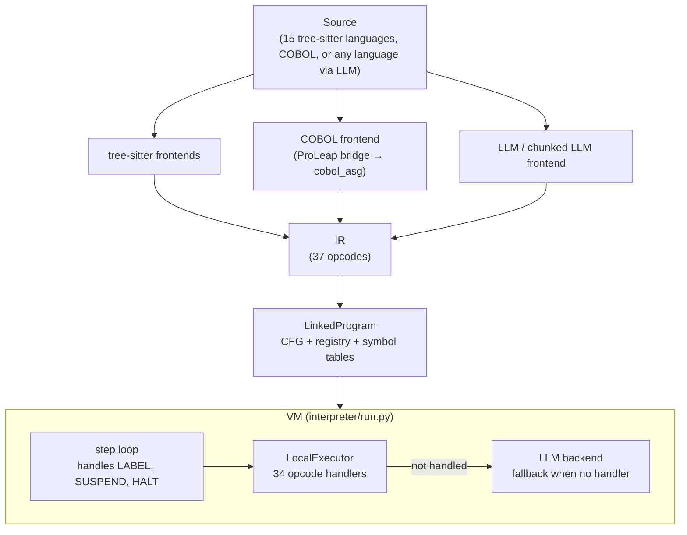
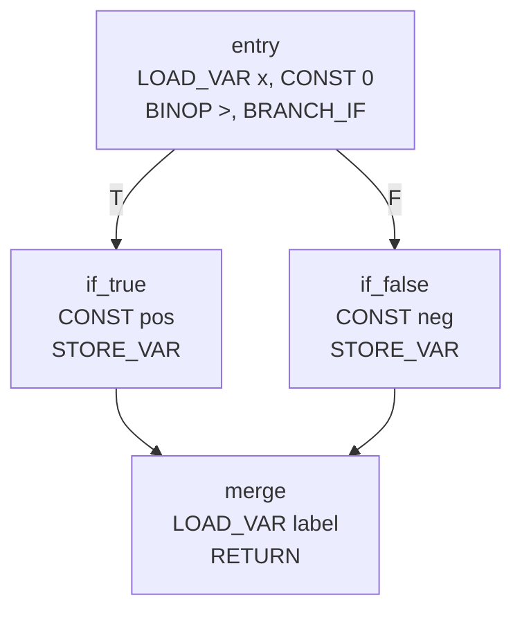
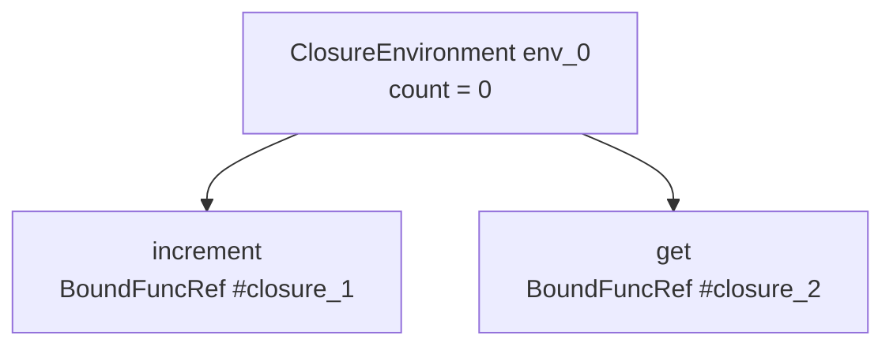

# RedDragon VM Design

How the RedDragon virtual machine works: state, step loop, calls, memory and the COBOL execution model. File references are relative to the repository root and cite a file and symbol, not line numbers. Decisions and their history live in [the ADR log](architectural-design-decisions.md); this document links to them instead of repeating them.

Related: [IR reference](ir-reference.md) (every opcode's operands and semantics), [type system](type-system.md), [linker design](linker-design.md), [dataflow notes](notes-on-dataflow-design.md).

---

## Contents

1. [Overview](#1-overview)
2. [Entry points](#2-entry-points)
3. [IR in brief](#3-ir-in-brief)
4. [Control flow graph](#4-control-flow-graph)
5. [VM state](#5-vm-state)
6. [Step loop](#6-step-loop)
7. [Calls and returns](#7-calls-and-returns)
8. [Best-effort execution](#8-best-effort-execution)
9. [Closures](#9-closures)
10. [Heap pointers (C, C++, Rust)](#10-heap-pointers-c-c-rust)
11. [Flat byte memory](#11-flat-byte-memory)
12. [COBOL execution model](#12-cobol-execution-model)
13. [Built-in functions](#13-built-in-functions)
14. [LLM fallback](#14-llm-fallback)
15. [Function and class registry](#15-function-and-class-registry)
16. [Dataflow analysis](#16-dataflow-analysis)
17. [Module map](#17-module-map)
18. [Worked example](#18-worked-example)
19. [Design principles](#19-design-principles)

---

## 1. Overview

Every frontend lowers source to one IR of 37 opcodes. The VM executes that IR over a CFG. It runs as far as it can without an LLM: an unknown value becomes a `SymbolicValue` and execution continues. The LLM is a fallback for instructions with no local handler.



## 2. Entry points

All in `interpreter/run.py`.

| Function | Does |
|---|---|
| `run(source, language, …, null_access=)` | Lower, build a single-module `LinkedProgram` (COBOL goes through `compile_cobol`), then call `run_linked`. Returns the final `VMState`. |
| `run_linked(linked, entry_point, …, initial_vm=)` | Run a linked program. A top-level entry runs `merged_cfg.entry`. A function entry runs in two phases: the module preamble, then the chosen function, sharing the step budget. |
| `execute_cfg(cfg, entry, registry, config, strategies, vm=)` | Run one CFG against a caller-supplied `VMState`. Raises if it reaches `SUSPEND`. |
| `run_resumable` / `resume` | As `execute_cfg`, but return `Suspended` or `Completed` (see [6.5](#65-suspend-and-resume)). |
| `run_linked_resumable` / `resume_linked` | The `LinkedProgram` versions. The preamble runs non-resumably. |
| `execute_cfg_traced` / `run_linked_traced` | Deep-copy `VMState` after every step into an `ExecutionTrace` (`interpreter/trace_types.py`). A separate loop, not `_run_loop` (see [6.6](#66-the-traced-loop)). |
| `initial_vm_state(io_provider=, null_access=)` | A fresh `VMState` with one `<main>` frame. `vm`/`initial_vm` arguments are required; this is how callers get one. |

For COBOL, `run()` switches a top-level entry to the program's procedure function, so phase 1 runs the program's init block and phase 2 enters `func_<PID>_0`.

**Configuration.** `VMConfig` (`interpreter/run_types.py`, frozen): `backend`, `max_steps` (default 100), `verbose`, `unresolved_call_strategy` (`SYMBOLIC` or `LLM`), `source_language`, `io_provider`, `step_callback` and `step_callback_interval`.

**Strategies.** `ExecutionStrategies` (`interpreter/run.py`, frozen) bundles the per-language pieces: `type_env`, `conversion_rules`, `overload_resolver`, `binop_coercion`, `unop_coercion`, the function and class symbol tables, `field_fallback`, `function_scoping` and `symbol_table`. `build_execution_strategies` and `_build_strategies_from_linked` build it, running type inference and building the overload resolver. Language choices:

| Strategy | Languages | Behaviour |
|---|---|---|
| `ImplicitThisFieldFallback` | Java, C#, Kotlin, Scala, C++ | A bare name not in scope resolves to `this.name` |
| `GlobalLeakFunctionScopingStrategy` | Ruby, PHP, Lua | A nested function definition is also written to the global frame |
| `JavaBinopCoercion` | Java | Java binary-operator coercion |

**Stats.** `ExecutionStats` (steps, LLM calls, heap objects, symbolic count, closures) comes back from `execute_cfg`. `PipelineStats` holds per-stage timings for `run()`.

## 3. IR in brief

The full reference is [ir-reference.md](ir-reference.md). The `Opcode` enum is in `interpreter/ir.py`; each opcode has a frozen dataclass in `interpreter/instructions.py` deriving from `InstructionBase`.

| Category | Opcodes |
|---|---|
| Value producers | `CONST`, `LOAD_VAR`, `LOAD_FIELD`, `LOAD_INDEX`, `NEW_OBJECT`, `NEW_ARRAY`, `BINOP`, `UNOP`, `CALL_FUNCTION`, `CALL_METHOD`, `CALL_UNKNOWN`, `CALL_CTOR`, `CALL_WITH_MEMORY` |
| Consumers and control flow | `DECL_VAR`, `STORE_VAR`, `STORE_FIELD`, `STORE_INDEX`, `BRANCH_IF`, `BRANCH`, `RETURN`, `THROW`, `HALT`, `TRY_PUSH`, `TRY_POP` |
| Special | `SYMBOLIC`, `LABEL` |
| Regions | `ALLOC_REGION`, `WRITE_REGION`, `LOAD_REGION` |
| Continuations | `SET_CONTINUATION`, `RESUME_CONTINUATION` |
| Suspension | `SUSPEND` |
| Pointers | `ADDRESS_OF`, `LOAD_INDIRECT`, `LOAD_FIELD_INDIRECT`, `STORE_INDIRECT` |
| Modules | `IMPORT_MODULE` |

`InstructionBase` carries `source_location`, `result_reg`, `label`, `branch_targets` and `id`, and exposes `opcode`, `operands`, `map_registers`, `map_labels`, `reads()` (a list of `StorageIdentifier`) and `writes()` (one `StorageIdentifier` or `None`). `IRInstruction` in `interpreter/ir.py` is a factory that builds the typed instruction from flat `(opcode, operands)` form.

Fields are domain types: `Register`, `CodeLabel`, `VarName`, `FieldName`, `FuncName`, `BinopKind`/`UnopKind`. Registers are `%0`, `%1`, …; named variables use `LOAD_VAR`/`STORE_VAR`/`DECL_VAR`. Block-scoped frontends may mangle names (`x$1`); see [type-system.md](type-system.md#block-scope-tracking-llvm-style).

**Constants are typed.** `Const` requires a `type_expr` and holds a real Python value. Build it with the factories `Const.int_`, `float_`, `decimal_` (COBOL only), `string`, `bool_`, `null_`, `func_ref`, `class_ref`. The VM does not parse literal text. Frontends map each language's null and booleans (`nil`, `null`, `undefined`, `NULL`, `nullptr`, `true`, `false`) to the canonical constants through `_lower_canonical_none`/`_true`/`_false`/`_bool` on `BaseFrontend` (`interpreter/frontends/_base.py`), so a `CONST` never reveals its source language.

## 4. Control flow graph

Types in `interpreter/cfg_types.py`: `BasicBlock(label, instructions, successors, predecessors)` and `CFG(blocks, entry)`, all keyed by `CodeLabel`. `build_cfg` in `interpreter/cfg.py`:

1. **Block starts:** instruction 0, every `LABEL`, and the instruction after any `BRANCH`, `BRANCH_IF`, `RETURN`, `THROW`, `HALT` or `RESUME_CONTINUATION`.
2. **Blocks:** slice between starts. A leading `LABEL` is removed and names the block; otherwise the block is `__block_<index>`.
3. **Edges** (via `_add_edge`, which keeps both directions):

```
BRANCH t               → t
BRANCH_IF t, f         → t and f
RESUME_CONTINUATION    → next block only (the real target is dynamic)
RETURN / THROW / HALT  → none
anything else / empty  → next block
```

The entry is the first block. Known gap: PERFORM return edges are missing because the continuation target is dynamic (red-dragon-picc; see the `build_cfg` docstring).

Function and class labels follow `func_<name>_<N>`, `end_<name>_<N>`, `class_<name>_<N>`, `end_class_<name>_<N>` (prefixes in `interpreter/constants.py`).



## 5. VM state

All state types are in `interpreter/vm/vm_types.py`.

```
VMState
├── _heap: dict[Address, HeapObject]          heap_get / heap_set / heap_contains / heap_ensure / heap_items …
│   └── HeapObject(type_hint: TypeExpr, fields: dict[FieldName, TypedValue])
├── _regions: dict[Address, bytearray]        region_get / region_set / region_items …
├── _segments: dict[Address, Segment]         segment_of; see §11
├── _next_address, _bases, _handles           bump allocator and sorted lookup
├── null_access: NullAccess                   NULL-page strategy; see §11
├── call_stack: list[StackFrame]
│   └── StackFrame
│       ├── function_name: FuncName
│       ├── registers: dict[Register, TypedValue]
│       ├── local_vars: dict[VarName, TypedValue]
│       ├── var_heap_aliases: dict[VarName, Pointer]   (&x promotion)
│       ├── return_label, return_ip, result_reg        (filled at call time)
│       ├── closure_env_id: ClosureId, captured_var_names
│       └── is_ctor: bool
├── path_conditions: list[str]
├── symbolic_counter: int                     gensym for sym_N and heap addresses
├── closures: dict[ClosureId, ClosureEnvironment]
├── continuations: dict[ContinuationName, CodeLabel]
├── exception_stack: list[ExceptionHandler]
├── data_layout: dict[str, dict]              COBOL field layout, set by run_linked
├── io_provider, cobol_random, cobol_random_seed
└── cobol_run_unit_return_code: int | None    see §12.3
```

Reading a register nothing has written raises `UnwrittenRegisterRead` (`interpreter/vm/unwritten_register_read.py`); it is a lowering bug, not a value. `heap_get` returns `NO_HEAP_OBJECT` (a null object) for a missing address. Heap addresses are `Address` values (`interpreter/address.py`) such as `obj_3`, `arr_4`, `mem_5`; region handles are `Address` values holding a decimal base (`"4096"`).

**Values.** Registers, locals and heap fields hold `TypedValue` (value plus `TypeExpr`). Raw values include Python primitives, `SymbolicValue(name, type_hint, constraints)`, `Pointer(base, offset)`, `FuncRef`/`BoundFuncRef`, `ClassRef`, byte lists for COBOL fields, and `CobolNumber` (`Decimal`) for COBOL arithmetic.

**`fresh_symbolic(hint)`** returns `sym_<counter>` and increments `symbolic_counter`. Handlers use the same counter to name heap objects and closures, so it is the VM's single ID source.

**`StateUpdate`** (Pydantic) is the effect of one instruction:

| Field | Effect |
|---|---|
| `register_writes`, `var_writes` | Write the current frame (var writes go to the new frame if `call_push` fired) |
| `heap_writes`, `new_objects` | Heap fields and allocations |
| `new_regions: dict[str, int]` | Allocate regions, keyed by stringified base address |
| `region_writes: list[RegionWrite(address, data)]` | Byte writes at flat addresses |
| `continuation_writes`, `continuation_clear` | Set or clear a continuation |
| `next_label` | Jump target |
| `call_push: StackFramePush`, `call_pop` | Push or pop a frame |
| `return_value` | Defaults to `VOID_RETURN` |
| `path_condition`, `reasoning` | Assumption and log text |

**`ExecutionResult(handled, update)`** is what a handler returns. `ExecutionResult.not_handled()` sends the instruction to the LLM fallback; `success(update)` carries the effect.

## 6. Step loop

### 6.1 The loop

`_run_loop` in `interpreter/run.py` serves `execute_cfg`, `run_resumable` and `resume`. Every iteration counts against `max_steps`, including block transitions.

```
for step in range(max_steps):
    if ip past end of block:
        follow successors[0], or stop if none
    inst = block.instructions[ip]
    LABEL   → ip += 1; continue
    SUSPEND → return a suspension cursor
    result = LocalExecutor.execute(inst, vm, ctx)
    update = handled ? coerce_local_update(result.update)
                     : materialize_raw_update(llm.interpret_instruction(inst, vm))
    if call_push and next_label: _handle_call_dispatch_setup (completes the push, then apply_update)
    else:                        apply_update
    HALT                          → stop
    RETURN, or THROW not caught   → _handle_return_flow
    next_label in cfg             → jump to it, ip = 0
    otherwise                     → ip += 1
else:
    warn that the step budget ran out
```

The LLM backend is created lazily on the first unhandled instruction. `step_callback` fires every `step_callback_interval` steps.

### 6.2 Dispatch

`LocalExecutor.DISPATCH` in `interpreter/vm/executor.py` is a `dict[Opcode, handler]` looked up by `inst.opcode`. It has 34 entries. The three opcodes without one:

| Opcode | Handled by |
|---|---|
| `LABEL` | `build_cfg` strips labels from blocks; the loop also skips any it meets |
| `SUSPEND` | `_run_loop` intercepts it before dispatch |
| `IMPORT_MODULE` | The linker removes resolved local imports. An unresolved import reaches the LLM fallback |

Handlers live in `interpreter/handlers/` by family: `variables.py`, `arithmetic.py`, `calls.py`, `control_flow.py`, `memory.py`, `objects.py`, `regions.py`, with shared helpers in `_common.py`. Each has the signature `handler(inst, vm, ctx) -> ExecutionResult`.

**`HandlerContext`** (frozen, in `executor.py`) is passed to every handler: `cfg`, `registry`, `current_label`, `ip`, `call_resolver`, `overload_resolver`, `type_env`, `binop_coercion`, `unop_coercion`, the function and class symbol tables, `field_fallback`, `function_scoping`, `symbol_table`. `_make_base_ctx` builds it once per run and the loop `replace`s the cursor each step.

### 6.3 apply_update

`apply_update` in `interpreter/vm/vm.py` applies a `StateUpdate` in this order:

1. `new_regions` (allocate), then `region_writes` (`vm.write_at`)
2. `continuation_writes`, then `continuation_clear`
3. `new_objects`
4. `register_writes`, coerced to the declared register type
5. `heap_writes`
6. `path_condition`
7. `call_push`
8. `var_writes` into the current frame, alias-aware, and mirrored into the closure environment for captured names
9. `call_pop` (never pops the last frame)

Pushing before `var_writes` is how arguments are passed: a call's parameter bindings land in the callee's frame.

`coerce_local_update` coerces handler register writes to the types in `type_env`. `materialize_raw_update` turns LLM output (plain JSON values, `__symbolic__` and `__pointer__` dicts) into `TypedValue`s.

### 6.4 Where state changes outside apply_update

`apply_update` is the main mutator, but not the only one. These write `VMState` directly:

- `DECL_VAR`, `STORE_VAR` write frames through `_write_var_to_frame` (alias-aware, closure-aware, and routed through `function_scoping` for function values).
- `TRY_PUSH`, `TRY_POP`, `THROW` push and pop `exception_stack`.
- `CONST` creates closure environments; `ADDRESS_OF` allocates `mem_N` and records `var_heap_aliases`.
- Class construction allocates its heap object; `LOAD_FIELD`, `STORE_FIELD`, `LOAD_INDEX`, `STORE_INDEX` materialise synthetic heap objects.
- Many handlers advance `symbolic_counter`.
- Builtins such as `__cobol_publish_return_code` set fields on `VMState`.

### 6.5 Suspend and resume

The only control state outside `VMState` is the cursor `(current_label, ip)`. Frames, return addresses, heap, regions and continuations are all in `VMState`. So `(VMState, label, ip)` is a complete continuation with no Python stack behind it.

- `SUSPEND` yields the value in `operand_reg`; on resume the injected value lands in `result_reg`. See [IR reference](ir-reference.md#suspend).
- `ExecutionState(vm, current_label, ip, resume_reg)` is the continuation. It holds no CFG or registry; `resume(cfg, registry, state, value)` takes them again, so the program can be rebuilt between suspend and resume.
- `run_resumable` returns `Suspended(state, value)` or `Completed(vm, stats)`. `resume` mutates `state.vm`; deep-copy the state to resume one suspension more than once.

Suspension happens between instructions, so `VMState` is consistent, including inside nested calls.

### 6.6 The traced loop

`execute_cfg_traced` has its own loop. It differs from `_run_loop`: it does not intercept `SUSPEND`, sends every `THROW` (caught or not) to `_handle_return_flow`, and has no `step_callback`. `run_linked_traced` always starts from `initial_vm_state()` with default settings.

## 7. Calls and returns

### 7.1 Function values

A function definition lowers to `CONST` with a `FunctionType` and the function's entry label. `_handle_const` looks the label up in `func_symbol_table` and produces a `BoundFuncRef(func_ref=FuncRef(name, label), closure_id)` (`interpreter/refs/func_ref.py`). A class constant with a `Type[X]` metatype becomes the `ClassRef` from `class_symbol_table`. There is no string encoding of function or class references.

### 7.2 CALL_FUNCTION

`_handle_call_function` (`interpreter/handlers/calls.py`) resolves arguments with `_resolve_call_args` (which expands `SpreadArguments` from a heap array), then tries in order:

```
0. io_provider        __cobol_* names the injected COBOL I/O provider recognises
1. builtin            Builtins.TABLE (§13)
2. scope lookup       walk call_stack innermost-out for the name; not found → call_resolver
2b. heap call-index   f(i) on a heap array (Scala apply)
2c. native index      s(i) on a Python str or list
3. constructor        value is a ClassRef → _try_class_constructor_call
4. user function      value is a BoundFuncRef → _try_user_function_call
5. otherwise          call_resolver.resolve_call
```

`CALL_CTOR` (`_handle_call_ctor`) does the scope lookup, then constructor, then user function, then the resolver, carrying the instruction's `type_hint`. `CALL_UNKNOWN` tries a user-function call on the target register, then the resolver.

### 7.3 CALL_METHOD

`_handle_call_method`:

```
1. receiver is a BoundFuncRef  → call it
2. receiver is a ClassRef      → static method from registry.class_methods, no self
3. method builtin              Builtins.METHOD_TABLE
4. receiver type not in the registry:
     heap field holding a BoundFuncRef → call it with the receiver as first arg (Lua tables, JS objects)
     else                              → call_resolver.resolve_method
5. registry method on the type, overloads chosen by overload_resolver
6. parent chain via registry.class_parents
7. __method_missing__ / __boxed__ delegation (_resolve_method_delegation_target)
8. otherwise → call_resolver.resolve_method
```

The callee's first parameter is bound to the receiver.

### 7.4 Dispatch and frame setup

`_try_user_function_call` returns a `StateUpdate` with `call_push`, `next_label` (the callee's entry) and `var_writes` (parameters, captured closure variables, and an `arguments` heap array). Handlers cannot know where the caller resumes, so `_handle_call_dispatch_setup` fills `return_label`, `return_ip = ip + 1` and `result_reg` on the `StackFramePush` before `apply_update`.

### 7.5 Parameters

A function body declares each parameter with `SYMBOLIC param:<name>`. `_handle_symbolic` returns the caller's binding from the frame if present; otherwise a fresh symbolic. So a called function sees concrete arguments, and a function entered directly sees symbols.

### 7.6 Constructors

`_try_class_constructor_call` allocates `obj_N` with the class type, writes a `Pointer` to it into `result_reg`, and, if the class has an `__init__` in the CFG, pushes a frame with `is_ctor=True`. `self`/`this` is bound to the pointer: as the first declared parameter when it is named `self` or `this`, otherwise as an implicit `this`. A constructor frame's `RETURN` yields void, so the pointer already in `result_reg` survives.

### 7.7 Return flow

`_handle_return` produces `return_value` and `call_pop`. After `apply_update` pops the frame, `_handle_return_flow`:

1. stops if the returning frame is `<main>` or the stack is empty;
2. writes `return_value` to the caller's `result_reg`, unless the value is void or there is no result register;
3. resumes at `return_label:return_ip`, or stops if that label is not in the CFG.

### 7.8 HALT

`HALT` (`Halt_`) is emitted only by COBOL `STOP RUN`. The loop breaks on it unconditionally, after applying its (empty) update, without consulting the call stack. `GOBACK` and `EXIT PROGRAM` lower to `RETURN`. `Halt_` is a separate type so return-type inference does not see it. See [ADR-145](architectural-design-decisions.md) and [ADR-147](architectural-design-decisions.md).

## 8. Best-effort execution

An unknown becomes a `SymbolicValue` and execution goes on.

| Situation | Result |
|---|---|
| `LOAD_VAR` of an unbound name | Field fallback (implicit `this`), then `sym_N` hinted with the name |
| Unknown function or method | `call_resolver` (`interpreter/vm/unresolved_call.py`): `SymbolicResolver` returns `sym_N` with constraint `f(args)`; `LLMPlausibleResolver` asks an LLM for a plausible value |
| `BINOP`/`UNOP` with a symbolic operand | New `sym_N` with constraint `a op b` (`sym == null` is `False`) |
| Concrete but uncomputable (`x / 0`, type error) | `Operators.eval_binop` returns `UNCOMPUTABLE`; the handler makes a symbolic |
| Field or index on an object not on the heap | A synthetic `HeapObject` is materialised at that address; a missing field becomes `sym_N` and, for `LOAD_FIELD`, is cached in the object so repeat reads agree |
| `BRANCH_IF` on a symbolic | Take the true branch and record `assuming <sym> is True` |
| Builtin returns `UNCOMPUTABLE` | `_try_builtin_call` wraps it as `sym_N` with constraint `name(args)` |

`Operators` (`interpreter/vm/vm.py`) holds `BINOP_TABLE` and `eval_unop`. Failures come back as the `UNCOMPUTABLE` sentinel, not exceptions. Concrete branches also record a path condition, such as `%3 is True`.

`LOAD_VAR` and `STORE_VAR` walk the call stack from innermost to outermost. `STORE_VAR` updates the frame where the name already exists; otherwise implicit `this`, otherwise the current frame. `DECL_VAR` always writes the current frame.

## 9. Closures

Closures capture by reference. Closures made in the same frame share one `ClosureEnvironment(bindings)`.

When `CONST` creates a `BoundFuncRef` inside a function (`len(call_stack) > 1`), `_handle_const`:

- reuses the enclosing frame's environment if it has one, adding any new locals; otherwise creates `env_N` from the frame's locals and records `closure_env_id` and `captured_var_names` on the frame;
- registers the same environment under a fresh `closure_N` and stamps that ID on the `BoundFuncRef`.

On a call, `_try_user_function_call` copies the environment's bindings into the new frame (parameters win) and marks them captured. Writes to captured names, through `apply_update` or `_write_var_to_frame`, also update the environment, so sibling closures and later calls see them.



After `increment()`, `env_0.bindings["count"]` is 1, and `get()` reads 1.

## 10. Heap pointers (C, C++, Rust)

These are object pointers on the heap. COBOL pointers are flat byte addresses instead (§11, §12.4).

`Pointer(base: Address, offset: int)` names `heap[base].fields[offset]`. `ADDRESS_OF x` (`_handle_address_of`, `interpreter/handlers/memory.py`):

- already aliased → the existing pointer;
- a function value → the function value itself;
- a pointer to an `obj_`/`arr_` heap object, or an address on the heap → `Pointer(addr, 0)`, no alias;
- otherwise → promote: allocate `mem_N` with field `0` holding the current value, record `var_heap_aliases[x]`, return `Pointer(mem_N, 0)`. A pointer held in a variable is promoted the same way, which gives `**pp`.

After promotion, `LOAD_VAR`/`STORE_VAR` of `x` read and write the heap slot.

| Operation | Behaviour |
|---|---|
| `LOAD_INDIRECT p` | Field `offset` (INDEX kind, then PROPERTY). Missing on an `obj_`/`arr_` base → the pointer itself; otherwise a symbolic. A function value dereferences to itself. |
| `STORE_INDIRECT p v` | Heap write to field `offset` (INDEX kind) |
| `p + n`, `p - n`, `n + p` | New `Pointer` with the offset moved |
| `p - q` (same base) | Offset difference |
| `<`, `>`, `<=`, `>=`, `==`, `!=` (same base) | Compare offsets |

## 11. Flat byte memory

Regions are byte-addressed memory, used by COBOL. [ADR-151](architectural-design-decisions.md) and [ADR-152](architectural-design-decisions.md).

**One address space.** `VMState` places each region as a `Segment(base, size)` (`interpreter/vm/segment.py`) in one flat space. A bump allocator starts at `FIRST_ADDRESS = 4096`; each region takes the next free address, and an empty region still takes one address. Storage stays one `bytearray` per segment, because callers hold and mutate those buffers in place.

```
address: 0 ........ 4095 | 4096 ......... 4096+a | 4096+a ......... | …
         NULL page       | segment A (WS)        | segment B (LINKAGE copy) | …
                           handle "4096"           handle "<4096+a>"
```

**Handles are addresses.** `ALLOC_REGION` returns the next base as an `int` and emits `new_regions={str(base): size}`. `WRITE_REGION r, off, len, bytes` writes at `r + off`; `LOAD_REGION r, off, len` reads `len` bytes at `r + off` and zero-pads a short read. Pointer arithmetic is plain integer `BINOP`. A symbolic size or address gives a symbolic result (or a no-op write).

**Access.** `read_at(address, length)` and `write_at(address, data)`:

- below 4096 → the `null_access` strategy;
- within one segment → a direct slice;
- across a segment end → continue into the following segments in address order, log a warning; gaps read as zero, bytes past the last segment are dropped on write and missing on read.

`region_set` on an existing handle overwrites in place and rejects a size change. `segment_of(handle)` gives a region's `Segment`.

**NULL page.** `NullAccess` (`interpreter/vm/null_access.py`) is a protocol with `on_read` and `on_write`, injected into `VMState.null_access`:

| Strategy | Read | Write |
|---|---|---|
| `WarnAndIgnore` (default, `WARN_AND_IGNORE`) | zeroes, warning | dropped, warning |
| `HaltOnNull` | raises `NullAddressAccess` | raises `NullAddressAccess` |

`run(null_access=)` and `initial_vm_state(null_access=)` choose it.

## 12. COBOL execution model

### 12.1 Program singletons

Each program's lowering (`interpreter/cobol/lower_program_init.py`) emits an init block that runs once at load. It allocates WORKING-STORAGE and the special-registers region, and stores a singleton heap object in `__prog_<PID>` with fields `ws_handle`, `return_code_handle`, `run` (a `BoundFuncRef` to `func_<PID>_0`) and `__init_params__` (a `BoundFuncRef` to `func_init_params_<PID>_0`).

### 12.2 CALL_WITH_MEMORY

`CALL … USING` passes one address per argument ([ADR-150](architectural-design-decisions.md), replacing ADR-144's copy-in/copy-back):

1. The caller builds an argument array in plain IR: `NEW_ARRAY` with a `count` field and, per argument, a `NEW_OBJECT` with `region`, `offset` and `omitted`. BY REFERENCE passes the argument's own region and offset. BY CONTENT, BY VALUE and literals pass a fresh `RegionId.CALL_ARGUMENT` copy.
2. `_handle_call_with_memory` resolves the callee name (from `func_name`, or from `target_reg` for `CALL identifier`, trimmed and upper-cased), finds `__prog_<PID>` in scope, and dispatches to its `__init_params__`, binding the array as `__call_arguments` in the new frame.
3. The callee binds each LINKAGE 01 to its argument: a region and a shift from its static offset. An absent or OMITTED argument binds NULL ([ADR-152](architectural-design-decisions.md)).

A literal callee that is not linked goes to `call_resolver` and stays symbolic. A runtime-resolved name that is not linked raises `UnresolvedProgramError`.

Harnesses build an argument array with `call_arguments(vm, regions)` (`interpreter/cobol/call_arguments.py`), passing each region BY REFERENCE at offset 0.

### 12.3 RETURN-CODE

- A program exit (`lower_program_exit`) loads its RETURN-CODE bytes, calls `__cobol_publish_return_code`, then `RETURN`s the bytes. `STOP RUN` publishes before `HALT`.
- The caller's `CALL_WITH_MEMORY` result register is seeded with its own RETURN-CODE, so a void return leaves it unchanged; the CALL lowering then copies the register into the caller's RETURN-CODE.
- `__cobol_publish_return_code` sets `VMState.cobol_run_unit_return_code`. The last program to end wins, which is the value the operating system would get.
- `read_return_code(vm)` (`interpreter/cobol/return_code_readback.py`) returns the published value, or falls back to scanning the heap for a `return_code_handle` region.

### 12.4 Pointers

`USAGE POINTER` items store flat addresses. `ADDRESS OF`, `NULL` (the constant 0), `SET ADDRESS OF` (rebinds a LINKAGE item's region register and shift) and `SET … UP BY` are ordinary IR over integers. Pointer width follows IBM's `LP` option via `AddressingMode`. [ADR-152](architectural-design-decisions.md).

### 12.5 PERFORM continuations

`SET_CONTINUATION name, label` records a return point. `RESUME_CONTINUATION name` jumps to it if set and clears it either way (`continuation_clear`); if unset it falls through.

### 12.6 Exact numerics

COBOL arithmetic uses `CobolNumber` (`Decimal`) from `cobol_numeric`, a top-level package that does not import `interpreter` (import-linter contract `cobol-numeric-is-a-leaf`). Lowering emits `Const.decimal_` and boundary builtins (`__cobol_add`, `__cobol_divide`, `__cobol_from_digits`, `__cobol_to_text`, …); intermediate scales follow IBM `ARITH(COMPAT)` and are computed at lowering time by `cobol_numeric.scale`. `_serialize_value` renders a `CobolNumber` as plain text. [ADR-148](architectural-design-decisions.md), [ADR-149](architectural-design-decisions.md), [ADR-146](architectural-design-decisions.md) for ROUNDED.

### 12.7 cobol_memory

`cobol_memory` is the static byte-extent algebra, also a leaf package (`cobol-memory-is-a-leaf`). The VM does not use it at run time; lowering and dataflow do.

| Type | Role |
|---|---|
| `RegionId` | The section a field lives in: WORKING_STORAGE, LINKAGE, LOCAL_STORAGE, FILE, SPECIAL_REGISTERS, INDEXES, CALL_ARGUMENT |
| `FieldExtent` | A byte range in one region, `EXACT` or `CLAMPED`; two fields alias when their ranges meet |
| `AbstractLocation` | Protocol: `may_alias`, `must_cover`, `alias_key` |
| `StorageIdentifier` | Protocol for registers and variables; the type of `InstructionBase.reads()`/`writes()` |

## 13. Built-in functions

`Builtins` in `interpreter/vm/builtins.py`:

- `TABLE: dict[FuncName, builtin]` — `len`, `strlen`, `range`, `print`, `println`, `int`, `float`, `str`, `bool`, `abs`, `max`, `min`, `keys`, `arrayOf` and its aliases, `slice`, `clone`, `isinstance`, `object_rest`, `str_upper`, `str_lower`, `str_strip`, `list_append`, `dict_contains_key`, `__py_contains__`, plus the COBOL `BYTE_BUILTINS` from `interpreter/cobol/byte_builtins.py`.
- `METHOD_TABLE` — `subList`, `substring`, `slice`, `to_string`, `toString`, `length`, `size`, `Length`.

A builtin takes `(args: list[TypedValue], vm)` and returns `BuiltinResult(value, new_objects, heap_writes)`; heap effects travel in the result. `UNCOMPUTABLE` becomes a symbolic. Language-specific helpers use mangled names (`__py_contains__`) so they cannot clash with user functions.

`__py_contains__` exists because Python list literals are heap objects, which `BINOP_TABLE`'s `in` cannot see. The Python frontend lowers `x in c` to it and adds `UNOP not` for `not in`.

`isinstance` compares a heap object's scalar type name with `str()` of the second argument (exact match, no parent walk). For a value not on the heap it maps `int`, `str`, `float`, `bool`, `list` to Python types.

## 14. LLM fallback

`interpreter/llm/backend.py`. `get_backend(name)` returns an `LLMInterpreterBackend` wrapping an `LLMClient`; providers go through LiteLLM. `interpret_instruction(instruction, vm)` sends a compact JSON prompt (instruction, resolved operands, relevant state) and parses a `StateUpdate`. The loop materialises it with `materialize_raw_update` and counts it in `llm_calls`.

All opcodes except `LABEL`, `SUSPEND` and `IMPORT_MODULE` have local handlers, so the fallback runs only for an unresolved `IMPORT_MODULE` or a `SUSPEND` under the traced loop.

## 15. Function and class registry

`FunctionRegistry` (`interpreter/registry.py`), built by `build_registry(instructions, cfg, func_symbol_table, class_symbol_table)`:

| Field | Contents |
|---|---|
| `func_params: dict[CodeLabel, list[str]]` | From `SYMBOLIC param:x` in each `func_` block, in order |
| `classes: dict[ClassName, CodeLabel]` | From `class_symbol_table` |
| `class_methods: dict[ClassName, dict[FuncName, list[CodeLabel]]]` | Function constants inside a class scope; lists hold overloads. Methods hoisted after `end_class_` still count |
| `class_parents: dict[ClassName, list[ClassName]]` | Linearised parent chain |
| `func_refs: dict[FuncName, FuncRef]` | Name to reference |

Use `lookup_methods`, `lookup_func`, `register_func`, `register_method`.

## 16. Dataflow analysis

`interpreter/dataflow.py`, `analyze(cfg)`: collect definitions, solve reaching definitions (worklist, capped by `DATAFLOW_MAX_ITERATIONS` worklist pops), extract def-use chains, build the raw dependency graph by tracing registers back from stores, then its transitive closure. `DataflowResult` holds both graphs. Definitions and uses are `StorageIdentifier`s from each instruction's `reads()`/`writes()`. COBOL field-level memory dataflow is in `interpreter/cobol/memory_dataflow.py`. Details: [notes-on-dataflow-design.md](notes-on-dataflow-design.md).

## 17. Module map

```
interpreter/
├── ir.py                 Opcode (37), CodeLabel, SourceLocation, SpreadArguments, IRInstruction factory
├── instructions.py       InstructionBase and one frozen dataclass per opcode
├── register.py, var_name.py, field_name.py, func_name.py, class_name.py,
│   address.py, closure_id.py, continuation_name.py, operator_kind.py   domain types
├── cfg_types.py, cfg.py  BasicBlock, CFG, build_cfg, cfg_to_mermaid
├── registry.py           FunctionRegistry, build_registry
├── refs/                 FuncRef, BoundFuncRef, ClassRef
├── run.py                entry points, _run_loop, execute_cfg_traced, ExecutionStrategies
├── run_types.py          VMConfig, ExecutionStats, PipelineStats
├── trace_types.py        TraceStep, ExecutionTrace
├── vm/
│   ├── vm_types.py       VMState, StackFrame, HeapObject, Pointer, SymbolicValue, StateUpdate, ExecutionResult, BuiltinResult
│   ├── vm.py             apply_update, coerce_local_update, materialize_raw_update, _resolve_reg, _heap_addr, Operators
│   ├── executor.py       HandlerContext, LocalExecutor.DISPATCH
│   ├── segment.py        Segment, FIRST_ADDRESS
│   ├── null_access.py, warn_and_ignore.py, halt_on_null.py, null_address_access.py   NULL-page strategies
│   ├── builtins.py       Builtins.TABLE, METHOD_TABLE
│   ├── unresolved_call.py  SymbolicResolver, LLMPlausibleResolver
│   ├── field_fallback.py   NoFieldFallback, ImplicitThisFieldFallback
│   └── function_scoping.py Local / GlobalLeak function scoping
├── handlers/             opcode handlers by family (variables, arithmetic, calls, control_flow, memory, objects, regions, _common)
├── llm/                  LLM backend, client, LLM frontends
├── types/                TypeExpr, type inference, coercion
├── overload/             overload resolution
├── project/              compiler, linker, LinkedProgram, EntryPoint, compile_cobol
├── frontends/            15 tree-sitter frontends
├── cobol/                COBOL lowering, byte builtins, call_arguments, return_code_readback, memory dataflow
└── dataflow.py           reaching definitions, def-use, dependency graphs
cobol_numeric/            CobolNumber, exact arithmetic, IBM scale rules (leaf)
cobol_memory/             RegionId, FieldExtent, AbstractLocation, StorageIdentifier (leaf)
cobol_asg/                COBOL parse model (leaf)
```

Import contracts (`.importlinter`): `interpreter.vm` and `interpreter.handlers` must not import `interpreter.frontends` (one exception: `executor` → `frontends.symbol_table`); they must not import `interpreter.cobol` (one exception: `vm.builtins` → `cobol.byte_builtins`); `interpreter.ir` imports none of the VM; `interpreter.project` must not import VM internals.

## 18. Worked example

```python
def double(x):
    return x * 2

result = double(5)
```

IR from the Python frontend (`dump_ir`), as CFG blocks:

```
[entry]          succs=end_double_1
  branch end_double_1
[func_double_0]
  %0 = symbolic param:x
  decl_var x %0
  %1 = load_var x
  %2 = const 2
  %3 = binop * %1 %2
  return %3
[__block_9]                       (implicit return, unreachable here)
  %4 = const None
  return %4
[end_double_1]
  %5 = const func_double_0
  decl_var double %5
  %6 = const 5
  %7 = call_function double %6
  store_var result %7
```

Registry: `func_params = {func_double_0: ["x"]}`.

Execution (`run(..., verbose=True)`):

```
step 0   entry:0          branch                    → end_double_1
step 1   end_double_1:0   const func_double_0       %5 = BoundFuncRef(double @ func_double_0)
step 2   end_double_1:1   decl_var double           <main>.double = %5
step 3   end_double_1:2   const 5                   %6 = 5
step 4   end_double_1:3   call_function double %6   scope lookup finds the BoundFuncRef;
                                                    push frame "double" (return end_double_1:4, result %7);
                                                    var_writes x = 5, arguments = arr_0
step 5   func_double_0:0  symbolic param:x          bound by caller → %0 = 5
step 6   func_double_0:1  decl_var x %0
step 7   func_double_0:2  load_var x                %1 = 5
step 8   func_double_0:3  const 2                   %2 = 2
step 9   func_double_0:4  binop * %1 %2             %3 = 10
step 10  func_double_0:5  return %3                 pop frame; caller %7 = 10; resume end_double_1:4
step 11  end_double_1:4   store_var result %7       <main>.result = 10
step 12  end of end_double_1, no successors         stop
```

`ExecutionStats.steps` is 13 and `llm_calls` is 0.

## 19. Design principles

| Principle | Where it shows |
|---|---|
| Deterministic first | 34 local handlers; the LLM only sees what has no handler |
| Effects as data | Handlers return `StateUpdate`; `apply_update` applies most of it (exceptions in §6.4) |
| Result types over exceptions | `ExecutionResult.not_handled()`; `Operators.UNCOMPUTABLE` |
| Null objects | `NO_HEAP_OBJECT`, `NO_REGISTER`, `NO_LABEL`, `NO_ADDRESS`, `VOID_RETURN` |
| Domain types | `Register`, `CodeLabel`, `VarName`, `FieldName`, `FuncName`, `Address`, `BinopKind`; typed `Const`; `FuncRef`/`ClassRef` instead of strings |
| Injected strategies | `ExecutionStrategies`, `UnresolvedCallResolver`, `NullAccess` |
| Continuation as data | `(VMState, label, ip)` is enough to suspend and resume |
| One address space for bytes | Region handles are addresses; pointers are integers (ADR-151, ADR-152) |
| Leaf packages for COBOL statics | `cobol_numeric`, `cobol_memory`, `cobol_asg` import nothing from `interpreter` |
