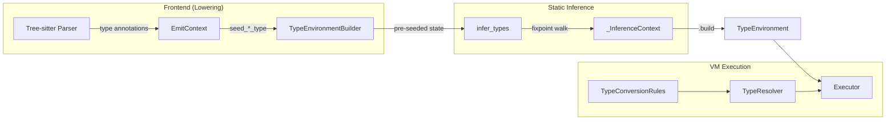
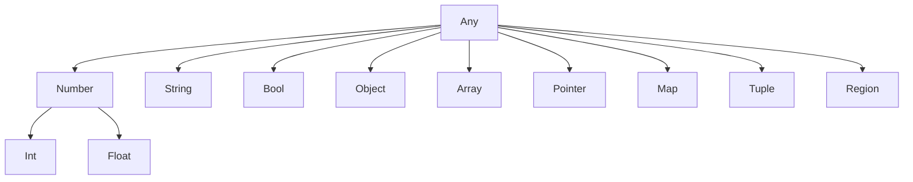
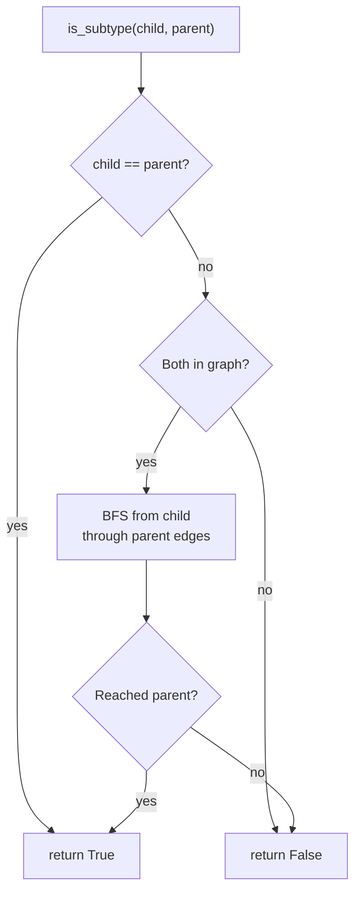
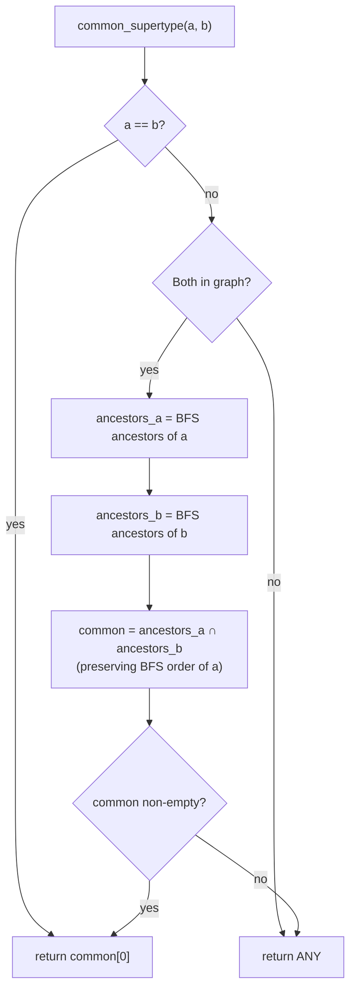
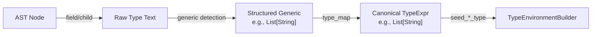
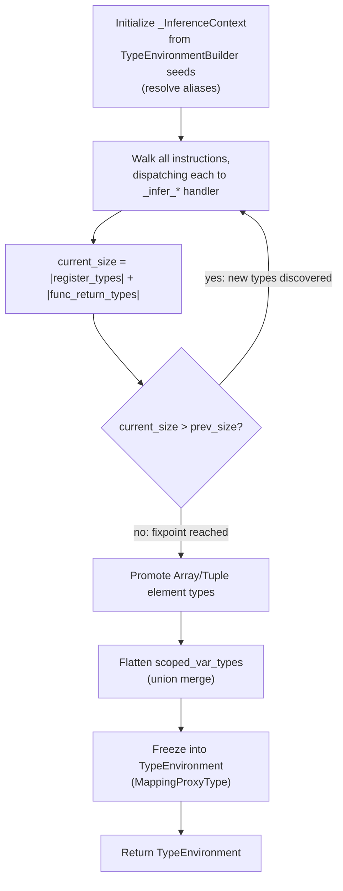
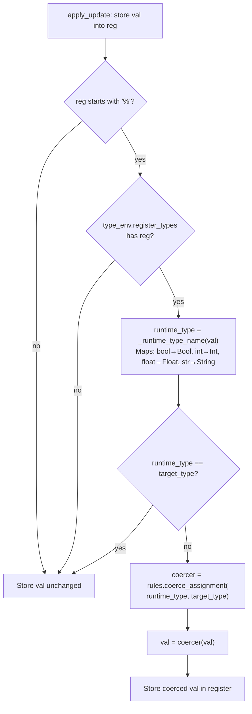
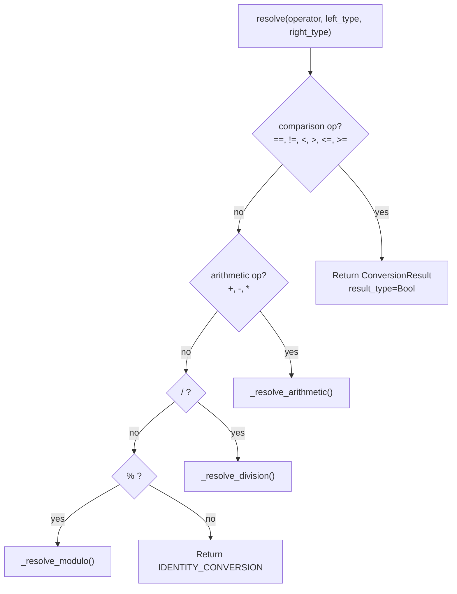
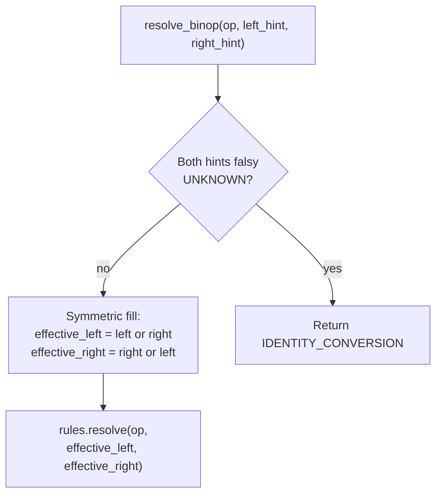
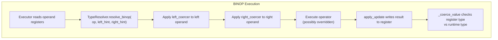

# Type System Design Document

RedDragon's type system provides **static type inference** over the universal IR, enabling type-aware operator semantics (e.g. integer division, float promotion) and write-time coercion during VM execution. It is designed for incomplete programs: when type information is missing, the system degrades gracefully to identity (no coercion) rather than failing.

## Table of Contents

- [Architecture Overview](#architecture-overview)
- [TypeExpr — Algebraic Data Type for Types](#typeexpr--algebraic-data-type-for-types)
  - [Variants](#variants)
  - [String Compatibility](#string-compatibility)
  - [Convenience Constructors](#convenience-constructors)
  - [parse_type() — String ↔ TypeExpr Round-Tripping](#parsetype--string--typeexpr-round-tripping)
  - [Union Types](#union-types)
  - [Function Types](#function-types)
  - [Tuple Types](#tuple-types)
  - [Type Aliases](#type-aliases)
  - [Interface/Trait Typing](#interfacetrait-typing)
  - [Bounded Type Variables](#bounded-type-variables)
- [Type Hierarchy](#type-hierarchy)
  - [TypeName Enum](#typename-enum)
  - [TypeNode](#typenode)
  - [TypeGraph](#typegraph)
- [Phase 1: Frontend Type Extraction](#phase-1-frontend-type-extraction)
  - [Type Extraction Pipeline](#type-extraction-pipeline)
  - [Seeding Methods](#seeding-methods)
  - [Universal Seeding Patterns](#universal-seeding-patterns)
  - [Per-Language Type Extraction](#per-language-type-extraction)
  - [TypeEnvironmentBuilder](#typeenvironmentbuilder)
- [Phase 2: Static Type Inference](#phase-2-static-type-inference)
  - [_InferenceContext](#_inferencecontext)
  - [infer_types() — Full Flow](#infertypes--full-flow)
  - [Fixpoint Algorithm](#fixpoint-algorithm)
  - [Per-Opcode Inference Rules](#per-opcode-inference-rules)
  - [Post-Fixpoint Promotion](#post-fixpoint-promotion)
  - [Function Signature Assembly](#function-signature-assembly)
  - [Type Alias Resolution](#type-alias-resolution)
  - [Builtin Type Knowledge](#builtin-type-knowledge)
  - [TypeEnvironment (Output)](#typeenvironment-output)
  - [Block-Scope Tracking (LLVM-style)](#block-scope-tracking-llvm-style)
- [Phase 3: Runtime Type Coercion](#phase-3-runtime-type-coercion)
  - [Coercion Flow](#coercion-flow)
  - [TypeConversionRules (ABC)](#typeconversionrules-abc)
  - [ConversionResult](#conversionresult)
  - [DefaultTypeConversionRules](#defaulttypeconversionrules)
  - [TypeResolver](#typeresolver)
  - [How Coercion Composes End-to-End](#how-coercion-composes-end-to-end)
- [End-to-End Example](#end-to-end-example)
- [Extensibility](#extensibility)

---

## Architecture Overview



The type system operates in three phases:

1. **Frontend extraction** — During IR lowering, frontends extract type annotations from source ASTs and seed them into a `TypeEnvironmentBuilder`. All seeding methods call `parse_type()` at the boundary, converting raw language-specific type strings into `TypeExpr` ADT objects.
2. **Static inference** — `infer_types()` walks the IR to fixpoint, propagating types through registers, variables, and function signatures. Pre-seeded types take precedence and are never widened.
3. **Runtime coercion** — During VM execution, `_coerce_value()` applies write-time coercion when storing values into typed registers, using pluggable `TypeConversionRules`.

---

## TypeExpr — Algebraic Data Type for Types

All types in the system are represented as `TypeExpr` values (`interpreter/type_expr.py`), an algebraic data type (ADT) with six variants. Every `TypeExpr` is a frozen (immutable) dataclass.

### Variants

| Variant | Fields | String Form | Example |
|---|---|---|---|
| `ScalarType` | `name: str` | `"Int"` | `ScalarType("Int")`, `ScalarType("String")` |
| `ParameterizedType` | `constructor: str`, `arguments: tuple[TypeExpr, ...]` | `"Pointer[Int]"` | `ParameterizedType("Map", (ScalarType("String"), ScalarType("Int")))` |
| `UnionType` | `members: frozenset[TypeExpr]` | `"Union[Int, String]"` | Members sorted alphabetically in string form |
| `FunctionType` | `params: tuple[TypeExpr, ...]`, `return_type: TypeExpr` | `"Fn(Int, String) -> Bool"` | `FunctionType((ScalarType("Int"),), ScalarType("Bool"))` |
| `TypeVar` | `name: str`, `bound: TypeExpr = UNKNOWN` | `"T"` or `"T: Number"` | `TypeVar("T", bound=ScalarType("Number"))` |
| `UnknownType` | *(none)* | `""` (empty string) | Singleton `UNKNOWN`; falsy |

### String Compatibility

All `TypeExpr` values support **string-compatible equality and hashing**:

```python
ScalarType("Int") == "Int"                                              # True
ParameterizedType("Pointer", (ScalarType("Int"),)) == "Pointer[Int]"    # True
UnionType({ScalarType("Int"), ScalarType("String")}) == "Union[Int, String]"  # True
hash(ScalarType("Int")) == hash("Int")                                  # True
```

This is implemented via `__eq__` (compares `str(self)` against `str(other)` or raw strings) and `__hash__` (hashes `str(self)`). The `__bool__` method returns the truthiness of the string representation, making `UNKNOWN` (empty string) falsy — so `if type_expr:` checks whether a type is known.

**No string roundtrips in the pipeline:** The entire type pipeline operates on `TypeExpr` objects end-to-end. Frontends call `parse_type()` at the seeding boundary, `TypeEnvironmentBuilder` stores `TypeExpr`, the inference engine and type resolver work with `TypeExpr` throughout, and `UNKNOWN` (falsy `UnknownType` singleton) replaces empty strings. There are no string serialization/deserialization roundtrips anywhere in the pipeline.

### Convenience Constructors

| Function | Returns | Example |
|---|---|---|
| `scalar(name)` | `ScalarType(name)` | `scalar("Int")` → `ScalarType("Int")` |
| `pointer(inner)` | `ParameterizedType("Pointer", (inner,))` | `pointer(scalar("Int"))` → `Pointer[Int]` |
| `array_of(element)` | `ParameterizedType("Array", (element,))` | `array_of(scalar("String"))` → `Array[String]` |
| `map_of(key, value)` | `ParameterizedType("Map", (key, value))` | `map_of(scalar("String"), scalar("Int"))` → `Map[String, Int]` |
| `tuple_of(*elements)` | `ParameterizedType("Tuple", elements)` | `tuple_of(scalar("Int"), scalar("String"))` → `Tuple[Int, String]` |
| `fn_type(params, ret)` | `FunctionType(params, ret)` | `fn_type((scalar("Int"),), scalar("Bool"))` → `Fn(Int) -> Bool` |
| `typevar(name, bound)` | `TypeVar(name, bound)` | `typevar("T", scalar("Number"))` → `T: Number` |
| `union_of(*types)` | `UnionType` or singleton | See [Union Types](#union-types) |
| `optional(inner)` | `union_of(inner, Null)` | `optional(scalar("Int"))` → `Union[Int, Null]` |
| `unknown()` | `UnknownType()` | Returns `UNKNOWN` singleton |

### parse_type() — String ↔ TypeExpr Round-Tripping

`parse_type(s: str) → TypeExpr` parses canonical type strings into `TypeExpr` objects. It round-trips with `__str__`: `parse_type(str(expr)) == expr` for all valid `TypeExpr` values.

**Supported syntax:**

| Input String | Parsed Result |
|---|---|
| `""` | `UNKNOWN` |
| `"Int"` | `ScalarType("Int")` |
| `"Pointer[Int]"` | `ParameterizedType("Pointer", (ScalarType("Int"),))` |
| `"Map[String, Int]"` | `ParameterizedType("Map", (ScalarType("String"), ScalarType("Int")))` |
| `"Pointer[Array[Int]]"` | Nested `ParameterizedType` |
| `"Union[Int, String]"` | `UnionType({ScalarType("Int"), ScalarType("String")})` |
| `"Optional[Int]"` | `UnionType({ScalarType("Int"), ScalarType("Null")})` |
| `"Fn(Int, String) -> Bool"` | `FunctionType((ScalarType("Int"), ScalarType("String")), ScalarType("Bool"))` |
| `"T: Number"` | `TypeVar("T", bound=ScalarType("Number"))` |

**Implementation:** A recursive descent parser with four internal functions:
- `_parse_expr(s, pos)` → `(TypeExpr, next_pos)` — dispatches to name, args, or function type parsing
- `_parse_name(s, pos)` → `(str, next_pos)` — consumes identifier until `[`, `]`, `,`, `(`, `)`, or end
- `_parse_args(s, pos)` → `(list[TypeExpr], next_pos)` — parses comma-separated type arguments within `[...]`
- `_parse_function_type(s, pos)` → `(FunctionType, next_pos)` — parses `Fn(params...) -> return_type`

### Union Types

`UnionType(members: frozenset[TypeExpr])` represents a type that could be any of its members. Always construct via `union_of()`, never directly.

**`union_of(*types)` behavior:**

1. **Flatten** nested unions: `union_of(Union[A, B], C)` → `Union[A, B, C]`
2. **Filter** `UNKNOWN` members (falsy types removed)
3. **Deduplicate** via frozenset
4. **Eliminate singletons**: if one member remains, return it directly (not wrapped in `Union`)
5. **Empty**: `union_of()` → `UNKNOWN`

**Canonical string form:** Members sorted alphabetically — `"Union[Bool, Int, String]"` — ensuring deterministic hashing and equality.

**Optional sugar:**

| Function | Behavior |
|---|---|
| `optional(T)` | `union_of(T, ScalarType("Null"))` → `Union[Null, T]` |
| `is_optional(t)` | Returns `True` if `t` is a `UnionType` containing `Null` |
| `unwrap_optional(t)` | Removes `Null` from union; returns singleton if one member remains |

**Inference interaction:** When `store_var_type()` assigns a different type to an already-typed variable, the existing type is widened to a union:
```
x = 5        →  x: Int
x = "hello"  →  x: Union[Int, String]
x = True     →  x: Union[Bool, Int, String]
```

### Function Types

`FunctionType(params: tuple[TypeExpr, ...], return_type: TypeExpr)` represents callable types:

- **String form**: `Fn(Int, String) -> Bool`
- **Zero params**: `Fn() -> Int`
- **Inference**: When a CONST instruction contains a function reference `<function:add@func_add_0>` and the function's parameter and return types are known, the inference engine assigns a `FunctionType` to the register holding the reference. `CALL_UNKNOWN` then resolves the return type from the `FunctionType` target.
- **Subtyping**: Standard function subtyping — contravariant parameters, covariant return:
  - `Fn(Number) -> Int ⊆ Fn(Int) -> Number` (accepts broader input, returns narrower output)

### Tuple Types

Tuple types use `ParameterizedType("Tuple", (element_types...))` for heterogeneous fixed-size collections:

- **Construction**: `tuple_of(scalar("Int"), scalar("String"))` → `Tuple[Int, String]`
- **Per-index tracking**: The inference engine tracks element types per index position via `tuple_element_types: dict[str, dict[int, TypeExpr]]`. When `STORE_INDEX` writes to index `i` of a tuple register, the element type is recorded at position `i`. When `LOAD_INDEX` reads from index `i`, the per-index type is resolved — so `t[0]` on `Tuple[Int, String]` resolves to `Int` and `t[1]` resolves to `String`.
- **Promotion**: After fixpoint convergence, variables typed as bare `Tuple` are promoted to `Tuple[T1, T2, ...]` via `_promote_tuple_element_types()` when per-index types are known.
- **Subtyping**: Covariant per element, same length required: `Tuple[Int, Int] ⊆ Tuple[Number, Number]`.

### Type Aliases

Type aliases map alias names to their target types with **transitive resolution**:

- **Seeding**: Frontends call `seed_type_alias(alias_name, target_type)` during lowering:
  - C: `typedef int UserId;` → `seed_type_alias("UserId", "int")` → `UserId = Int`
  - TypeScript: `type StringMap = Map<string, string>` → `StringMap = Map[String, String]`
- **Resolution**: `_resolve_alias(t, aliases, depth)` expands `ScalarType` names through the alias registry:
  - Simple: `UserId` → `Int`
  - Parameterized: `Pointer[UserId]` → `Pointer[Int]` (each argument resolved recursively)
  - Transitive: `Km` → `Distance` → `Int` (chains resolved up to depth 20)
  - Cycle protection: Depth limit of 20 prevents infinite loops from circular aliases
- **Timing**: Aliases are resolved at the start of `infer_types()`, before the fixpoint walk. All pre-seeded types (register types, variable types, function types) are resolved through aliases.
- **Availability**: The full alias map is available in `TypeEnvironment.type_aliases` for inspection.

### Interface/Trait Typing

Java `implements`, C# `implements`, and similar clauses create class→interface subtype edges:

- **`TypeNode.kind`**: Each node in the type DAG has a `kind` field — `"class"` (default) or `"interface"`. Interface nodes are created with `kind="interface"`.
- **Seeding**: `seed_interface_impl(class_name, interface_name)` during frontend lowering. Accumulates in `TypeEnvironmentBuilder.interface_implementations: dict[str, list[str]]`.
- **TypeGraph extension**: `extend_with_interfaces(implementations)`:
  1. For each interface not already in the graph, creates a new `TypeNode(name=iface, parents=(TypeName.ANY,), kind="interface")`
  2. For each class, merges the interface names into the class's parent tuple (preserving existing parents, deduplicating via `dict.fromkeys()`)
  3. Returns a new immutable `TypeGraph` with the added edges
- **Result**: `Dog ⊆ Comparable` subtype checks work after extension; interface nodes are parented under `Any`.

### Bounded Type Variables

`TypeVar(name: str, bound: TypeExpr = UNKNOWN)` represents generic type parameters like Java's `<T extends Number>`:

- **Construction**: `typevar("T", bound=scalar("Number"))` → `T: Number`
- **Unbounded**: `typevar("T")` defaults bound to `UNKNOWN`, which is treated as `Any` — any concrete type satisfies an unbounded TypeVar.
- **Subtyping rules**:
  - **Concrete vs TypeVar parent**: `Int ⊆ T: Number` iff `Int ⊆ Number` (concrete satisfies TypeVar iff it satisfies the bound)
  - **TypeVar child vs concrete**: `T: Number ⊆ Float` iff `Number ⊆ Float` (TypeVar is treated as its bound)
  - **TypeVar vs TypeVar**: `T: Int ⊆ U: Number` iff `Int ⊆ Number` (compare bounds)
  - **Composition**: `Array[Int] ⊆ Array[T: Number]` — TypeVar checking composes with variance checking on parameterized types

---

## Type Hierarchy

The default type hierarchy is a DAG rooted at `ANY` with 12 nodes, defined via the `TypeName` enum (`interpreter/constants.py`):



### TypeName Enum

All canonical type names (`interpreter/constants.py`):

```
ANY = "Any"       NUMBER = "Number"     INT = "Int"        FLOAT = "Float"
STRING = "String"  BOOL = "Bool"        OBJECT = "Object"  ARRAY = "Array"
POINTER = "Pointer" MAP = "Map"         TUPLE = "Tuple"    REGION = "Region"
```

### TypeNode

`TypeNode` (`interpreter/type_node.py`) is a frozen dataclass representing a single node in the hierarchy:

```python
@dataclass(frozen=True)
class TypeNode:
    name: str                          # e.g. "Int", "Dog", "Comparable"
    parents: tuple[str, ...] = ()      # parent type names (forms DAG edges)
    kind: str = "class"                # "class" or "interface"
```

### TypeGraph

`TypeGraph` (`interpreter/type_graph.py`) is an **immutable** DAG built from a tuple of `TypeNode` values. Internally stores nodes in a `dict[str, TypeNode]` for O(1) lookup. All mutation operations (`extend`, `with_variance`, `extend_with_interfaces`) return new `TypeGraph` instances.

**Constructor:**
```python
TypeGraph(
    nodes: tuple[TypeNode, ...],
    variance_registry: dict[str, tuple[Variance, ...]] = {},
)
```

#### String-Based Operations (Scalar Types)

| Operation | Algorithm | Complexity |
|---|---|---|
| `contains(type_name)` | Dict lookup in `_nodes` | O(1) |
| `is_subtype(child, parent)` | BFS from child through parent edges | O(V + E) |
| `common_supertype(a, b)` | Intersect BFS ancestor lists; return first common | O(V + E) |
| `extend(additional_nodes)` | Merge nodes into new graph (preserves variance registry) | O(V) |

**`is_subtype(child: str, parent: str) → bool`:**
1. Return `True` if `child == parent` (reflexive)
2. Return `False` if either type is not in the graph
3. BFS from `child` through parent edges: maintain `visited` set and `queue`
4. For each node popped, check if it equals `parent`; if so return `True`
5. Enqueue all parents of the current node
6. Return `False` if BFS exhausts without finding `parent`

**`common_supertype(a: str, b: str) → str`:**
1. Return `a` if `a == b`
2. Return `Any` if either is not in the graph
3. Compute `ancestors_a` via BFS (list in discovery order)
4. Compute `ancestors_b` as a set (for O(1) membership)
5. Filter `ancestors_a` to keep only those also in `ancestors_b`
6. Return the first match (closest common ancestor by BFS order) or `Any`

The BFS order ensures the **least upper bound** — `common_supertype("Int", "Float")` returns `"Number"` (not `"Any"`).

#### TypeExpr-Based Operations

**`is_subtype_expr(child: TypeExpr, parent: TypeExpr) → bool`:**

Pattern-matches on the child/parent combination:

| Child | Parent | Rule |
|---|---|---|
| `UnionType` | any | `all(is_subtype_expr(member, parent) for member in child.members)` — every member must satisfy |
| any | `UnionType` | `any(is_subtype_expr(child, member) for member in parent.members)` — at least one member must satisfy |
| `TypeVar` | any | Treat TypeVar as its bound (default `Any`); check `is_subtype_expr(bound, parent)` |
| any | `TypeVar` | Check `is_subtype_expr(child, bound)` |
| `ScalarType` | `ScalarType` | Delegate to `is_subtype(child.name, parent.name)` — DAG walk |
| `ParameterizedType` | `ParameterizedType` | Same constructor, same arity; per-argument variance check via `_check_variance()` |
| `ParameterizedType` | `ScalarType` | `is_subtype(constructor, parent.name)` — e.g. `Pointer[Int] ⊆ Any` |
| `FunctionType` | `FunctionType` | Same arity; **contravariant** params (`pp_i ⊆ cp_i`), **covariant** return (`cr ⊆ pr`) |
| *(other)* | *(other)* | `False` |

**`_check_variance(child_arg, parent_arg, variance) → bool`:**

| Variance | Check |
|---|---|
| `COVARIANT` | `is_subtype_expr(child_arg, parent_arg)` |
| `CONTRAVARIANT` | `is_subtype_expr(parent_arg, child_arg)` — direction flipped |
| `INVARIANT` | `child_arg == parent_arg` — exact equality |

**`common_supertype_expr(a: TypeExpr, b: TypeExpr) → TypeExpr`:**

| Case | Rule |
|---|---|
| `a == b` | Return `a` |
| Either is `UnionType` | Collect all members from both, return `union_of(*all_members)` |
| Both `ScalarType` | `scalar(common_supertype(a.name, b.name))` |
| Both `ParameterizedType`, same constructor, same arity | Per-argument `_lub_with_variance()`, post-check invariant violations |
| Both `FunctionType`, same arity | Pairwise `common_supertype_expr` on params and return type |
| *(other)* | `scalar("Any")` |

**`_lub_with_variance(a, b, variance) → TypeExpr`:**

| Variance | Rule |
|---|---|
| `INVARIANT` | Return `a` if `a == b`, else `scalar("Any")` |
| `COVARIANT` or `CONTRAVARIANT` | `common_supertype_expr(a, b)` — standard LUB |

#### Subtype Check Algorithm (Scalar)



#### Least Upper Bound Algorithm (Scalar)



#### Variance Annotations

The `variance_registry: dict[str, tuple[Variance, ...]]` maps type constructor names to per-argument variance (`interpreter/constants.py`):

```python
class Variance(StrEnum):
    COVARIANT = "covariant"
    CONTRAVARIANT = "contravariant"
    INVARIANT = "invariant"
```

| Variance | Subtype Rule | LUB Rule | Example |
|---|---|---|---|
| `COVARIANT` (default) | child arg ⊆ parent arg | Standard LUB | `List[Int] ⊆ List[Number]` |
| `CONTRAVARIANT` | parent arg ⊆ child arg (flipped) | Standard LUB | Function parameters |
| `INVARIANT` | args must be exactly equal | Equal or `Any` | `MutableList[Int] ⊄ MutableList[Number]` |

Constructors not listed in the variance registry default to **all-covariant** (backwards-compatible). Mixed variance is supported — e.g., `Map` with invariant key and covariant value:

```python
graph = graph.with_variance({
    "MutableList": (Variance.INVARIANT,),
    "Map": (Variance.INVARIANT, Variance.COVARIANT),
})
```

#### Graph Extension Operations

**`extend(additional: tuple[TypeNode, ...]) → TypeGraph`:**
- Merges additional `TypeNode` entries into a new graph (preserves existing variance registry)
- Used to add user-defined class types: `graph.extend((TypeNode("Dog", ("Animal",)),))`

**`extend_with_interfaces(implementations: dict[str, tuple[str, ...]]) → TypeGraph`:**
1. For each interface not already in the graph, creates `TypeNode(name=iface, parents=("Any",), kind="interface")`
2. For each class, merges interface names into the class's `parents` tuple (preserving existing parents, deduplicating)
3. Returns new immutable `TypeGraph`

**`with_variance(registry: dict[str, tuple[Variance, ...]]) → TypeGraph`:**
- Merges new variance entries with the existing registry (new entries override)
- Returns new immutable `TypeGraph` with same nodes

---

## Phase 1: Frontend Type Extraction

During IR lowering, each of the 15 tree-sitter frontends extracts type annotations from AST nodes and seeds them into the `TypeEnvironmentBuilder` via `TreeSitterEmitContext`.

### Type Extraction Pipeline

The extraction happens in three layers (`interpreter/frontends/type_extraction.py`):



**Layer 1 — Raw text extraction:**
- `extract_type_from_field(ctx, node, field_name="type")` — Extracts text from a named AST field (e.g., Java's `formal_parameter` has a `type` field)
- `extract_type_from_child(ctx, node, child_types)` — Extracts from the first child matching one of the given node types

**Layer 2 — Generic type structuring:**

Generic types are extracted **structurally from tree-sitter ASTs**, not via string replacement. Each component is normalised independently through the frontend's `type_map`, and nested generics are handled recursively through the same pipeline.

- `extract_normalized_type(ctx, node, field_name, type_map)` — Extracts from field, detects generics, decomposes into bracket notation
- `extract_normalized_type_from_child(ctx, node, child_types, type_map)` — Same but from child nodes
- `_decompose_generic(ctx, node, args_child_type, type_map)` — Recursively converts generic AST patterns into bracket notation:
  - Java/Scala: `generic_type` → `type_arguments` children
  - C#: `generic_name` → `type_argument_list`
  - Kotlin: `user_type` → `type_arguments` (unwraps `type_projection` wrappers)
  - Handles nested generics: `List<Map<String, Integer>>` → `"List[Map[String, Int]]"`

**Layer 3 — Normalization:**
- `normalize_type_hint(raw, type_map)` — Maps language-specific type names to canonical `TypeName` values via a per-frontend `type_map` dictionary

### Seeding Methods

`TreeSitterEmitContext` (`interpreter/frontends/context.py`) provides six seeding methods. Each calls `parse_type()` at the boundary to convert raw strings into `TypeExpr`:

| Method | Seeds | Stored As |
|---|---|---|
| `seed_register_type(reg, type_name)` | `builder.register_types["%3"] = parse_type("Int")` | `TypeExpr` |
| `seed_var_type(var_name, type_name)` | `builder.var_types["x"] = parse_type("Int")` | `TypeExpr` |
| `seed_param_type(param_name, type_hint)` | `builder.func_param_types[current_func].append(("x", parse_type("Int")))` | `(str, TypeExpr)` |
| `seed_func_return_type(func_label, return_type)` | `builder.func_return_types["func_add_0"] = parse_type("Int")` | `TypeExpr` |
| `seed_type_alias(alias_name, target_type)` | `builder.type_aliases["UserId"] = parse_type("Int")` | `TypeExpr` |
| `seed_interface_impl(class_name, interface_name)` | `builder.interface_implementations["Dog"].append("Comparable")` | `list[str]` |

### Universal Seeding Patterns

All frontends follow the same patterns for seeding types, regardless of language:

**Parameter seeding sequence** (e.g., `int x` in a function):
```
1. Emit SYMBOLIC opcode with operand "param:x"  →  generates register %N
2. ctx.seed_register_type("%N", "Int")           →  builder.register_types["%N"] = ScalarType("Int")
3. ctx.seed_param_type("x", "Int")               →  builder.func_param_types[func_label].append(("x", ScalarType("Int")))
4. Emit STORE_VAR x, %N
5. ctx.seed_var_type("x", "Int")                 →  builder.var_types["x"] = ScalarType("Int")
```

**Return type seeding** (e.g., `int add(...)` or `-> int`):
```
1. Extract raw type from "return_type" field (or language-specific field name)
2. Normalize through type_map
3. ctx.seed_func_return_type(func_label, normalized_type)
```

**Variable declaration seeding** (e.g., `int x = 5`):
```
1. Extract type from "type" field or child nodes
2. Lower initializer expression → value register %N
3. Emit STORE_VAR x, %N
4. ctx.seed_var_type("x", type_hint)
```

### Per-Language Type Extraction

Each frontend implements `_build_type_map()` mapping language-specific type names to canonical `TypeName` values:

#### Statically-Typed Languages (Rich Seeds)

**Java** — No type map (Java types pass through as-is). Generic types extracted via `generic_type` → `type_arguments` AST pattern:
- `List<String>` → `List[String]`
- `Map<String, Integer>` → `Map[String, Int]`
- `List<Map<String, Integer>>` → `List[Map[String, Int]]`
- Seeded types: var types, param types, return types, interface implementations

**C/C++** — Pointer depth tracking via `_count_pointer_depth()` counting nested `pointer_declarator` AST nodes:
- `int*` → `Pointer[Int]`
- `int**` → `Pointer[Pointer[Int]]`
- `_wrap_pointer_type(type_hint, depth)` wraps the base type in N levels of `Pointer[...]`

**C#** — Generic types via `generic_name` → `type_argument_list`:
- `List<string>` → `List[String]`
- `Dictionary<string, int>` → `Dictionary[String, Int]`
- Return type extracted from `"returns"` field (not `"return_type"`)

**Kotlin** — Generic types via `user_type` → `type_arguments` (unwraps `type_projection` wrappers):
- `List<String>` → `List[String]`
- `Map<String, Int>` → `Map[String, Int]`
- Nullable types handled via `nullable_type` child

**Scala** — Generic types via `generic_type` → `type_arguments`:
- `List[String]` → `List[String]` (Scala bracket syntax matches our canonical form)
- `Map[String, Int]` → preserved as-is with normalized components

**TypeScript** — Type map: `{"number": "Float", "string": "String", "boolean": "Bool", "void": "Any", "any": "Any", "undefined": "Any", "null": "Any", "never": "Any", "object": "Object"}`. Type annotations extracted from `: type` syntax via `type_annotation` AST nodes.

**Rust** — No type map. Types extracted from `"type"` field. Return types from `"return_type"` field.

**Go** — No type map. Return types from `"result"` field (Go-specific).

#### Dynamically-Typed Languages (Sparse Seeds)

**Python, Ruby, JavaScript, PHP, Lua, Pascal** — Produce fewer type seeds (no explicit type annotations in most cases). The inference pass fills in gaps from literal types, operator result types, and function return types.

**Python** — Type hints (PEP 484) can be extracted when present; otherwise relies entirely on inference.

**JavaScript/TypeScript** — `var` declarations have no type; `let`/`const` with TypeScript annotations are extracted.

### TypeEnvironmentBuilder

`TypeEnvironmentBuilder` (`interpreter/type_environment_builder.py`) is a mutable dataclass that accumulates type seeds during lowering:

```python
@dataclass
class TypeEnvironmentBuilder:
    register_types:            dict[str, TypeExpr]                    # "%0" → ScalarType("Int")
    var_types:                 dict[str, TypeExpr]                    # "x"  → ScalarType("Int")
    func_return_types:         dict[str, TypeExpr]                    # "func_add_0" → ScalarType("Int")
    func_param_types:          dict[str, list[tuple[str, TypeExpr]]]  # "func_add_0" → [("a", ScalarType("Int"))]
    type_aliases:              dict[str, TypeExpr]                    # "UserId" → ScalarType("Int")
    interface_implementations: dict[str, list[str]]                   # "Dog" → ["Comparable", "Serializable"]
    var_scope_metadata:        dict[str, VarScopeInfo]                # "x$1" → VarScopeInfo("x", 1)
```

All fields default to empty dicts/lists. The `var_scope_metadata` is populated by block-scope tracking (see [Block-Scope Tracking](#block-scope-tracking-llvm-style)).

Its `.build()` method freezes the accumulated state into an immutable `TypeEnvironment`. Internally, it calls `_build_func_signatures()` which filters to user-facing function names only (excludes internal labels starting with `func_`). Each name maps to a `list[FunctionSignature]` to support method overloads.

---

## Phase 2: Static Type Inference

`infer_types()` (`interpreter/type_inference.py`) walks the IR instruction list to fixpoint, propagating types through registers, variables, and function signatures. It accepts pre-seeded state from the `TypeEnvironmentBuilder` and returns an immutable `TypeEnvironment`.

### _InferenceContext

`_InferenceContext` is a mutable dataclass that bundles all state accumulated during the inference walk:

```python
@dataclass
class _InferenceContext:
    # Core type storage
    register_types:       dict[str, TypeExpr]                    # %N → type
    scoped_var_types:     dict[str, dict[str, TypeExpr]]         # scope_label → {var_name → type}

    # Function metadata
    func_return_types:    dict[str, TypeExpr]                    # func_label → return type
    func_param_types:     dict[str, list[tuple[str, TypeExpr]]]  # func_label → [(name, type)]
    current_func_label:   str                                    # active function scope

    # Class metadata
    current_class_name:   TypeExpr                               # active class (ScalarType or UNKNOWN)
    class_method_types:   dict[TypeExpr, dict[str, TypeExpr]]    # class → {method_name → return_type}
    class_method_signatures: dict[TypeExpr, dict[str, list[FunctionSignature]]]  # class → {method → [sigs]}
    field_types:          dict[TypeExpr, dict[str, TypeExpr]]    # class → {field_name → field_type}

    # Array/Tuple element tracking
    array_element_types:      dict[str, TypeExpr]                # register → element type
    var_array_element_types:  dict[str, TypeExpr]                # var_name → element type
    tuple_registers:          set[str]                           # registers holding tuples
    tuple_element_types:      dict[str, dict[int, TypeExpr]]     # register → {index → type}
    var_tuple_element_types:  dict[str, dict[int, TypeExpr]]     # var_name → {index → type}

    # Tracking helpers
    const_values:         dict[str, str]                         # register → raw CONST value
    register_source_var:  dict[str, str]                         # register → variable name (for CALL_UNKNOWN)
    _seeded_var_names:    frozenset[str]                         # protected from widening
```

**Key methods:**

**`store_var_type(name, type_expr)`** — Stores a variable type in the current function scope with union widening:
1. If `name` is in `_seeded_var_names`, return immediately — seeded types from the builder take precedence and are never widened
2. Get or create the scope dict for `current_func_label`
3. If the variable has no existing type (UNKNOWN), store the new type directly
4. If the variable already has a different type, widen to `union_of(existing, type_expr)`

**`lookup_var_type(name) → TypeExpr`** — Two-level scope lookup:
1. Check `scoped_var_types[current_func_label]` first
2. Fall back to `scoped_var_types[""]` (global scope)
3. Return `UNKNOWN` if not found in either

**`flat_var_types() → dict[str, TypeExpr]`** — Flattens all scoped variable types into a single dict for the final `TypeEnvironment`. When the same variable name appears in multiple scopes with different types, the result is a **union** of those types (not last-writer-wins):
```python
for scope_dict in self.scoped_var_types.values():
    for name, type_expr in scope_dict.items():
        existing = result.get(name, UNKNOWN)
        if not existing:
            result[name] = type_expr
        elif existing != type_expr:
            result[name] = union_of(existing, type_expr)
```

### infer_types() — Full Flow

```python
def infer_types(
    instructions: list[IRInstruction],
    type_resolver: TypeResolver,
    type_env_builder: TypeEnvironmentBuilder = TypeEnvironmentBuilder(),
) -> TypeEnvironment:
```

**Step 1 — Alias resolution and pre-seeding:**
1. Extract `aliases = type_env_builder.type_aliases`
2. Initialize `_InferenceContext`:
   - `register_types` ← builder register types, each value resolved through aliases
   - `scoped_var_types[_GLOBAL_SCOPE]` ← builder var types, resolved through aliases
   - `func_return_types` ← builder func return types, resolved through aliases
   - `func_param_types` ← builder func param types, each param type resolved through aliases
   - `_seeded_var_names` ← `frozenset(type_env_builder.var_types.keys())` — immutable set protecting seeded vars from widening

**Step 2 — Fixpoint loop:**
```python
prev_size = -1
current_size = 0
passes = 0
while current_size > prev_size:
    prev_size = current_size
    for inst in instructions:
        _infer_instruction(inst, ctx, type_resolver)
    current_size = len(ctx.register_types) + len(ctx.func_return_types)
    passes += 1
```
- **Convergence**: Each pass can only **add** entries to `register_types` and `func_return_types` (never remove or shrink). Both are bounded by the finite set of registers and function labels. So the size monotonically increases until it stabilizes.
- **Forward references**: If function `A` calls function `B` (defined later in the IR), pass 1 may not know `B`'s return type. Pass 2 picks it up.

**Step 3 — Post-fixpoint promotion:**
- `_promote_array_element_types(ctx)` — Upgrades variables/registers typed as bare `Array` to `Array[ElementType]` when element types are known
- `_promote_tuple_element_types(ctx)` — Upgrades variables/registers typed as bare `Tuple` to `Tuple[T1, T2, ...]` when per-index types are known

**Step 4 — Assembly:**
1. `flat_vars = ctx.flat_var_types()` — flatten with union merge
2. `func_signatures = _build_func_signatures(...)` — filter to user-facing standalone function names (class methods excluded)
3. Freeze `class_method_signatures` into nested `MappingProxyType` keyed by class `TypeExpr`
4. Freeze `scoped_var_types` into nested `MappingProxyType`
5. Construct and return `TypeEnvironment` with all fields wrapped in `MappingProxyType`

### Fixpoint Algorithm



### Per-Opcode Inference Rules

The inference walk dispatches each instruction to a handler via the `_DISPATCH` table (18 opcodes handled). Each handler has the signature `(inst: IRInstruction, ctx: _InferenceContext, type_resolver: TypeResolver) → None`.

#### LABEL — Scope Tracking

Detects function and class scope boundaries via label prefixes:

| Label Pattern | Action |
|---|---|
| `func_*` | Set `ctx.current_func_label`; ensure `func_param_types` dict exists |
| `class_*` (not `end_class_*`) | Extract class name → set `ctx.current_class_name` as `ScalarType`; reset `current_func_label`; init `class_method_types` dict |
| `end_class_*` | Reset both `current_class_name` and `current_func_label` |
| *(other)* | Reset `current_func_label` (exited function scope) |

#### SYMBOLIC — Parameter Collection and Self/This Typing

Handles placeholder instructions for function parameters:

1. **Parameter type collection**: If inside a function and the operand starts with `param:`, extract the parameter name and register type, append to `func_param_types[current_func_label]` (skip if already seeded)
2. **Self/this typing**: Inside a class scope, if the operand is `param:self`, `param:this`, or `param:$this` (matched against `SELF_PARAM_NAMES` constant) and the register type is unset, assign `ctx.current_class_name`

#### CONST — Literal and Function Reference Typing

1. **Function reference extraction**: If the raw value matches `<function:name@label>`:
   - Map user-facing name → return type and param types from the label's entries
   - If inside a class, record method return type in `class_method_types`
   - Assign `FunctionType(params, return_type)` to the register
   - Return early
2. **Literal typing** (via `_infer_const_type(raw)`):
   - `"True"` / `"False"` → `Bool`
   - `"None"` → `UNKNOWN`
   - Integer literals → `Int`
   - Float literals → `Float`
   - Quoted strings → `String`
   - Function/class references → `UNKNOWN`
3. Store raw value in `const_values[reg]` for later index parsing

#### LOAD_VAR — Variable → Register

1. Track `register_source_var[result_reg] = var_name` (for CALL_UNKNOWN resolution)
2. Look up variable type via `ctx.lookup_var_type()` (current scope → global fallback)
3. If found, store in `register_types[result_reg]`
4. Propagate array element types from variable to register
5. Propagate tuple element types from variable to register

#### STORE_VAR — Register → Variable

1. Look up source register's type in `register_types`
2. Call `ctx.store_var_type(var_name, type)` with union widening
3. Propagate array element types from register to variable
4. Propagate tuple element types from register to variable

#### BINOP — Binary Operator

1. Extract operator string and left/right operand register types
2. Call `type_resolver.resolve_binop(operator, left_type, right_type)` → `ConversionResult`
3. If `result.result_type` is non-UNKNOWN, store in `register_types[result_reg]`

#### UNOP — Unary Operator

1. Check `_UNOP_FIXED_TYPES` dictionary:
   - `not`, `!` → `Bool`
   - `#` → `Int` (Lua length)
   - `~` → `Int` (bitwise NOT)
2. If found, store fixed type
3. Otherwise, copy operand's type to result (e.g., `-x` has same type as `x`)

#### NEW_OBJECT — Constructor

Extract class name from operand, store `scalar(class_name)` in result register.

#### NEW_ARRAY — Array/Tuple Construction

- If first operand is `"tuple"`: store `scalar("Tuple")` and add register to `tuple_registers` set
- Otherwise: store `scalar("Array")`

#### CALL_FUNCTION — Direct Function Call

1. Skip if result register already has a type (from builder seeding)
2. Look up function name in `func_return_types` → store return type
3. Fall back to `_BUILTIN_RETURN_TYPES` (12 entries: `len` → Int, `str` → String, etc.)

#### CALL_METHOD — Method Call

Three-tier lookup:
1. **Class method**: `class_method_types[obj_class][method_name]`
2. **Global function**: `func_return_types[method_name]` (for uniquely-named methods)
3. **Builtin method**: `_BUILTIN_METHOD_RETURN_TYPES` (60+ entries: `.upper()` → String, `.split()` → Array, etc.)

#### CALL_UNKNOWN — Indirect Call via Register

1. Check if target register has a `FunctionType` → extract and use its `return_type`
2. Otherwise, look up `register_source_var[target_reg]` to find the variable name
3. Check `func_return_types[var_name]` or `_BUILTIN_RETURN_TYPES[var_name]`

#### STORE_INDEX / LOAD_INDEX — Array/Tuple Element Access

**STORE_INDEX:**
- If array register is in `tuple_registers`: parse index constant, record per-index type in `tuple_element_types[arr_reg][index]`
- Otherwise: record element type in `array_element_types[arr_reg]`

**LOAD_INDEX:**
- If array register is in `tuple_registers`: parse index constant, look up per-index type → precise per-position typing
- Otherwise: look up global element type for the array register

#### STORE_FIELD / LOAD_FIELD — Object Field Access

**STORE_FIELD:** Record `field_types[class_type][field_name] = value_type`

**LOAD_FIELD:** Look up `field_types[class_type][field_name]` → store in result register

#### RETURN — Function Return Type

1. Skip if not inside a function or return type already recorded
2. Extract return value register's type
3. Store in `func_return_types[current_func_label]`

#### ALLOC_REGION / LOAD_REGION — Region Operations

- `ALLOC_REGION` → result type `scalar("Region")`
- `LOAD_REGION` → result type `scalar("Array")`

### Post-Fixpoint Promotion

After the fixpoint loop converges, two promotion passes upgrade bare container types:

**`_promote_array_element_types(ctx)`:**
- For each variable in `var_array_element_types`: if the variable is typed as bare `Array` in any scope, upgrade to `Array[ElementType]`
- For each register in `array_element_types`: same upgrade
- Example: `items = [1, 2, 3]` → `items: Array` → promoted to `items: Array[Int]`

**`_promote_tuple_element_types(ctx)`:**
- For each variable in `var_tuple_element_types`: if typed as bare `Tuple`, build ordered element tuple from per-index types, upgrade to `Tuple[T1, T2, ...]`
- For each register: same upgrade
- Example: `t = (1, "hello")` → `t: Tuple` → promoted to `t: Tuple[Int, String]`

### Function Signature Assembly

`_build_func_signatures(func_return_types, func_param_types)` builds the public-facing function signature map for **standalone functions only** (class methods are in `method_signatures`):

1. Collect all names from both `func_return_types` and `func_param_types`
2. **Filter**: Exclude names starting with `func_` (internal labels like `func_add_0`)
3. Only user-facing names that came through a `<function:name@label>` CONST mapping are included
4. Build `FunctionSignature(params=tuple(...), return_type=...)` for each, wrapped in a `list` to support overloads

Class methods are assembled separately from `class_method_signatures`, keyed by class `TypeExpr` (e.g. `ScalarType("Dog")`). This prevents cross-class name collisions (e.g. `Dog.speak` vs `Cat.speak`).

### Type Alias Resolution

`_resolve_alias(t: TypeExpr, aliases: dict[str, TypeExpr], depth: int = 0) → TypeExpr`:

1. **Depth check**: If `depth > 20`, return `t` unchanged (circular alias protection)
2. **ScalarType**: If `t.name` is in aliases, recursively resolve the target
3. **ParameterizedType**: Recursively resolve each argument, reconstruct with resolved arguments
4. **Other types**: Return unchanged

Examples:
- `_resolve_alias(scalar("UserId"), {"UserId": scalar("Int")})` → `scalar("Int")`
- `_resolve_alias(ParameterizedType("Pointer", (scalar("UserId"),)), ...)` → `ParameterizedType("Pointer", (scalar("Int"),))`
- Chain: `Km → Distance → Int` resolved transitively

### Builtin Type Knowledge

**Builtin function return types** (12 entries):

| Function | Return Type |
|---|---|
| `len` | `Int` |
| `int` | `Int` |
| `float` | `Float` |
| `str` | `String` |
| `bool` | `Bool` |
| `range` | `Array` |
| `abs`, `max`, `min` | `Number` |
| `arrayOf`, `intArrayOf`, `Array` | `Array` |

**Builtin method return types** (60+ entries), organized by return type:

| Return Type | Methods |
|---|---|
| **String** | `upper`, `lower`, `strip`, `lstrip`, `rstrip`, `replace`, `format`, `join`, `capitalize`, `title`, `swapcase`, `trim`, `toLowerCase`, `toUpperCase`, `substring`, `charAt`, `toString`, `concat`, `downcase`, `upcase`, `chomp`, `chop`, `gsub`, `sub`, `encode`, `decode` |
| **Int** | `find`, `index`, `rfind`, `rindex`, `count`, `indexOf`, `lastIndexOf`, `size`, `length` |
| **Bool** | `startswith`, `endswith`, `isdigit`, `isalpha`, `isalnum`, `isupper`, `islower`, `isspace`, `startsWith`, `endsWith`, `includes`, `contains`, `isEmpty`, `has` |
| **Array** | `split`, `splitlines`, `rsplit`, `keys`, `values`, `items`, `entries`, `toArray`, `toList` |

### TypeEnvironment (Output)

The inference pass produces a frozen `TypeEnvironment` (`interpreter/type_environment.py`):

```python
@dataclass(frozen=True)
class TypeEnvironment:
    register_types:            MappingProxyType[str, TypeExpr]
    var_types:                 MappingProxyType[str, TypeExpr]
    func_signatures:           MappingProxyType[str, list[FunctionSignature]]
    type_aliases:              MappingProxyType[str, TypeExpr]               = MappingProxyType({})
    interface_implementations: MappingProxyType[str, tuple[str, ...]]        = MappingProxyType({})
    scoped_var_types:          MappingProxyType[str, MappingProxyType[str, TypeExpr]] = MappingProxyType({})
    var_scope_metadata:        MappingProxyType[str, VarScopeInfo]           = MappingProxyType({})
    method_signatures:         MappingProxyType[TypeExpr, MappingProxyType[str, list[FunctionSignature]]] = MappingProxyType({})
```

| Field | Contents |
|---|---|
| `register_types` | `"%0" → ScalarType("Int")`, `"%4" → ParameterizedType("Array", (ScalarType("Int"),))` |
| `var_types` | `"x" → ScalarType("Int")`, `"items" → ParameterizedType("Array", ...)` — flattened across scopes with union merge |
| `func_signatures` | `"add" → [FunctionSignature(params=..., return_type=...)]` — standalone functions only, list supports overloads |
| `method_signatures` | `ScalarType("Dog") → {"getAge" → [FunctionSignature(...)]}` — class-scoped, keyed by TypeExpr |
| `type_aliases` | `"UserId" → ScalarType("Int")` — full alias registry |
| `interface_implementations` | `"Dog" → ("Comparable", "Serializable")` — frozen tuples |
| `scoped_var_types` | `"func_add_0" → {"x": ScalarType("Int")}` — per-function scoped types (not flattened) |
| `var_scope_metadata` | `"x$1" → VarScopeInfo(original_name="x", scope_depth=1)` — mangled name metadata |

**Accessor:** `env.get_func_signature(name, index=0, class_name=UNKNOWN)` returns the signature at overload `index` for a standalone function (when `class_name` is `UNKNOWN`) or a class method (when `class_name` is provided). Returns `_NULL_SIGNATURE` (with `UNKNOWN` return type) if not found.

`FunctionSignature` (`interpreter/function_signature.py`) is a frozen dataclass:
```python
@dataclass(frozen=True)
class FunctionSignature:
    params: tuple[tuple[str, TypeExpr], ...]    # ordered (name, type) pairs
    return_type: TypeExpr                        # return type (UNKNOWN if not known)
```

All fields use `MappingProxyType` for true deep immutability — fields cannot be reassigned (frozen dataclass) and the dicts they point to cannot be mutated (`MappingProxyType` raises `TypeError` on `__setitem__`, `.pop()`, etc.).

### Block-Scope Tracking (LLVM-style)

For block-scoped languages (Java, C, C++, C#, Rust, Go, Kotlin, Scala, TypeScript `let`/`const`), `TreeSitterEmitContext` provides LLVM-style scope tracking that disambiguates variable names at IR emission time. This follows the approach used by real compiler frontends (LLVM's Clang, GCC's GIMPLE): **scoping is resolved in the frontend, not in the IR**.

**Motivation:** Without scope tracking, the inference engine cannot distinguish `x: Int` in one block from `x: String` in a sibling block. The inferred types would collide, producing an incorrect `Union[Int, String]`. By mangling the names at emission time, each scope gets a distinct variable in the IR.

**State fields on `TreeSitterEmitContext`:**
```python
_block_scope_stack: list[dict[str, str]]      # stack of scope dicts: original_name → resolved_name
_scope_counter: int                            # monotonically increasing counter for mangled names
_var_scope_metadata: dict[str, VarScopeInfo]   # mangled_name → VarScopeInfo
_base_declared_vars: set[str]                  # variables declared at base level (before any scope)
```

**Methods:**

| Method | Purpose |
|---|---|
| `enter_block_scope()` | Push a new empty `dict` onto `_block_scope_stack` |
| `exit_block_scope()` | Pop the innermost scope dict |
| `declare_block_var(name) → str` | Declare a variable; returns mangled name if shadowing, original name otherwise |
| `resolve_var(name) → str` | Walk scope stack from innermost to outermost; return mapped name or original |
| `reset_block_scopes()` | Clear stack and base vars (used at function boundaries) |
| `var_scope_metadata` (property) | Returns `_var_scope_metadata` dict |

**`declare_block_var(name)` algorithm:**
1. Check if `name` exists in any outer scope (earlier stack entries) or in `_base_declared_vars`
2. If shadowing detected:
   - Increment `_scope_counter`
   - Generate mangled name `f"{name}${_scope_counter}"` (e.g., `x$1`, `x$2`)
   - Record `VarScopeInfo(original_name=name, scope_depth=len(stack))` in `_var_scope_metadata`
   - Map `name → mangled` in the current scope dict
   - Return mangled name
3. If no shadowing:
   - Map `name → name` in the current scope dict (or add to `_base_declared_vars` if no scope is active)
   - Return original name

**`VarScopeInfo`** (`interpreter/var_scope_info.py`) — frozen metadata:
```python
@dataclass(frozen=True)
class VarScopeInfo:
    original_name: str     # the un-mangled variable name
    scope_depth: int       # nesting depth where the shadow was declared
```

**Worked example:**
```java
int x = 10;           // declare_block_var("x") → "x" (base level)
{                     // enter_block_scope()
    int x = 20;       // declare_block_var("x") → "x$1" (shadows outer x)
    {                 // enter_block_scope()
        int x = 30;   // declare_block_var("x") → "x$2" (shadows x$1)
        // resolve_var("x") → "x$2"
    }                 // exit_block_scope()
    // resolve_var("x") → "x$1"
}                     // exit_block_scope()
// resolve_var("x") → "x"

// var_scope_metadata:
//   "x$1" → VarScopeInfo(original_name="x", scope_depth=1)
//   "x$2" → VarScopeInfo(original_name="x", scope_depth=2)
```

**Loop variable scoping:** For-each style loops (Java enhanced-for, C++ range-for, C# foreach, Rust for-in, Go range, Kotlin for, Scala for-comprehension, JS/TS for-in and for-of) declare their iteration variables inside a new block scope. Each loop's control flow lowerer calls `enter_block_scope()` before the loop body label, then `declare_block_var(raw_name)` to register the iteration variable. The scope is exited after `pop_loop()`. This ensures that `for (int x : list)` correctly shadows an outer `x`:

```java
int x = 0;                    // declare_block_var("x") → "x"
for (int x : list) {          // enter_block_scope(); declare_block_var("x") → "x$1"
    int y = x;                // resolve_var("x") → "x$1"
}                             // exit_block_scope()
int z = x;                    // resolve_var("x") → "x"

// var_scope_metadata: "x$1" → VarScopeInfo(original_name="x", scope_depth=1)
```

**Catch clause variable scoping:** Each catch clause enters its own block scope before declaring the exception variable. This prevents the catch parameter from colliding with an outer variable of the same name:

```java
int e = 0;                    // declare_block_var("e") → "e"
try { ... } catch (Exception e) {   // enter_block_scope(); declare_block_var("e") → "e$1"
    log(e);                   // resolve_var("e") → "e$1"
}                             // exit_block_scope()
int z = e;                    // resolve_var("e") → "e"
```

The scope enter/exit is applied in `lower_try_catch()` (`interpreter/frontends/common/exceptions.py`), which is shared across all languages with try/catch semantics (Java, C++, C#, Kotlin, Scala, TypeScript, JavaScript, Python, Ruby).

**Function-scoped languages** (Python, JavaScript `var`, Ruby, Lua, PHP, Pascal) **bypass this entirely** — they do not call `enter_block_scope()`/`declare_block_var()`, so variable names pass through unchanged.

**Mixed-scoping languages** (JavaScript/TypeScript with both `var` and `let`/`const`): The frontend uses `declare_block_var()` for `let`/`const` declarations and raw names for `var`. The scope tracker is opt-in per declaration, not per language.

---

## Phase 3: Runtime Type Coercion

During VM execution, type coercion is applied at **write time** — every register store passes through `_coerce_value()`. Heap writes bypass coercion.

### Coercion Flow



**`_runtime_type_name(val)`** maps Python runtime values to canonical `TypeName` values:

| Python type | TypeName |
|---|---|
| `bool` | `Bool` (checked before `int` — `bool` is a subclass of `int` in Python) |
| `int` | `Int` |
| `float` | `Float` |
| `str` | `String` |
| *(other)* | `""` (empty — no coercion) |

**`_coerce_value(val, reg, type_env, conversion_rules)`:**
1. If `reg` doesn't start with `%` → return `val` unchanged (not a register)
2. Look up `target_type = type_env.register_types.get(reg, UNKNOWN)`
3. If no target type → return `val` unchanged
4. Infer `runtime_type = _runtime_type_name(val)`
5. If runtime type matches target type → return `val` unchanged
6. Get `coercer = conversion_rules.coerce_assignment(scalar(runtime_type), target_type)`
7. Return `coercer(val)`

### TypeConversionRules (ABC)

`TypeConversionRules` (`interpreter/conversion_rules.py`) is the abstract base class defining the pluggable coercion interface:

```python
class TypeConversionRules(ABC):
    @abstractmethod
    def resolve(
        self, operator: str, left_type: TypeExpr, right_type: TypeExpr
    ) -> ConversionResult:
        """Map (operator, left_type, right_type) to coercion rules for binary ops."""
        ...

    @abstractmethod
    def coerce_assignment(
        self, value_type: TypeExpr, target_type: TypeExpr
    ) -> Callable[[Any], Any]:
        """Return a function that coerces a value of value_type into target_type."""
        ...
```

### ConversionResult

`ConversionResult` (`interpreter/conversion_result.py`) is a frozen dataclass describing how to handle a binary operation:

```python
@dataclass(frozen=True)
class ConversionResult:
    result_type: TypeExpr = UNKNOWN           # Type of the operation's result
    left_coercer: Callable[[Any], Any] = _identity    # Applied to left operand BEFORE eval
    right_coercer: Callable[[Any], Any] = _identity   # Applied to right operand BEFORE eval
    operator_override: str = ""               # Replaces original operator (e.g. "/" → "//")

IDENTITY_CONVERSION = ConversionResult()      # Singleton: no coercion, no override
```

### DefaultTypeConversionRules

`DefaultTypeConversionRules` (`interpreter/default_conversion_rules.py`) implements the standard coercion table. It uses three internal coercer functions:
- `_to_float(x)` → `float(x)` — widening promotion
- `_to_int(x)` → `int(x)` — Bool → Int promotion
- `_truncate_to_int(x)` → `math.trunc(x)` — truncate toward zero (C/Java semantics)

#### resolve() — Binary Operator Dispatch



#### Arithmetic Operator Coercion (+, -, *)

| Left | Right | Result Type | Left Coercer | Right Coercer |
|---|---|---|---|---|
| Int | Int | Int | identity | identity |
| Int | Float | Float | `_to_float` | identity |
| Float | Int | Float | identity | `_to_float` |
| Float | Float | Float | identity | identity |
| Bool | Int | Int | `_to_int` | identity |
| Int | Bool | Int | identity | `_to_int` |
| *(other)* | *(other)* | UNKNOWN | identity | identity |

#### Division Operator Coercion (/)

| Left | Right | Result Type | Operator Override | Coercers |
|---|---|---|---|---|
| Int | Int | **Int** | **`//`** (floor division) | none |
| Int | Float | Float | — | left → `_to_float` |
| Float | Int | Float | — | right → `_to_float` |
| Float | Float | Float | — | none |
| *(other)* | *(other)* | UNKNOWN | — | none |

The `operator_override = "//"` is key: when both operands are `Int`, the `/` operator is silently rewritten to Python's `//` (floor division), preserving integer division semantics across all source languages (`7 / 2 = 3`, not `3.5`).

#### Modulo Operator Coercion (%)

| Left | Right | Result Type |
|---|---|---|
| Int | Int | Int |
| *(other)* | *(other)* | UNKNOWN |

#### Assignment Coercion

| Value Type | Target Type | Coercer | Semantics |
|---|---|---|---|
| X | X (same) | `_identity` | No-op |
| Float | Int | `math.trunc()` | Truncate toward zero (C/Java semantics) |
| Int | Float | `float()` | Widening promotion |
| Bool | Int | `int()` | `True` → 1, `False` → 0 |
| *(other)* | *(other)* | `_identity` | No coercion when types unknown |

### TypeResolver

`TypeResolver` (`interpreter/type_resolver.py`) composes `TypeConversionRules` with **graceful degradation** for missing type information:

```python
class TypeResolver:
    def __init__(self, conversion_rules: TypeConversionRules) -> None:
        self._conversion_rules = conversion_rules
```

#### resolve_binop(operator, left_hint, right_hint) → ConversionResult



**Three-tier logic:**
1. Both hints UNKNOWN → `IDENTITY_CONVERSION` (no coercion)
2. One hint missing → assume the other's type (symmetric fill: `effective_left = left_hint or right_hint`)
3. Both present → delegate to `conversion_rules.resolve()`

#### resolve_assignment(value_hint, target_hint) → Callable

**Two-tier logic:**
1. Either hint falsy → `_identity` (no coercion)
2. Both present → delegate to `conversion_rules.coerce_assignment()`

### How Coercion Composes End-to-End



---

## End-to-End Example

Consider this Java source:

```java
int a = 10;
double b = 3.0;
double c = a + b;
int d = 7 / 2;
```

### Phase 1: Frontend Seeds

The Java frontend extracts type annotations from AST nodes and seeds:
- `seed_var_type("a", "int")` → `builder.var_types["a"] = ScalarType("Int")`
- `seed_var_type("b", "double")` → `builder.var_types["b"] = ScalarType("Float")`
- `seed_var_type("c", "double")` → `builder.var_types["c"] = ScalarType("Float")`
- `seed_var_type("d", "int")` → `builder.var_types["d"] = ScalarType("Int")`

### Phase 2: Inference Walk

The IR for `c = a + b`:
```
CONST %0 10              → _infer_const: register_types["%0"] = ScalarType("Int")
STORE_VAR a %0            → _infer_store_var: var_types["a"] already seeded — skip (in _seeded_var_names)
CONST %1 3.0              → _infer_const: register_types["%1"] = ScalarType("Float")
STORE_VAR b %1            → _infer_store_var: var_types["b"] already seeded — skip
LOAD_VAR %2 a             → _infer_load_var: register_types["%2"] = ScalarType("Int") (from var_types["a"])
LOAD_VAR %3 b             → _infer_load_var: register_types["%3"] = ScalarType("Float") (from var_types["b"])
BINOP %4 + %2 %3          → _infer_binop: TypeResolver.resolve_binop("+", Int, Float)
                             → ConversionResult(result_type=Float, left_coercer=_to_float)
                             register_types["%4"] = ScalarType("Float")
STORE_VAR c %4            → _infer_store_var: var_types["c"] already seeded — skip
```

The IR for `d = 7 / 2`:
```
CONST %5 7                → register_types["%5"] = ScalarType("Int")
CONST %6 2                → register_types["%6"] = ScalarType("Int")
BINOP %7 / %5 %6          → TypeResolver.resolve_binop("/", Int, Int)
                             → ConversionResult(result_type=Int, operator_override="//")
                             register_types["%7"] = ScalarType("Int")
STORE_VAR d %7            → var_types["d"] already seeded — skip
```

### Phase 3: Runtime Coercion

When `%4` (the `a + b` result) is evaluated:
1. The `+` BINOP handler sees `ConversionResult(result_type=Float, left_coercer=_to_float)`
2. Left operand `10` is coerced to `10.0` before addition: `10.0 + 3.0 = 13.0`
3. `_coerce_value(13.0, "%4", ...)`: runtime type Float matches target type Float → no assignment coercion

When `%7` (the `7 / 2` result) is evaluated:
1. The `/` BINOP handler sees `ConversionResult(result_type=Int, operator_override="//")`
2. The operator is rewritten: `7 // 2 = 3` (floor division, not `3.5`)
3. `_coerce_value(3, "%7", ...)`: runtime type Int matches target type Int → no assignment coercion

---

## Extensibility

The type system is designed for extension via dependency injection:

| Extension Point | Mechanism | Example |
|---|---|---|
| **Custom type hierarchies** | `TypeGraph.extend(additional_nodes)` | `graph.extend((TypeNode("Dog", ("Animal",)),))` |
| **Interface hierarchies** | `TypeGraph.extend_with_interfaces(impls)` | Add `Dog ⊆ Comparable` edges |
| **Variance annotations** | `TypeGraph.with_variance(registry)` | `{"MutableList": (Variance.INVARIANT,)}` |
| **Custom coercion rules** | Implement `TypeConversionRules` ABC | COBOL fixed-point arithmetic, a language where `/` always produces Float |
| **Frontend type seeding** | `TreeSitterEmitContext.seed_*()` methods | Any frontend can seed register, var, alias, interface, and param types |
| **Type aliases** | `seed_type_alias()` → transitive resolution | `typedef int UserId;` → `UserId = Int` |
| **Block-scope tracking** | `enter_block_scope()` / `declare_block_var()` | Frontend-level name mangling for block-scoped languages |

