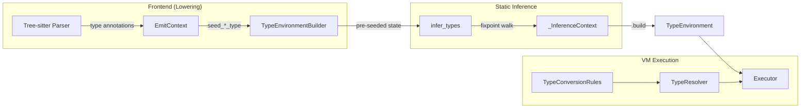
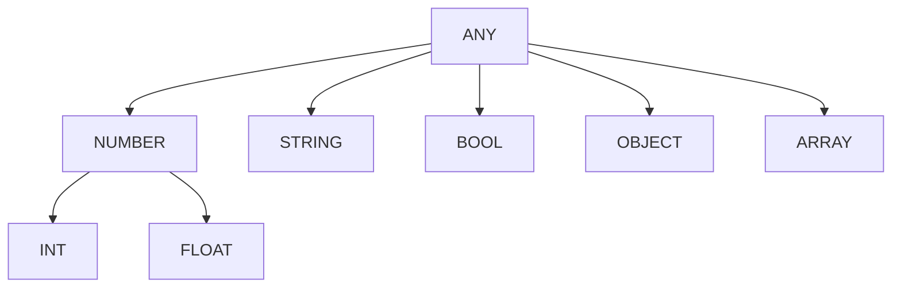
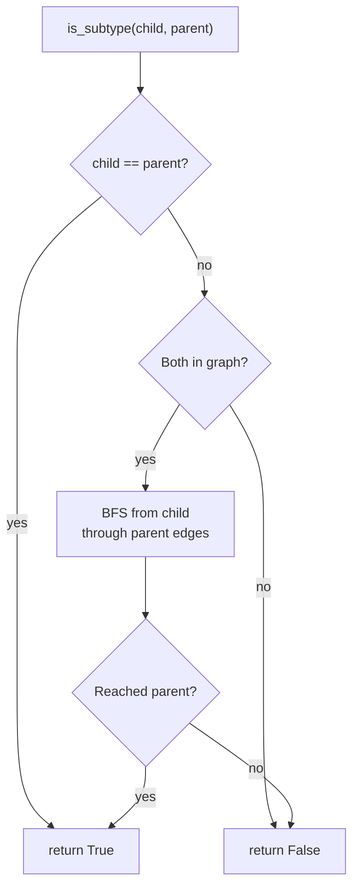
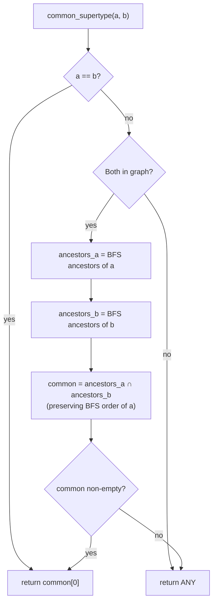
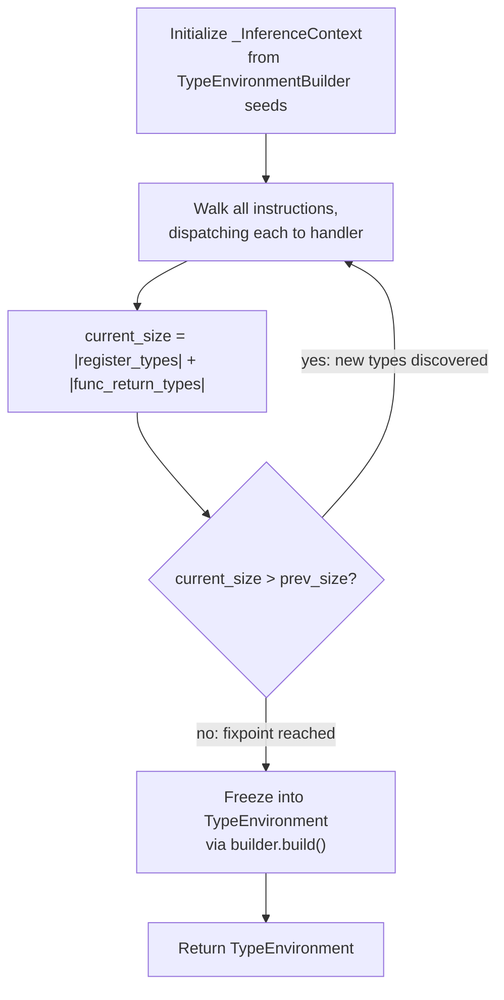
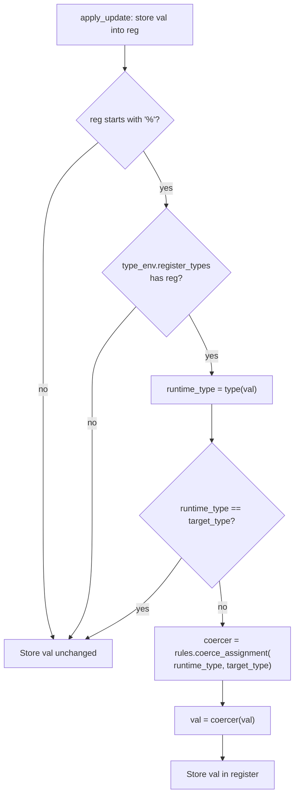
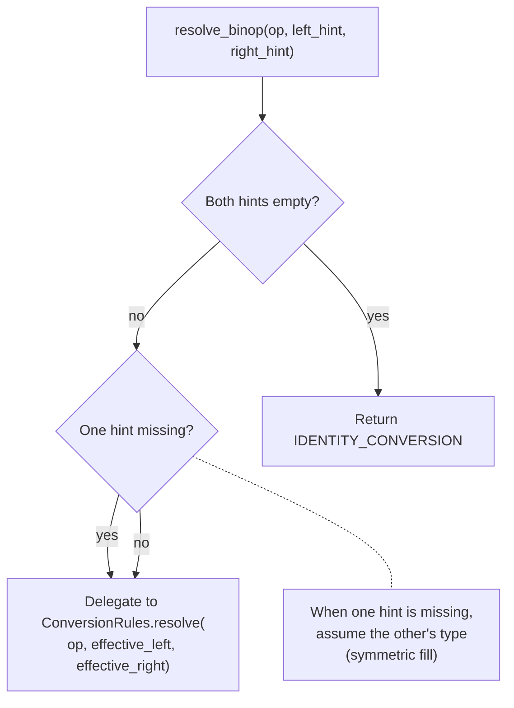

# Type System Design Document

RedDragon's type system provides **static type inference** over the universal IR, enabling type-aware operator semantics (e.g. integer division, float promotion) and write-time coercion during VM execution. It is designed for incomplete programs: when type information is missing, the system degrades gracefully to identity (no coercion) rather than failing.

## Architecture Overview



The type system operates in three phases:

1. **Frontend extraction** — During IR lowering, frontends extract type annotations from source and seed them into a `TypeEnvironmentBuilder`
2. **Static inference** — `infer_types()` walks the IR to fixpoint, propagating types through registers, variables, and function signatures
3. **Runtime coercion** — During execution, the VM applies write-time coercion when storing values into typed registers

## Type Hierarchy

The default type hierarchy is a DAG rooted at `ANY`:



**`TypeNode`** (`interpreter/type_node.py`) — Each node is a frozen dataclass with a `name` and a tuple of `parents`, forming the edges of the DAG.

**`TypeGraph`** (`interpreter/type_graph.py`) — Immutable DAG built from a tuple of `TypeNode` values. Supports three operations:

| Operation | Algorithm | Complexity |
|---|---|---|
| `contains(t)` | Dict lookup | O(1) |
| `is_subtype(child, parent)` | BFS from child through parent edges | O(V + E) |
| `common_supertype(a, b)` | Intersect BFS ancestor lists; return first common | O(V + E) |
| `extend(nodes)` | Merge and return new graph (immutable) | O(V) |

### Subtype Check Algorithm



### Least Upper Bound (common_supertype)



The BFS order ensures the **closest** common ancestor is returned, not just any common ancestor. For example, `common_supertype(INT, FLOAT)` returns `NUMBER` (not `ANY`).

The graph can be extended with user-defined class types at runtime via `extend()`, which merges new `TypeNode` entries (e.g. `TypeNode("Dog", ("Animal",))`) into a new immutable graph.

## Phase 1: Frontend Type Extraction

During IR lowering, the `TreeSitterEmitContext` provides four seeding methods that populate the `TypeEnvironmentBuilder`:

| Method | Seeds | Example |
|---|---|---|
| `seed_register_type(reg, type)` | `register_types["%3"] = "Int"` | Typed parameter `int x` → `%3 = Int` |
| `seed_var_type(var, type)` | `var_types["x"] = "Int"` | Typed declaration `int x = 5` |
| `seed_param_type(name, type)` | `func_param_types["func_add_0"].append(("x", "Int"))` | Function param `(int x)` |
| `seed_func_return_type(label, type)` | `func_return_types["func_add_0"] = "Int"` | Return annotation `-> int` |

Type annotations are extracted via `extract_type_from_field()` and normalized through `normalize_type_hint()`, which maps language-specific type names to canonical names (e.g. `int` → `Int`, `double` → `Float`, `str`/`String`/`string` → `String`).

Languages with explicit type annotations (Java, C#, C++, Kotlin, TypeScript, Scala) produce richer seeds. Dynamically-typed languages (Python, Ruby, JavaScript, PHP) produce fewer seeds — the inference pass fills in the gaps.

### TypeEnvironmentBuilder

`TypeEnvironmentBuilder` (`interpreter/type_environment_builder.py`) is a mutable dataclass that accumulates type information during lowering:

```
register_types:   dict[str, str]                    # "%0" → "Int"
var_types:        dict[str, str]                    # "x"  → "Int"
func_return_types: dict[str, str]                   # "func_add_0" → "Int"
func_param_types:  dict[str, list[tuple[str, str]]] # "func_add_0" → [("a", "Int"), ("b", "Int")]
```

Its `.build()` method freezes the accumulated state into an immutable `TypeEnvironment`.

## Phase 2: Static Type Inference

`infer_types()` (`interpreter/type_inference.py`) walks the IR instruction list to fixpoint, adding inferred types on top of the pre-seeded state.

### Fixpoint Algorithm



The fixpoint loop resolves forward references: if function `A` calls function `B` (defined later in the IR), the first pass may not know `B`'s return type. On the second pass, `B`'s return type is available and propagates into `A`'s call site.

Convergence is guaranteed because each pass can only **add** entries to `register_types` and `func_return_types` (never remove or modify), and both maps are bounded by the finite set of registers and function labels in the IR.

### Per-Opcode Inference Rules

The inference walk dispatches each instruction to a handler via the `_DISPATCH` table (19 opcodes handled):

| Opcode | Inference Rule |
|---|---|
| `LABEL` | Track current function label and class scope |
| `SYMBOLIC` | Infer `self`/`this` parameter type from class scope; collect param types |
| `CONST` | Infer literal type: `42` → Int, `3.14` → Float, `"hello"` → String, `True`/`False` → Bool; extract function/class ref mappings |
| `LOAD_VAR` | Copy variable type to result register; track register→variable source |
| `STORE_VAR` | Copy source register type to variable (skip if already seeded) |
| `BINOP` | Delegate to `TypeResolver.resolve_binop()` for result type |
| `UNOP` | Fixed types for `not`/`!` → Bool, `#`/`~` → Int; otherwise propagate operand type |
| `NEW_OBJECT` | Result type = class name from operand |
| `NEW_ARRAY` | Result type = Array |
| `CALL_FUNCTION` | Look up function return type from `func_return_types`, then `_BUILTIN_RETURN_TYPES` |
| `CALL_METHOD` | Look up class method return type, then `func_return_types`, then `_BUILTIN_METHOD_RETURN_TYPES` |
| `CALL_UNKNOWN` | Resolve target register to source variable name, then look up return type |
| `STORE_FIELD` | Record field type for class→field mapping |
| `LOAD_FIELD` | Look up field type from class→field mapping |
| `STORE_INDEX` | Record element type for array register |
| `LOAD_INDEX` | Look up element type from array register |
| `ALLOC_REGION` | Result type = "Region" |
| `LOAD_REGION` | Result type = Array |
| `RETURN` | Record return type for current function label |

### Builtin Type Knowledge

The inference engine has built-in knowledge of common function and method return types across languages:

**Builtin functions** (12 entries): `len` → Int, `int` → Int, `float` → Float, `str` → String, `bool` → Bool, `range` → Array, `abs`/`max`/`min` → Number, `arrayOf`/`intArrayOf`/`Array` → Array

**Builtin methods** (60+ entries), organized by return type:
- **→ String**: `upper`, `lower`, `strip`, `replace`, `format`, `join`, `capitalize`, `title`, `trim`, `toLowerCase`, `toUpperCase`, `substring`, `charAt`, `toString`, `concat`, `downcase`, `upcase`, `gsub`, `sub`, `encode`, `decode`, ...
- **→ Int**: `find`, `index`, `rfind`, `count`, `indexOf`, `lastIndexOf`, `size`, `length`
- **→ Bool**: `startswith`, `endswith`, `isdigit`, `isalpha`, `startsWith`, `endsWith`, `includes`, `contains`, `isEmpty`, `has`
- **→ Array**: `split`, `splitlines`, `keys`, `values`, `items`, `entries`, `toArray`, `toList`

### TypeEnvironment (Output)

The inference pass produces a frozen `TypeEnvironment` (`interpreter/type_environment.py`):

```
register_types:  MappingProxyType[str, str]                    # "%0" → "Int"
var_types:       MappingProxyType[str, str]                    # "x"  → "Int"
func_signatures: MappingProxyType[str, FunctionSignature]      # "add" → FunctionSignature(...)
```

`FunctionSignature` is a frozen dataclass with `params: tuple[tuple[str, str], ...]` and `return_type: str`. Only user-facing function names (not internal labels like `func_add_0`) appear in `func_signatures`.

All fields use `MappingProxyType` for true immutability — the environment cannot be modified after construction.

## Phase 3: Runtime Type Coercion

During VM execution, type coercion is applied at **write time** — every register store passes through `_coerce_value()`.

### Coercion Flow



### TypeConversionRules

`TypeConversionRules` (`interpreter/conversion_rules.py`) is an ABC with two methods:

```python
def resolve(operator, left_type, right_type) -> ConversionResult
def coerce_assignment(value_type, target_type) -> Callable[[Any], Any]
```

`DefaultTypeConversionRules` (`interpreter/default_conversion_rules.py`) implements the standard coercion table:

#### Binary Operator Coercion

| Operator | Left | Right | Result Type | Coercion | Override |
|---|---|---|---|---|---|
| `+`, `-`, `*` | Int | Int | Int | — | — |
| `+`, `-`, `*` | Int | Float | Float | left → float() | — |
| `+`, `-`, `*` | Float | Int | Float | right → float() | — |
| `+`, `-`, `*` | Float | Float | Float | — | — |
| `+`, `-`, `*` | Bool | Int | Int | left → int() | — |
| `+`, `-`, `*` | Int | Bool | Int | right → int() | — |
| `/` | Int | Int | Int | — | `//` (floor division) |
| `/` | Int | Float | Float | left → float() | — |
| `/` | Float | Int | Float | right → float() | — |
| `/` | Float | Float | Float | — | — |
| `%` | Int | Int | Int | — | — |
| `==`, `!=`, `<`, `>`, `<=`, `>=` | any | any | Bool | — | — |

The `operator_override` mechanism is key: when both operands are `Int`, `/` is silently rewritten to `//` (Python floor division), preserving integer semantics across all source languages.

#### Assignment Coercion

| Value Type | Target Type | Coercer | Semantics |
|---|---|---|---|
| Float | Int | `math.trunc()` | Truncate toward zero (C/Java semantics) |
| Int | Float | `float()` | Widening promotion |
| Bool | Int | `int()` | `True` → 1, `False` → 0 |
| same | same | identity | No-op |
| other | other | identity | No coercion when types unknown |

### ConversionResult

`ConversionResult` (`interpreter/conversion_result.py`) is the output of binary operator resolution:

```python
@dataclass(frozen=True)
class ConversionResult:
    result_type: str = ""          # Canonical type of the result
    left_coercer: Callable = _identity   # Applied to left operand before eval
    right_coercer: Callable = _identity  # Applied to right operand before eval
    operator_override: str = ""    # Replaces original operator (e.g. "/" → "//")
```

### TypeResolver

`TypeResolver` (`interpreter/type_resolver.py`) composes `TypeConversionRules` with graceful degradation for missing type information:



For assignments: if either hint is empty, return identity (no coercion). Both must be known to trigger coercion.

## End-to-End Example

Consider this Java source:

```java
int a = 10;
double b = 3.0;
double c = a + b;
int d = 7 / 2;
```

### Phase 1: Frontend Seeds

The Java frontend extracts type annotations and seeds:
- `var_types["a"] = "Int"`, `var_types["b"] = "Float"`, `var_types["c"] = "Float"`, `var_types["d"] = "Int"`

### Phase 2: Inference Walk

The IR for `c = a + b`:
```
CONST %0 10              → register_types["%0"] = "Int"
STORE_VAR a %0            → var_types["a"] already seeded as "Int"
CONST %1 3.0              → register_types["%1"] = "Float"
STORE_VAR b %1            → var_types["b"] already seeded as "Float"
LOAD_VAR %2 a             → register_types["%2"] = "Int" (from var_types)
LOAD_VAR %3 b             → register_types["%3"] = "Float" (from var_types)
BINOP %4 + %2 %3          → TypeResolver: Int + Float → Float (left coerced to float)
                             register_types["%4"] = "Float"
STORE_VAR c %4            → var_types["c"] already seeded as "Float"
```

The IR for `d = 7 / 2`:
```
CONST %5 7                → register_types["%5"] = "Int"
CONST %6 2                → register_types["%6"] = "Int"
BINOP %7 / %5 %6          → TypeResolver: Int / Int → Int (operator_override = "//")
                             register_types["%7"] = "Int"
STORE_VAR d %7            → var_types["d"] already seeded as "Int"
```

### Phase 3: Runtime Coercion

When `%4` (the `a + b` result) is stored:
1. The `+` BINOP handler sees `ConversionResult(result_type="Float", left_coercer=float)`
2. Left operand `10` is coerced to `10.0` before addition: `10.0 + 3.0 = 13.0`

When `%7` (the `7 / 2` result) is stored:
1. The `/` BINOP handler sees `ConversionResult(result_type="Int", operator_override="//")`
2. The operator is rewritten: `7 // 2 = 3` (floor division, not `3.5`)

When `c = 13.0` is stored into `%4` (target type Float): runtime type matches, no coercion needed.
When `d = 3` is stored into `%7` (target type Int): runtime type matches, no coercion needed.

## Extensibility

The type system is designed for extension via dependency injection:

- **Custom type hierarchies**: Provide additional `TypeNode` entries via `TypeGraph.extend()` to add user-defined class types with inheritance relationships
- **Custom coercion rules**: Implement `TypeConversionRules` to define domain-specific operator semantics (e.g. COBOL decimal arithmetic)
- **Frontend seeding**: Any frontend can populate the `TypeEnvironmentBuilder` with language-specific type information via the four `seed_*_type()` methods

## File Reference

| File | Role |
|---|---|
| `interpreter/type_node.py` | `TypeNode` — frozen dataclass for DAG nodes |
| `interpreter/type_graph.py` | `TypeGraph` — immutable DAG with subtype/LUB queries |
| `interpreter/type_environment_builder.py` | `TypeEnvironmentBuilder` — mutable accumulator for frontend seeds |
| `interpreter/type_environment.py` | `TypeEnvironment` — frozen inference result |
| `interpreter/function_signature.py` | `FunctionSignature` — frozen param/return type record |
| `interpreter/type_inference.py` | `infer_types()` — fixpoint inference engine |
| `interpreter/type_resolver.py` | `TypeResolver` — composes rules with missing-hint logic |
| `interpreter/conversion_rules.py` | `TypeConversionRules` — ABC for coercion rules |
| `interpreter/conversion_result.py` | `ConversionResult` — coercion descriptor |
| `interpreter/default_conversion_rules.py` | `DefaultTypeConversionRules` — standard coercion table |
| `interpreter/frontends/context.py` | `TreeSitterEmitContext.seed_*_type()` — frontend seeding API |
| `interpreter/vm.py` | `_coerce_value()`, `apply_update()` — runtime coercion |
